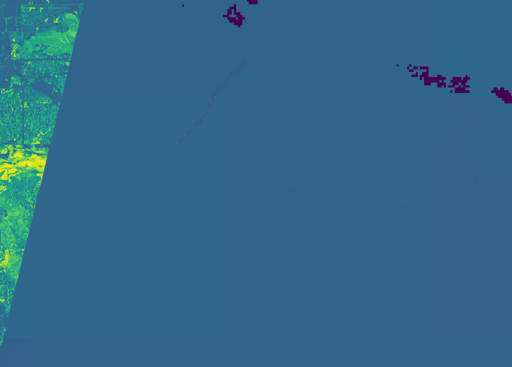

# FutureFarmNow API Documentation
Version: 0.3-RC1

All the following end-points are hosted under the URL `https://raptor.cs.ucr.edu/futurefarmnow-backend-<VERSION>`.
The current version is shown at the top of this document.
All the following endpoints should be preceded with the base URL given above.

## List vector products
Lists all the vector datasets available on the server.

| End Point   | `/vectors.json` |
|-------------|-----------------|
| HTTP Method | GET             |

*Result:*
```json
{
  "vectors": [
    {
      "id": "farmland",
      "title": "California Farmlands",
      "description": "All farmlands in California"
    }, {
      ...
    }
  ]
}
```

## Retrieve vector dataset
Returns the full vector dataset or a subset of it defined by a region in the GeoJSON file format.


| End Point   | `/vectors/<id>.geojson` |
|-------------|-------------------------|
| HTTP method | GET                     |

### Parameters

| Parameter | Required? | How to use | Description                              |
|-----------|-----------|------------|------------------------------------------|
| id        | required  | URL        | The ID of the vector dataset to retrieve | 
| minx      | optional  | ?minx=     | West edge longitude                      |
| miny      | optional  | ?miny=     | South edge latitude                      |
| maxx      | optional  | ?maxx=     | East edge longitude                      |
| maxy      | optional  | ?maxy=     | North edge latitude                      |

Note: if MBR is not specified, the whole dataset will be returned as GeoJSON.

### Examples
#### URL
<http://raptor.cs.ucr.edu/futurefarmnow-backend-0.2-RC1/vectors/farmland.geojson?minx=-120.1&miny=40&maxx=-120&maxy=40.01>

#### Response
```json
{
  "type" : "FeatureCollection",
  "features" : [ {
    "type" : "Feature",
    "properties" : {
      "OBJECTID" : 11327,
      "Crop2014" : "Alfalfa and Alfalfa Mixtures",
      "Acres" : 5.834048494999999E-14,
      "County" : "Lassen",
      "Source" : "Land IQ, LLC",
      "Modified_B" : "Zhongwu Wang",
      "Date_Data_" : "July, 2014",
      "Last_Modif" : "2017-05-07T00:00:00.000Z",
      "DWR_Standa" : "P | PASTURE",
      "GlobalID" : "{332F0E0D-503F-4D89-9B9B-9617134F904A}"
    },
    "geometry" : {
      "type" : "Polygon",
      "coordinates" : [<coordinate array>]
    }
  }]
}
```

## Retrieve vector dataset Tile
Retrieves a tile visualization for the entire Farmland dataset.

| Endpoint    | `/vectors/<id>/tile-z-x-y.png`                                 |
|-------------|-----------------------------------------------------------------|
| HTTP method | GET                                                             |
| Since       | 0.1.1                                                           |

### Examples
#### URL
<http://raptor.cs.ucr.edu/futurefarmnow-backend-0.2-RC1/vectors/farmland/tile-1-0-0.png>

#### Response


## Get soil statistics for a single farmland

Get soil statistics for a single geometry defined by GeoJSON. The output is in JSON format.

| Endpoint     | `/soil/singlepolygon.json` |
|--------------|----------------------------|
| HTTP method  | GET/POST                   |
| POST payload | GeoJSON geometry object    |

| Parameter | Required? | How to use                                                                                                           | Description                           |
|-----------|-----------|----------------------------------------------------------------------------------------------------------------------|---------------------------------------|
| soildepth | Required  | ?soildepth=from-to                                                                                                   | Soil depth on which to run statistics |
| layer     | Required  | Accepted values: "alpha", "bd", "clay", "hb", "ksat", "lambda", "n", "om", "ph", "sand", "silt","theta_r", "theta_s" | Soil parameter to consider            |

*Note*: GET is the preferred HTTP method for this service since it does not modify the state of the server and its caching will be handled better by the client. However, since some SDKs do not support a payload for GET requests, the POST method is also supported for compatibility.

*Note*: The parameter `soildepth` is provided as a range in the format `from-to`.
Currently, the accepted values for from and to are {0, 5, 15, 30, 60, 100, 200} and `from` must be less than `to`.

### Examples
#### URL
<https://raptor.cs.ucr.edu/futurefarmnow-backend-0.2-RC1/soil/singlepolygon.json?soildepth=0-5&layer=lambda>

#### GET/POST payload
```json
{"type":"MultiPolygon","coordinates":[[[[-117.09285814562507255,33.82248877684289567],[-117.09311988685111316,33.82246974122563898],[-117.09331976020517629,33.82251733063394994],[-117.09355294847989626,33.82266485703437553],[-117.09538513346878119,33.82400211388483768],[-117.09564211542040368,33.82423530113598531],[-117.09599903494739692,33.82481588961324093],[-117.09783597921065734,33.82807099268816842],[-117.09792163986121238,33.8282327962675069],[-117.09794067516207861,33.82843742987725477],[-117.09788356836114076,33.82861826850821529],[-117.09774080090969051,33.82882290268781844],[-117.0961322847484638,33.82924644646776358],[-117.09398601100701853,33.82969378533054083],[-117.09304374385099834,33.82983179392608264],[-117.09270110214713156,33.82988890181807307],[-117.09183021871685071,33.83022678523190052],[-117.08819916096476277,33.83170205102513961],[-117.08812777723903764,33.83168301447423687],[-117.08798976906194866,33.83161639136280741],[-117.08712364400770412,33.83004118685605022],[-117.08695232270660824,33.82988414239322594],[-117.08675244755589517,33.82970806288982146],[-117.08648118867942856,33.82922741160864177],[-117.08644311807771032,33.82898470633658405],[-117.08640980585201419,33.82877531380393776],[-117.08633842122794988,33.82863730499543919],[-117.08410648683597799,33.82495865906553689],[-117.08412076376079369,33.8248920329527607],[-117.08423021898659044,33.82482540828065964],[-117.08734255445929762,33.82398783761156125],[-117.09285814562507255,33.82248877684289567]]]]}
```

#### Example with cUrl
```shell
curl -X GET "http://raptor.cs.ucr.edu/futurefarmnow-backend-0.2-RC1/soil/singlepolygon.json?soildepth=0-15&layer=lambda&layer=alpha" -H "Content-Type: application/geo+json" -d '{"type":"MultiPolygon","coordinates":[[[[-117.09285814562507255,33.82248877684289567],[-117.09311988685111316,33.82246974122563898],[-117.09331976020517629,33.82251733063394994],[-117.09355294847989626,33.82266485703437553],[-117.09538513346878119,33.82400211388483768],[-117.09564211542040368,33.82423530113598531],[-117.09599903494739692,33.82481588961324093],[-117.09783597921065734,33.82807099268816842],[-117.09792163986121238,33.8282327962675069],[-117.09794067516207861,33.82843742987725477],[-117.09788356836114076,33.82861826850821529],[-117.09774080090969051,33.82882290268781844],[-117.0961322847484638,33.82924644646776358],[-117.09398601100701853,33.82969378533054083],[-117.09304374385099834,33.82983179392608264],[-117.09270110214713156,33.82988890181807307],[-117.09183021871685071,33.83022678523190052],[-117.08819916096476277,33.83170205102513961],[-117.08812777723903764,33.83168301447423687],[-117.08798976906194866,33.83161639136280741],[-117.08712364400770412,33.83004118685605022],[-117.08695232270660824,33.82988414239322594],[-117.08675244755589517,33.82970806288982146],[-117.08648118867942856,33.82922741160864177],[-117.08644311807771032,33.82898470633658405],[-117.08640980585201419,33.82877531380393776],[-117.08633842122794988,33.82863730499543919],[-117.08410648683597799,33.82495865906553689],[-117.08412076376079369,33.8248920329527607],[-117.08423021898659044,33.82482540828065964],[-117.08734255445929762,33.82398783761156125],[-117.09285814562507255,33.82248877684289567]]]]}'
```

#### Response
```json
{"query":{"soildepth":"0-5","layer":"alpha"},"results":{"max":-0.24714702,"min":-0.25878787,"sum":-0.24714702,"median":-48.268135,"stddev":-0.25208578,"count":195,"mean":-0.2475289,"lowerquart":-0.25,"upperquart": -0.23}}
```

## Get soil statistics for all farmlands in a region
Get computed soil statistics for selected vector products in JSON format

| Endpoint    | `/soil/<id>.json` |
|-------------|--------------------|
| HTTP method | GET                |

| Parameter | Required? | How to use                                                                                                           | Description                          |
|-----------|-----------|----------------------------------------------------------------------------------------------------------------------|--------------------------------------|
| id        | Required  | URL                                                                                                                  | The ID of the vector dataset         |
| minx      | Optional  | ?minx=                                                                                                               | West edge longitude value            |
| miny      | Optional  | ?miny=                                                                                                               | South edge latitude value            |
| maxx      | Optional  | ?maxx=                                                                                                               | East edge longitude value            |
| maxy      | Optional  | ?maxy=                                                                                                               | North edge latitude value            |
| soildepth | Required  | from-to                                                                                                              | Soil depth to compute statistics for |
| layer     | Required  | Accepted values: "alpha", "bd", "clay", "hb", "ksat", "lambda", "n", "om", "ph", "sand", "silt","theta_r", "theta_s" | Soil parameter to consider           |

*Note*: The parameter `soildepth` is provided as a range in the format `from-to`.
Currently, the accepted values for from and to are {0, 5, 15, 30, 60, 100, 200} and `from` must be less than `to`.

### Examples
#### URL
<http://raptor.cs.ucr.edu/futurefarmnow-backend-0.2-RC1/soil/farmland.json?minx=-127.8&miny=29.8&maxx=-115.6&maxy=33.7&soildepth=0-5&layer=ph>

#### Response
```json
{
  "query":{
    "soildepth":"0-5",
    "layer":"ph",
    "mbr":{
      "minx":-127.8,
      "miny":29.8,
      "maxx":-112.6,
      "maxy":42.7
    }
  },
  "results":[{
    "objectid":"41176",
    "value":6.1090255
  },
    ...
  ]
}
```

## Get soil image for a region

Get an image of soil statistics in a region defined by a GeoJSON geometry.

| Endpoint     | `/soil/image.png`       |
|--------------|-------------------------|
| HTTP method  | GET/POST                |
| POST payload | GeoJSON geometry object |
| Since        | 0.3                     |

| Parameter | Required? | How to use                                                                                                           | Description                           |
|-----------|-----------|----------------------------------------------------------------------------------------------------------------------|---------------------------------------|
| soildepth | Required  | ?soildepth=from-to                                                                                                   | Soil depth on which to run statistics |
| layer     | Required  | Accepted values: "alpha", "bd", "clay", "hb", "ksat", "lambda", "n", "om", "ph", "sand", "silt","theta_r", "theta_s" | Soil parameter to consider            |

*Note*: GET is the preferred HTTP method for this service since it does not modify the state of the server and its caching will be handled better by the client. However, since some SDKs do not support a payload for GET requests, the POST method is also supported for compatibility.

*Note*: The parameter `soildepth` is provided as a range in the format `from-to`.
Currently, the accepted values for from and to are {0, 5, 15, 30, 60, 100, 200} and `from` must be less than `to`.

### Examples
#### URL
<https://raptor.cs.ucr.edu/futurefarmnow-backend-0.3-RC1/soil/image.png?soildepth=0-5&layer=alpha>

#### GET/POST payload
```json
{"type" : "Polygon",  "coordinates" : [ [ [ -120.11975251694177, 36.90564006418889 ], [ -120.12409234994458, 36.90565751854381 ], [ -120.12406217104261, 36.90824957916899 ], [ -120.12410082465097, 36.90918197014845 ], [ -120.12405123315573, 36.90918899854245 ], [ -120.11974725371255, 36.9091820470047 ], [ -120.11975251694177, 36.90564006418889 ] ] ] }
```

#### Example with cUrl
```shell
cat > test.geojson
{"type" : "Polygon",  "coordinates" : [ [ [ -120.11975251694177, 36.90564006418889 ], [ -120.12409234994458, 36.90565751854381 ], [ -120.12406217104261, 36.90824957916899 ], [ -120.12410082465097, 36.90918197014845 ], [ -120.12405123315573, 36.90918899854245 ], [ -120.11874725371255, 36.9091820470047 ], [ -120.11975251694177, 36.90564006418889 ] ] ]  }
^D
curl -X GET "http://raptor.cs.ucr.edu/futurefarmnow-backend-0.3-RC1/soil/image.png?soildepth=0-5&layer=alpha" -H "Content-Type: application/geo+json" -d @test.geojson
```

#### Response (Enlarged to show details)


## Soil Sample

Request a set of points to sample a field given as a polygon.

| Endpoint     | `/soil/sample.json`     |
|--------------|-------------------------|
| HTTP method  | GET/POST                |
| POST payload | GeoJSON geometry object |

| Parameter  | Required? | How to use                                                                                                           | Description                           |
|------------|-----------|----------------------------------------------------------------------------------------------------------------------|---------------------------------------|
| soildepth  | Required  | ?soildepth=from-to                                                                                                   | Soil depth on which to run statistics |
| layer*     | Required  | Accepted values: "alpha", "bd", "clay", "hb", "ksat", "lambda", "n", "om", "ph", "sand", "silt","theta_r", "theta_s" | Soil parameter to consider            |
| num_points | Required  | How many points in the sample, Accepted values: {5, 7, 10, 12}                                                       | Number of points in the answer        |

*Note*: GET is the preferred HTTP method for this service since it does not modify the state of the server and its caching will be handled better by the client.
However, since some SDKs do not support a payload for GET requests, the POST method is also supported for compatibility.

*Note*: The parameter `soildepth` is provided as a range in the format `from-to`.
Currently, the accepted values for from and to are {0, 5, 15, 30, 60, 100, 200} and `from` must be less than `to`.

*Note*: *Multiple layers can be requested to include in the sample. If multiple layers are requested, this parameter can be repeated,
e.g., "layer=alpha&layer=clay"

### Examples
#### URL
<https://raptor.cs.ucr.edu/futurefarmnow-backend-0.2-RC1/soil/sample.json?soildepth=0-5&layer=lambda&layer=alpha&num_points=5>

#### GET/POST payload
```json
{"type":"MultiPolygon","coordinates":[[[[-117.09285814562507255,33.82248877684289567],[-117.09311988685111316,33.82246974122563898],[-117.09331976020517629,33.82251733063394994],[-117.09355294847989626,33.82266485703437553],[-117.09538513346878119,33.82400211388483768],[-117.09564211542040368,33.82423530113598531],[-117.09599903494739692,33.82481588961324093],[-117.09783597921065734,33.82807099268816842],[-117.09792163986121238,33.8282327962675069],[-117.09794067516207861,33.82843742987725477],[-117.09788356836114076,33.82861826850821529],[-117.09774080090969051,33.82882290268781844],[-117.0961322847484638,33.82924644646776358],[-117.09398601100701853,33.82969378533054083],[-117.09304374385099834,33.82983179392608264],[-117.09270110214713156,33.82988890181807307],[-117.09183021871685071,33.83022678523190052],[-117.08819916096476277,33.83170205102513961],[-117.08812777723903764,33.83168301447423687],[-117.08798976906194866,33.83161639136280741],[-117.08712364400770412,33.83004118685605022],[-117.08695232270660824,33.82988414239322594],[-117.08675244755589517,33.82970806288982146],[-117.08648118867942856,33.82922741160864177],[-117.08644311807771032,33.82898470633658405],[-117.08640980585201419,33.82877531380393776],[-117.08633842122794988,33.82863730499543919],[-117.08410648683597799,33.82495865906553689],[-117.08412076376079369,33.8248920329527607],[-117.08423021898659044,33.82482540828065964],[-117.08734255445929762,33.82398783761156125],[-117.09285814562507255,33.82248877684289567]]]]}
```

#### Example with cUrl
```shell
curl -X GET "https://raptor.cs.ucr.edu/futurefarmnow-backend-0.2-RC1/soil/sample.json?soildepth=0-15&layer=alpha&layer=clay&num_points=5" -H "Content-Type: application/geo+json" -d '{"type":"MultiPolygon","coordinates":[[[[-117.09285814562507255,33.82248877684289567],[-117.09311988685111316,33.82246974122563898],[-117.09331976020517629,33.82251733063394994],[-117.09355294847989626,33.82266485703437553],[-117.09538513346878119,33.82400211388483768],[-117.09564211542040368,33.82423530113598531],[-117.09599903494739692,33.82481588961324093],[-117.09783597921065734,33.82807099268816842],[-117.09792163986121238,33.8282327962675069],[-117.09794067516207861,33.82843742987725477],[-117.09788356836114076,33.82861826850821529],[-117.09774080090969051,33.82882290268781844],[-117.0961322847484638,33.82924644646776358],[-117.09398601100701853,33.82969378533054083],[-117.09304374385099834,33.82983179392608264],[-117.09270110214713156,33.82988890181807307],[-117.09183021871685071,33.83022678523190052],[-117.08819916096476277,33.83170205102513961],[-117.08812777723903764,33.83168301447423687],[-117.08798976906194866,33.83161639136280741],[-117.08712364400770412,33.83004118685605022],[-117.08695232270660824,33.82988414239322594],[-117.08675244755589517,33.82970806288982146],[-117.08648118867942856,33.82922741160864177],[-117.08644311807771032,33.82898470633658405],[-117.08640980585201419,33.82877531380393776],[-117.08633842122794988,33.82863730499543919],[-117.08410648683597799,33.82495865906553689],[-117.08412076376079369,33.8248920329527607],[-117.08423021898659044,33.82482540828065964],[-117.08734255445929762,33.82398783761156125],[-117.09285814562507255,33.82248877684289567]]]]}'
```

#### Response
```json
{
  "query": {
    "type": "MultiPolygon",
    "coordinates": [...]
  },
  "results": [
    {
      "x": -117.08930555556414,
      "y": 33.83041666666827,
      "id": 0
    },
    {
      "x": -117.08902777778637,
      "y": 33.826805555557186,
      "id": 1
    },
    {
      "x": -117.08569444445307,
      "y": 33.82736111111274,
      "id": 2
    },
    {
      "x": -117.0909722222308,
      "y": 33.82763888889052,
      "id": 3
    },
    {
      "x": -117.09347222223077,
      "y": 33.82763888889052,
      "id": 4
    }
  ],
  "statistics": {
    "layers": {
      "alpha": {
        "actual": {
          "max": -0.06293073296546936,
          "min": -0.20014359056949615,
          "sum": -129.93594360351562,
          "median": -0.1260596662759781,
          "stddev": 0.019030116498470306,
          "count": 996,
          "mean": -0.1304577738046646,
          "lowerquart": -0.14032815396785736,
          "upperquart": -0.12047208100557327
        },
        "sample": {
          "max": -0.11671777069568634,
          "min": -0.14534753561019897,
          "sum": -0.6546581983566284,
          "median": -0.1308237910270691,
          "stddev": 0.011226361617445946,
          "count": 5,
          "mean": -0.13093164563179016,
          "lowerquart": -0.1377495378255844,
          "upperquart": -0.12401952594518661
        }
      },
      "clay": {
        "actual": {
          "max": 14.45147705078125,
          "min": 3.3041064739227295,
          "sum": 8615.775390625,
          "median": 8.250617980957031,
          "stddev": 1.7484899759292603,
          "count": 996,
          "mean": 8.65037727355957,
          "lowerquart": 7.432931065559387,
          "upperquart": 9.575295448303223
        },
        "sample": {
          "max": 9.891276359558105,
          "min": 7.261268138885498,
          "sum": 42.733428955078125,
          "median": 8.537104606628418,
          "stddev": 1.043372631072998,
          "count": 5,
          "mean": 8.546686172485352,
          "lowerquart": 7.853697299957275,
          "upperquart": 9.190081596374512
        }
      }
    }
  }
}
```


## Get NDVI for a single farmland

Get NDVI time series for a single geometry defined by GeoJSON. The output is in JSON format.

| Endpoint     | `/ndvi/singlepolygon.json` |
|--------------|----------------------------|
| HTTP method  | GET/POST                   |
| POST payload | GeoJSON geometry object    |
| since        | 0.3                        |

| Parameter | Required? | How to use       | Description              |
|-----------|-----------|------------------|--------------------------|
| from      | Required  | ?from=yyyy-mm-dd | Start date of the search |
| to        | Required  | ?to=yyyy-mm-dd   | End date of the search   |

### Examples
#### URL
<https://raptor.cs.ucr.edu/futurefarmnow-backend-0.3-RC1/ndvi/singlepolygon.json?from=2023-09-25&to=2023-09-30>

#### GET/POST payload
```json
{"type" : "Polygon",  "coordinates" : [ [ [ -120.11975251694177, 36.90564006418889 ], [ -120.12409234994458, 36.90565751854381 ], [ -120.12406217104261, 36.90824957916899 ], [ -120.12410082465097, 36.90918197014845 ], [ -120.12405123315573, 36.90918899854245 ], [ -120.11974725371255, 36.9091820470047 ], [ -120.11975251694177, 36.90564006418889 ] ] ] }
```

#### Example with cUrl
```shell
curl -X GET "http://raptor.cs.ucr.edu/futurefarmnow-backend-0.3-RC1/ndvi/singlepolygon.json?from=2024-01-01&to=2024-01-31" -H "Content-Type: application/geo+json" -d '{ "type": "Polygon", "coordinates": [ [ [ -118.923626554418789, 35.134814256286248 ], [ -118.924826581456216, 35.143157232002977 ], [ -118.905961863912353, 35.145811034496113 ], [ -118.904961895958394, 35.139820211208132 ], [ -118.907145228355603, 35.135074833938482 ], [ -118.923626554418789, 35.134814256286248 ] ] ] }'
```
#### Response
```json
{
  "query": {
    "from": "2024-01-01",
    "to": "2024-01-31",
    "geometry": {
      "coordinates": [...],
      "type": "Polygon"
    }
  },
  "results": [
    {
      "date": "2024-01-08",
      "mean": 0.11700827638807884
    },
    {
      "date": "2024-01-11",
      "mean": 0.1836339493120872
    } ...
  ]
}
```

## Get NDVI for all farmlands in a region
Get NDVI time series for selected vector products in JSON format

| Endpoint    | `/ndvi/<id>.json` |
|-------------|-------------------|
| HTTP method | GET               |
| since       | 0.3               | 

| Parameter | Required? | How to use       | Description                  |
|-----------|-----------|------------------|------------------------------|
| id        | Required  | URL              | The ID of the vector dataset |
| minx      | Optional  | ?minx=           | West edge longitude value    |
| miny      | Optional  | ?miny=           | South edge latitude value    |
| maxx      | Optional  | ?maxx=           | East edge longitude value    |
| maxy      | Optional  | ?maxy=           | North edge latitude value    |
| from      | Required  | ?from=yyyy-mm-dd | The starting date            |
| to        | Required  | ?to=yyyy-mm-dd   | The ending date              |

The result is an array of (date, ndvi) values for each object. Notice that some dates may be missing.
The result contains only the defined values.
### Examples
#### URL
<http://raptor.cs.ucr.edu/futurefarmnow-backend-0.3-RC1/ndvi/AZ_Farmland.json?minx=-114.7&miny=32.5&maxx=-114.64&maxy=32.55267&from=2023-09-25&to=2023-09-30>

#### Response
```json
{
  "query":{
    "from":"2023-09-25",
    "to":"2023-09-30",
    "mbr":{
      "minx":-127.8,
      "miny":29.8,
      "maxx":-112.6,
      "maxy":42.7
    }
  },
  "results":[{
    "objectid":"41176",
    "results": [
      {"date":  "2023-09-25", "mean": 0.8},
      {"date":  "2023-09-27", "mean": 0.3},
      ...
    ]
  },
    ...
  ]
}
```
## Get raw data for ET map algorithm

Submit a request for ET map data fetching over a specified geometry and date range. The system will collect and align all required datasets (NLDAS, Landsat, PRISM) for evapotranspiration modeling.

| Endpoint    | `/etmap`                   |
|-------------|----------------------------|
| HTTP method | POST                       |
| Since       | 0.3                        |

### Parameters

| Parameter | Required? | How to use                                                    | Description                                          |
|-----------|-----------|---------------------------------------------------------------|------------------------------------------------------|
| date_from | Required  | JSON: "date_from": "yyyy-mm-dd"                             | Start date for data collection                       |
| date_to   | Required  | JSON: "date_to": "yyyy-mm-dd"                               | End date for data collection                         |
| geometry  | Required  | JSON: "geometry": {GeoJSON geometry object}                 | Area of interest geometry (Polygon or MultiPolygon) |

*Note*: After fetching data, the Evapotranspiration computation runs in a separate background thread.

### Examples
#### URL
<https://raptor.cs.ucr.edu/futurefarmnow-backend-0.3-RC1/etmap>

#### POST payload
```json
{
  "date_from": "2024-04-16",
  "date_to": "2024-04-17", 
  "geometry": {
    "type": "Polygon",
    "coordinates": [
      [
        [-117.52, 33.86],
        [-117.20, 33.86], 
        [-117.20, 34.05],
        [-117.52, 34.05],
        [-117.52, 33.86]
      ]
    ]
  }
}
```
#### Example with cUrl
```
curl -X POST "https://raptor.cs.ucr.edu/futurefarmnow-backend-0.3-RC1/etmap" -H "Content-Type: application/json" -d '{"date_from": "2024-04-16", "date_to": "2024-04-17", "geometry": {"type": "Polygon", "coordinates": [[[-117.52, 33.86], [-117.20, 33.86], [-117.20, 34.05], [-117.52, 34.05], [-117.52, 33.86]]]}}'
```

#### Response
```json
{
  "request_id": "ffaf09bf-e712-4d42-a22c-a50554c0a0d6"
}
```

## Get ET Map status

Check the status of an ET Map request using the request ID.

| Endpoint    | `/etmap/<request_id>.json`                                   |
|-------------|--------------------------------------------------------------|
| HTTP method | GET                                                          |
| Since       | 0.3                                                          |

### Parameters

| Parameter | Required? | How to use | Description                                 |
|-----------|-----------|------------|---------------------------------------------|
| request_id| Required  | URL        | The UUID of the ET map data fetching request|


### Examples
#### URL
<https://raptor.cs.ucr.edu/futurefarmnow-backend-0.3-RC1/etmap/ffaf09bf-e712-4d42-a22c-a50554c0a0d6.json>

#### Response
```json
{
  "created_at": "2025-08-30T08:29:44.201452",
  "request": {
    "date_from": "2024-04-16",
    "date_to": "2024-04-17",
    "geometry": {
      "coordinates": [
        [
          [
            -117.52,
            33.86
          ],
          [
            -117.2,
            33.86
          ],
          [
            -117.2,
            34.05
          ],
          [
            -117.52,
            34.05
          ],
          [
            -117.52,
            33.86
          ]
        ]
      ],
      "type": "Polygon"
    }
  },
  "request_id": "ffaf09bf-e712-4d42-a22c-a50554c0a0d6",
  "status": "calculation_complete",
  "updated_at": "2025-08-30T08:31:38.278548"
}
```
## Get ET map image for a region

Get an ET map image of a region.

| Endpoint     | `/etmap/<request_id>.png`|
|--------------|--------------------------|
| HTTP method  | GET                      |
| POST payload | GeoJSON geometry object  |
| Since        | 0.3                      |

### Parameters

| Parameter  | Required? | How to use  | Description                                  |
|------------|-----------|-------------|----------------------------------------------|
| request_id | Required  | URL         | The UUID of the ET map data fetching request |

*Note*: Replace “.png” with “.tif” to download the ET map as a GeoTIFF.

### Examples
#### URL
<https://raptor.cs.ucr.edu/futurefarmnow-backend-0.3-RC1/etmap/ffaf09bf-e712-4d42-a22c-a50554c0a0d6.png>

#### Example with cUrl
```
curl -X GET "http://raptor.cs.ucr.edu/futurefarmnow-backend-0.3-RC1/etmap/ffaf09bf-e712-4d42-a22c-a50554c0a0d6.png"
```

#### Response (Enlarged to show details)

