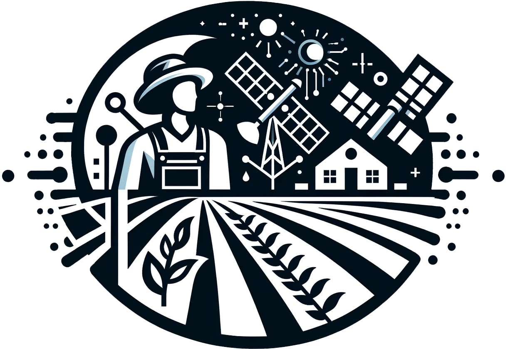

Person:
- I have a web application that has a RESTful API. I need your help in developing the front-end from scratch. I need the code to be organized in three files, index.html, app.js, and style.css. I don't want to use npm. To start, I want the application to a single full-screen page. On the left, there is a panel that the user can scroll through (contents will come later). On the right, the majoring of the screen should be a map. We will use OpenLayers for the map. Make the map initialized in California. I would like to use React for building this application.

ChatGPT:
- For your web application that includes a scrolling panel on the left and an OpenLayers map on the right, organized without npm and using React, we'll start with the basics. Since React typically benefits from a build process for JSX transformation and module bundling, using it without npm and build tools like Webpack or Parcel is a bit unconventional. However, we can use CDN links for React and Babel to get started in a more straightforward HTML environment.

Here's a basic structure to get you started:
### `index.html`

This file will serve as the entry point of your application. It includes React and Babel CDNs, sets up a root div for your React app, and links to your `style.css` and `app.js` files.

```html
<!DOCTYPE html>
<html lang="en">
<head>
    <meta charset="UTF-8">
    <meta name="viewport" content="width=device-width, initial-scale=1.0">
    <title>Your Application</title>
    <link rel="stylesheet" href="style.css">
    <script src="https://cdn.jsdelivr.net/npm/react@17/umd/react.development.js"></script>
    <script src="https://cdn.jsdelivr.net/npm/react-dom@17/umd/react-dom.development.js"></script>
    <!-- Babel for JSX transformation -->
    <script src="https://cdnjs.cloudflare.com/ajax/libs/babel-standalone/6.26.0/babel.min.js"></script>
    <!-- OpenLayers -->
    <link rel="stylesheet" href="https://cdn.jsdelivr.net/npm/openlayers/dist/ol.css" type="text/css">
    <script src="https://cdn.jsdelivr.net/npm/openlayers"></script>
</head>
<body>
    <div id="root"></div>
    <script type="text/babel" src="app.js"></script>
</body>
</html>
```


### `app.js`

This file will contain your React components. Note that we're using inline Babel for JSX, which isn't recommended for production due to performance reasons but will work for your prototype.

```javascript
const { useState, useEffect } = React;

function App() {
    useEffect(() => {
        const map = new ol.Map({
            target: 'map',
            layers: [
                new ol.layer.Tile({
                    source: new ol.source.OSM()
                })
            ],
            view: new ol.View({
                center: ol.proj.fromLonLat([-119.4179, 36.7783]), // California's Lon and Lat
                zoom: 6
            })
        });
    }, []);

    return (
        <div className="container">
            <div className="sidebar">Scrolling content goes here</div>
            <div id="map" className="map"></div>
        </div>
    );
}

ReactDOM.render(<App />, document.getElementById('root'));
```


### `style.css`

This will contain basic styles to layout your sidebar and map. You'll likely want to adjust these styles based on your application's needs.

```css
body, html {
    height: 100%;
    margin: 0;
}

.container {
    display: flex;
    height: 100%;
}

.sidebar {
    width: 30%;
    overflow-y: scroll;
    background-color: #f0f0f0;
}

.map {
    width: 70%;
    height: 100vh; /* Use viewport height to make it full-screen */
}
```


This setup provides a basic full-screen page with a sidebar and a map centered on California using OpenLayers, all organized as requested into `index.html`, `app.js`, and `style.css` files without relying on npm for dependencies. Remember, for a more complex or production-ready application, you'd likely want to set up a proper build process with npm or yarn to handle JSX, module bundling, and possibly state management more efficiently.

Person:
- Next step, I want the panel on the left to show a vector dataset selector. When a dataset is selected, it is displayed on the map using the Tile API. The details on how to access the required APIs is below.

# FutureFarmNow API Documentation
Version: 0.3-RC1

All the following end-points are hosted under the URL `https://raptor.cs.ucr.edu/futurefarmnow-backend-<VERSION>`.
The current version is shown at the top of this document.
All the following endpoints should be preceded with the base URL given above.

## List vector products
Lists all the vector datasets available on the server.

| End Point   | `/vectors.json` |
|-------------|-----------------|
| HTTP Method | GET             |

*Result:*
```json
{
  "vectors": [
    {
      "id": "farmland",
      "title": "California Farmlands",
      "description": "All farmlands in California"
    }, {
      ...
    }
  ]
}
```

## Retrieve vector dataset
Returns the full vector dataset or a subset of it defined by a region in the GeoJSON file format.


| End Point   | `/vectors/<id>.geojson` |
|-------------|-------------------------|
| HTTP method | GET                     |

### Parameters

| Parameter | Required? | How to use | Description                              |
|-----------|-----------|------------|------------------------------------------|
| id        | required  | URL        | The ID of the vector dataset to retrieve | 
| minx      | optional  | ?minx=     | West edge longitude                      |
| miny      | optional  | ?miny=     | South edge latitude                      |
| maxx      | optional  | ?maxx=     | East edge longitude                      |
| maxy      | optional  | ?maxy=     | North edge latitude                      |

Note: if MBR is not specified, the whole dataset will be returned as GeoJSON.

### Examples
#### URL
<http://raptor.cs.ucr.edu/futurefarmnow-backend-0.2-RC1/vectors/farmland.geojson?minx=-120.1&miny=40&maxx=-120&maxy=40.01>

#### Response
```json
{
  "type" : "FeatureCollection",
  "features" : [ {
    "type" : "Feature",
    "properties" : {
      "OBJECTID" : 11327,
      "Crop2014" : "Alfalfa and Alfalfa Mixtures",
      "Acres" : 5.834048494999999E-14,
      "County" : "Lassen",
      "Source" : "Land IQ, LLC",
      "Modified_B" : "Zhongwu Wang",
      "Date_Data_" : "July, 2014",
      "Last_Modif" : "2017-05-07T00:00:00.000Z",
      "DWR_Standa" : "P | PASTURE",
      "GlobalID" : "{332F0E0D-503F-4D89-9B9B-9617134F904A}"
    },
    "geometry" : {
      "type" : "Polygon",
      "coordinates" : [<coordinate array>]
    }
  }]
}
```

## Retrieve vector dataset Tile
Retrieves a tile visualization for the entire Farmland dataset.

| Endpoint    | `/vectors/<id>/tile-z-x-y.png`                                 |
|-------------|-----------------------------------------------------------------|
| HTTP method | GET                                                             |
| Since       | 0.1.1                                                           |

### Examples
#### URL
<http://raptor.cs.ucr.edu/futurefarmnow-backend-0.2-RC1/vectors/farmland/tile-1-0-0.png>

#### Response


ChatGPT:
- To incorporate a vector dataset selector in your left panel and display the selected dataset on the map using the Tile API from the FutureFarmNow API documentation, we'll expand upon the previous React setup. The steps involve fetching the list of vector datasets from the API, allowing the user to select one, and then displaying the selected dataset on the map.
### Step 1: Fetching Vector Dataset List

First, you'll need to fetch the list of available vector datasets from the API and display them in the sidebar as selectable options. You'll add this logic to your `App` component in `app.js`.
### Step 2: Displaying Selected Dataset on the Map

Once a dataset is selected, you'll use the Tile API endpoint to display the selected dataset on the map.

Here's how you can modify `app.js` to incorporate these functionalities:

```javascript
const { useState, useEffect } = React;

function App() {
    const [vectors, setVectors] = useState([]);
    const [selectedVectorId, setSelectedVectorId] = useState('');

    useEffect(() => {
        fetch('https://raptor.cs.ucr.edu/futurefarmnow-backend-0.3-RC1/vectors.json')
            .then(response => response.json())
            .then(data => setVectors(data.vectors))
            .catch(error => console.error('Error fetching vector list:', error));
    }, []);

    useEffect(() => {
        if (selectedVectorId !== '') {
            // Assuming a map instance is already created and assigned to `map` variable
            const mapSource = new ol.source.XYZ({
                url: `https://raptor.cs.ucr.edu/futurefarmnow-backend-0.3-RC1/vectors/${selectedVectorId}/tile-{z}-{x}-{y}.png`
            });

            const mapLayer = new ol.layer.Tile({ source: mapSource });
            const map = new ol.Map({
                target: 'map',
                layers: [
                    new ol.layer.Tile({
                        source: new ol.source.OSM()
                    }),
                    mapLayer
                ],
                view: new ol.View({
                    center: ol.proj.fromLonLat([-119.4179, 36.7783]), // California's Lon and Lat
                    zoom: 6
                })
            });
        }
    }, [selectedVectorId]);

    const handleVectorSelection = (event) => {
        setSelectedVectorId(event.target.value);
    };

    return (
        <div className="container">
            <div className="sidebar">
                <select onChange={handleVectorSelection}>
                    <option value="">Select a dataset</option>
                    {vectors.map(vector => (
                        <option key={vector.id} value={vector.id}>{vector.title}</option>
                    ))}
                </select>
            </div>
            <div id="map" className="map"></div>
        </div>
    );
}

ReactDOM.render(<App />, document.getElementById('root'));
```


### Explanation:
- **Fetching Vector Datasets:**  When the component mounts, it fetches the list of vector datasets available on the server using the `useEffect` hook and stores them in state. This list is then displayed in a dropdown (`<select>`) element for the user to choose from.
- **Displaying the Selected Dataset:**  Another `useEffect` hook monitors `selectedVectorId`. When a dataset is selected (i.e., `selectedVectorId` changes), the hook fetches the corresponding tile for the dataset and updates the OpenLayers map to display it.
### Note:
- This implementation assumes the map variable is accessible where needed. In a more complex application, you might need a different approach to manage the map's state and lifecycle.
- Remember to replace placeholders and URLs with actual data and paths as needed, and adjust CORS policies or use a proxy if you encounter CORS errors due to cross-origin requests.

Person:
- Here is the current code.

const { useState, useEffect } = React;
const baseURL = ""
function App() {
const [vectors, setVectors] = useState([]);
const [selectedVectorId, setSelectedVectorId] = useState('');

    useEffect(() => {
        fetch(baseURL+'vectors.json')
            .then(response => response.json())
            .then(data => setVectors(data.vectors))
            .catch(error => console.error('Error fetching vector list:', error));
    }, []);

    useEffect(() => {
        if (selectedVectorId !== '') {
            // Assuming a map instance is already created and assigned to `map` variable
            const mapSource = new ol.source.XYZ({
                url: baseURL+`vectors/${selectedVectorId}/tile-{z}-{x}-{y}.png`
            });

            const mapLayer = new ol.layer.Tile({ source: mapSource });
            const map = new ol.Map({
                target: 'map',
                layers: [
                    new ol.layer.Tile({
                        source: new ol.source.OSM()
                    }),
                    mapLayer
                ],
                view: new ol.View({
                    center: ol.proj.fromLonLat([-119.4179, 36.7783]), // California's Lon and Lat
                    zoom: 6
                })
            });
        }
    }, [selectedVectorId]);

    const handleVectorSelection = (event) => {
        setSelectedVectorId(event.target.value);
    };

    return (
        <div className="container">
            <div className="sidebar">
                <select onChange={handleVectorSelection}>
                    <option value="">Select a dataset</option>
                    {vectors.map(vector => (
                        <option key={vector.id} value={vector.id}>{vector.title}</option>
                    ))}
                </select>
            </div>
            <div id="map" className="map"></div>
        </div>
    );
}

ReactDOM.render(<App />, document.getElementById('root'));


When I change the selected dataset, I want it to show only the selected dataset. Currently, when I change the dataset, it keeps showing the old one.

ChatGPT:
- To ensure that only the selected dataset is displayed on the map when you change your selection, you need to manage the map layers more dynamically. One approach is to remove the previous dataset layer before adding the new one. Since the `useEffect` hook creates a new map instance every time the `selectedVectorId` changes, it results in stacking up the previous layers without removing the old ones.

Here's how you can modify your code to address this issue:
1. **Initialize the Map Once:**  Create the map instance outside of your `useEffect` hook that reacts to `selectedVectorId`. This ensures the map is initialized only once.
2. **Update the Map Dynamically:**  When `selectedVectorId` changes, dynamically update the map by clearing existing dataset layers and then adding the new one.

Here is the updated code snippet that implements these changes:

```javascript
const { useState, useEffect, useRef } = React;
const baseURL = "https://raptor.cs.ucr.edu/futurefarmnow-backend-0.3-RC1/";

function App() {
    const [vectors, setVectors] = useState([]);
    const [selectedVectorId, setSelectedVectorId] = useState('');
    const mapRef = useRef(null); // Use useRef to hold the map instance

    // Initialize the map only once
    useEffect(() => {
        mapRef.current = new ol.Map({
            target: 'map',
            layers: [
                new ol.layer.Tile({
                    source: new ol.source.OSM()
                })
            ],
            view: new ol.View({
                center: ol.proj.fromLonLat([-119.4179, 36.7783]), // California's Lon and Lat
                zoom: 6
            })
        });
    }, []);

    // Dynamically update the map when selectedVectorId changes
    useEffect(() => {
        if (selectedVectorId && mapRef.current) {
            const mapSource = new ol.source.XYZ({
                url: baseURL + `vectors/${selectedVectorId}/tile-{z}-{x}-{y}.png`
            });

            const mapLayer = new ol.layer.Tile({
                source: mapSource
            });

            // Clear existing dataset layers (assuming it's the second layer)
            if (mapRef.current.getLayers().getLength() > 1) {
                mapRef.current.getLayers().removeAt(1); // Remove the existing dataset layer
            }

            // Add the new dataset layer
            mapRef.current.addLayer(mapLayer);
        }
    }, [selectedVectorId]);

    const handleVectorSelection = (event) => {
        setSelectedVectorId(event.target.value);
    };

    return (
        <div className="container">
            <div className="sidebar">
                <select onChange={handleVectorSelection} value={selectedVectorId}>
                    <option value="">Select a dataset</option>
                    {vectors.map(vector => (
                        <option key={vector.id} value={vector.id}>{vector.title}</option>
                    ))}
                </select>
            </div>
            <div id="map" className="map"></div>
        </div>
    );
}

ReactDOM.render(<App />, document.getElementById('root'));
```


### Key Changes Explained:
- ** for Map Instance:**  The `useRef` hook is used to store the map instance. This allows the map to be initialized once and then reused, avoiding the creation of multiple map instances.
- **Dynamic Layer Management:**  Before adding a new layer for the selected dataset, the code checks if there are more than the base layer (OSM layer) present. If so, it removes the last layer (which would be the previously selected dataset) before adding the new one.
- **:**  Adding the `value` prop to the `<select>` element ensures the displayed value in the dropdown matches the `selectedVectorId` state, enhancing the form's controlled component behavior.

This approach ensures that each time you select a new dataset, only the relevant dataset is displayed on the map, addressing the issue of accumulating layers from previous selections.

Person:
- Now, I want the user to be able to draw a polygon on the map. A maximum of one polygon can be drawn. If the user draws another polygon, the old one should disappear. We will use this polygon to submit queries to the backend later.

ChatGPT:
- To allow users to draw a polygon on the map and ensure that only one polygon can be drawn at a time, you'll need to use OpenLayers' drawing interactions. Here's how you can modify your application to include this functionality:
1. **Add Drawing Interaction:**  After the map is initialized, add a drawing interaction for polygons. This interaction should allow the user to draw a polygon on the map.
2. **Manage the Polygon Layer:**  Ensure that if there's an existing polygon drawn, it gets removed before a new one is drawn. This requires managing the layers or features within a specific vector layer dedicated to the drawn polygons.

Here's an updated version of your `App` component that includes polygon drawing functionality:

```javascript
const { useState, useEffect, useRef } = React;
const baseURL = "https://raptor.cs.ucr.edu/futurefarmnow-backend-0.3-RC1/";

function App() {
    const [vectors, setVectors] = useState([]);
    const [selectedVectorId, setSelectedVectorId] = useState('');
    const mapRef = useRef(null);
    const drawInteractionRef = useRef(null);
    const vectorSourceRef = useRef(new ol.source.Vector()); // Source for the drawing layer

    // Initialize the map and the drawing interaction
    useEffect(() => {
        mapRef.current = new ol.Map({
            target: 'map',
            layers: [
                new ol.layer.Tile({
                    source: new ol.source.OSM()
                }),
                new ol.layer.Vector({ // Drawing layer
                    source: vectorSourceRef.current,
                })
            ],
            view: new ol.View({
                center: ol.proj.fromLonLat([-119.4179, 36.7783]), // California's Lon and Lat
                zoom: 6
            })
        });

        // Initialize drawing interaction for polygons
        drawInteractionRef.current = new ol.interaction.Draw({
            source: vectorSourceRef.current,
            type: 'Polygon',
            // Add other properties as needed
        });

        // Add drawing interaction to the map
        mapRef.current.addInteraction(drawInteractionRef.current);

        // Event listener for draw end to limit to one polygon
        drawInteractionRef.current.on('drawend', () => {
            // Remove the previous polygon before a new one is drawn
            if (vectorSourceRef.current.getFeatures().length > 1) {
                let features = vectorSourceRef.current.getFeatures();
                vectorSourceRef.current.removeFeature(features[0]); // Remove the oldest polygon
            }
        });

        return () => {
            // Cleanup interaction when component unmounts or is reinitialized
            if (mapRef.current) {
                mapRef.current.removeInteraction(drawInteractionRef.current);
            }
        };
    }, []);

    // Rest of your component logic remains the same

    const handleVectorSelection = (event) => {
        setSelectedVectorId(event.target.value);
    };

    return (
        <div className="container">
            <div className="sidebar">
                <select onChange={handleVectorSelection} value={selectedVectorId}>
                    <option value="">Select a dataset</option>
                    {vectors.map(vector => (
                        <option key={vector.id} value={vector.id}>{vector.title}</option>
                    ))}
                </select>
            </div>
            <div id="map" className="map"></div>
        </div>
    );
}

ReactDOM.render(<App />, document.getElementById('root'));
```


### Key Points:
- **Vector Source for Drawings:**  A `Vector` source (`vectorSourceRef`) is used to store the drawn polygons. This allows easy management of the drawing features.
- **Drawing Interaction:**  The `Draw` interaction (`drawInteractionRef`) is configured for polygon drawing. It's added to the map when the component mounts.
- **Single Polygon Logic:**  The `drawend` event of the `Draw` interaction ensures that only one polygon can exist at a time. When a new polygon is drawn, if there's already a polygon present, the first polygon in the source is removed.
- **Cleanup on Unmount:**  The cleanup function in the `useEffect` hook ensures that the draw interaction is properly removed if the component is unmounted or reinitialized, preventing potential memory leaks or unintended behavior.

This setup allows users to draw polygons on the map, ensuring that only one polygon is present at any time. This polygon can later be used to submit queries to your backend.

Person:
- Currently, I can draw the polygon but once I complete drawing the polygon, it disappears.

ChatGPT:
- If the polygon disappears right after you finish drawing it, this could be due to a few reasons, including the draw interaction being incorrectly configured, the vector layer not being properly set up to display the features, or an issue with how features are managed post-draw. Let's refine the setup to ensure the drawn polygons persist on the map:
1. **Ensure the Vector Source and Layer are Correctly Configured** : Confirm that the vector layer, which holds the drawn features, is correctly set up and added to the map.
2. **Check Feature Removal Logic** : Ensure that the logic intended to limit the map to one polygon does not inadvertently remove the newly drawn polygon.
3. **Review Draw Interaction Configuration** : Verify that the draw interaction is correctly configured to add drawn features to the vector source intended for display.

Here's a refined approach, focusing on ensuring the persistence of the drawn polygon and correcting potential issues:

```javascript
const { useState, useEffect, useRef } = React;
const baseURL = "https://raptor.cs.ucr.edu/futurefarmnow-backend-0.3-RC1/";

function App() {
    const [vectors, setVectors] = useState([]);
    const [selectedVectorId, setSelectedVectorId] = useState('');
    const mapRef = useRef(null);
    const vectorLayerRef = useRef(null); // Reference to the vector layer for drawings

    useEffect(() => {
        // Define the vector source for drawings
        const vectorSource = new ol.source.Vector();

        // Define and assign the vector layer for drawings using the vector source
        vectorLayerRef.current = new ol.layer.Vector({
            source: vectorSource,
        });

        mapRef.current = new ol.Map({
            target: 'map',
            layers: [
                new ol.layer.Tile({
                    source: new ol.source.OSM()
                }),
                vectorLayerRef.current // Add the vector layer for drawings to the map
            ],
            view: new ol.View({
                center: ol.proj.fromLonLat([-119.4179, 36.7783]), // California's Lon and Lat
                zoom: 6
            })
        });

        // Define the draw interaction with the type 'Polygon'
        const drawInteraction = new ol.interaction.Draw({
            source: vectorSource, // Use the same vector source for the draw interaction
            type: 'Polygon',
        });

        mapRef.current.addInteraction(drawInteraction);

        drawInteraction.on('drawstart', function() {
            // Clear previous features every time a new draw starts
            vectorSource.clear();
        });

        // Optional: if you want to do something once drawing is complete, use 'drawend' event

        return () => {
            // Cleanup: remove the draw interaction when the component unmounts
            if (mapRef.current) {
                mapRef.current.removeInteraction(drawInteraction);
            }
        };
    }, []);

    const handleVectorSelection = (event) => {
        setSelectedVectorId(event.target.value);
    };

    return (
        <div className="container">
            <div className="sidebar">
                <select onChange={handleVectorSelection} value={selectedVectorId}>
                    <option value="">Select a dataset</option>
                    {vectors.map(vector => (
                        <option key={vector.id} value={vector.id}>{vector.title}</option>
                    ))}
                </select>
            </div>
            <div id="map" className="map"></div>
        </div>
    );
}

ReactDOM.render(<App />, document.getElementById('root'));
```


### Adjustments Made:
- **)** : Ensures the vector layer created for drawings is referenced and added to the map's layers. This is crucial for drawn polygons to be visible.
- **Clearing Vector Source on Draw Start** : Instead of removing features post-draw, which might cause timing issues leading to disappearing polygons, the vector source is cleared at the start of a new draw. This approach maintains only one polygon on the map and avoids the issue of the polygon disappearing after drawing.

This setup should ensure that when a polygon is drawn, it remains visible on the map, and previous polygons are cleared when starting a new drawing, adhering to the requirement of maintaining a maximum of one polygon at a time.

Person:
- Here is my full code again:

const { useState, useEffect, useRef } = React;
const baseURL = ""
function App() {
const [vectors, setVectors] = useState([]);
const [selectedVectorId, setSelectedVectorId] = useState('');
const mapRef = useRef(null); // Use useRef to hold the map instance
const vectorLayerRef = useRef(null); // Reference to the vector layer for drawings

    useEffect(() => {
        fetch(baseURL+'vectors.json')
            .then(response => response.json())
            .then(data => setVectors(data.vectors))
            .catch(error => console.error('Error fetching vector list:', error));
    }, []);

    // Initialize the map and the drawing interaction
    useEffect(() => {
        // Define the vector source for drawings
        const vectorSource = new ol.source.Vector();

        // Define and assign the vector layer for drawings using the vector source
        vectorLayerRef.current = new ol.layer.Vector({
            source: vectorSource,
        });

        mapRef.current = new ol.Map({
            target: 'map',
            layers: [
                new ol.layer.Tile({
                    source: new ol.source.OSM()
                }),
                vectorLayerRef.current // Add the vector layer for drawings to the map
            ],
            view: new ol.View({
                center: ol.proj.fromLonLat([-119.4179, 36.7783]), // California's Lon and Lat
                zoom: 6
            })
        });

        // Define the draw interaction with the type 'Polygon'
        const drawInteraction = new ol.interaction.Draw({
            source: vectorSource, // Use the same vector source for the draw interaction
            type: 'Polygon',
        });

        mapRef.current.addInteraction(drawInteraction);

        drawInteraction.on('drawstart', function() {
            // Clear previous features every time a new draw starts
            vectorSource.clear();
        });

        // Optional: if you want to do something once drawing is complete, use 'drawend' event

        return () => {
            // Cleanup: remove the draw interaction when the component unmounts
            if (mapRef.current) {
                mapRef.current.removeInteraction(drawInteraction);
            }
        };
    }, []);

    // Dynamically update the map when selectedVectorId changes
    useEffect(() => {
        if (selectedVectorId && mapRef.current) {
            const mapSource = new ol.source.XYZ({
                url: baseURL + `vectors/${selectedVectorId}/tile-{z}-{x}-{y}.png`
            });

            const mapLayer = new ol.layer.Tile({
                source: mapSource
            });

            // Clear existing dataset layers (assuming it's the second layer)
            if (mapRef.current.getLayers().getLength() > 1) {
                mapRef.current.getLayers().removeAt(1); // Remove the existing dataset layer
            }

            // Add the new dataset layer
            mapRef.current.addLayer(mapLayer);
        }
    }, [selectedVectorId]);

    const handleVectorSelection = (event) => {
        setSelectedVectorId(event.target.value);
    };

    return (
        <div className="container">
            <div className="sidebar">
                <select onChange={handleVectorSelection}>
                    <option value="">Select a dataset</option>
                    {vectors.map(vector => (
                        <option key={vector.id} value={vector.id}>{vector.title}</option>
                    ))}
                </select>
            </div>
            <div id="map" className="map"></div>
        </div>
    );
}

ReactDOM.render(<App />, document.getElementById('root'));


The polygon disappears after completing the drawing. Can you highlight the changes the I need to make to fix this issue?

ChatGPT:
- Given the code you've shared and the issue with the disappearing polygon, let's focus on precisely what changes you need to make to ensure the polygon remains visible after being drawn. The key areas to review are the interaction setup for drawing polygons and how the drawn features are managed within the vector source. Here are the changes you should make:
1. **Ensure Vector Source is Not Cleared Unintentionally** : The `vectorSource.clear()` in the `drawstart` event handler clears all features from the vector source. If this happens after the polygon is drawn (due to any asynchronous behavior or event misfires), it could cause the drawn polygon to disappear. You intend to clear the previous polygon when starting a new one, but ensure this is the only effect.
2. **Review Map Layer Management** : In the section where you manage dataset layers based on `selectedVectorId`, you're removing layers to ensure only the selected dataset is displayed. Make sure this doesn't inadvertently affect the vector layer for your drawings.

Given your description, it seems the code structure is sound for the drawing functionality, and the issue might stem from the interaction with how layers are dynamically managed or the timing of clearing the vector source. Here's a refined approach to ensure the drawn polygon persists:
### Ensure Persistent Drawing

Instead of clearing the vector source directly in the `drawstart` event, consider managing the drawn polygons more explicitly to prevent unintended removal. Here's how you can adjust the drawing logic:

```javascript
drawInteraction.on('drawend', function(event) {
    // Remove all previous features (polygons) except the newly drawn one
    vectorSource.clear(); // Clear the source first
    vectorSource.addFeature(event.feature); // Then add the newly drawn feature back
});
```


### Corrected `useEffect` for Draw Interaction:

Adjust your existing `useEffect` that sets up the draw interaction with this refined logic to manage polygon persistence effectively:

```javascript
useEffect(() => {
    // (Initialization of the map and vectorLayerRef.current remains unchanged)

    // Define the draw interaction with the type 'Polygon'
    const drawInteraction = new ol.interaction.Draw({
        source: vectorSource, // Use the same vector source for the draw interaction
        type: 'Polygon',
    });

    mapRef.current.addInteraction(drawInteraction);

    drawInteraction.on('drawend', function(event) {
        // Clear and keep only the latest polygon
        vectorSource.clear(); // Clears the source
        vectorSource.addFeature(event.feature); // Adds the newly drawn polygon
    });

    return () => {
        // Cleanup
        if (mapRef.current) {
            mapRef.current.removeInteraction(drawInteraction);
        }
    };
}, []);
```


### Summary of Changes:
- **Changed Event Handling** : Moved the logic to clear previous polygons and keep the new one to the `drawend` event handler. This ensures the newly drawn polygon is immediately added back after clearing the source, preserving its visibility.
- **Ensured Layer Management Doesn't Affect Drawings** : Make sure that your dynamic layer management for `selectedVectorId` does not inadvertently remove the vector layer used for drawings.

These adjustments focus on ensuring the drawn polygon's persistence by refining how and when the vector source is cleared and ensuring the new polygon is immediately added back. This approach minimizes the risk of the drawn polygon disappearing after completion.

Person:
- Adding the line: vectorSource.addFeature(event.feature); // Adds the newly drawn polygon
  Fixed the issue.  Now, I have another issue. The first time I click on the map to start drawing the polygon, the mouse pointer sticks to the map and drags it around. I have to click the mouse again to actually start drawing the polygon.

ChatGPT:
- The issue you're experiencing with the mouse pointer sticking to the map and dragging it around before starting to draw the polygon is likely related to how OpenLayers handles interactions. Specifically, it might be an issue with the map's default drag-and-pan interaction conflicting with the initiation of the polygon drawing interaction. To address this, you can temporarily disable the drag-and-pan interaction when starting the polygon drawing and then re-enable it after the drawing is finished or when the drawing mode is exited.

Here's how you can adjust your setup to mitigate this issue:
1. **Reference the Drag-and-Pan Interaction** : When initializing your map, keep a reference to the default drag-and-pan interaction so that you can easily disable and re-enable it.
2. **drawstart** : Listen to the `drawstart` event of your drawing interaction and temporarily disable the drag-and-pan interaction.
3. **drawend** : Once the drawing is completed (on the `drawend` event), re-enable the drag-and-pan interaction.

Here's an example of how you might implement these changes:

```javascript
useEffect(() => {
    // (Initialization of the map and vectorLayerRef.current remains unchanged)

    // Find and reference the drag-and-pan interaction
    const dragPanInteraction = mapRef.current.getInteractions().getArray()
        .find(interaction => interaction instanceof ol.interaction.DragPan);

    // Define the draw interaction with the type 'Polygon'
    const drawInteraction = new ol.interaction.Draw({
        source: vectorSource, // Use the same vector source for the draw interaction
        type: 'Polygon',
    });

    // Disable drag-and-pan when starting to draw a polygon
    drawInteraction.on('drawstart', function() {
        if (dragPanInteraction) dragPanInteraction.setActive(false);
    });

    // Re-enable drag-and-pan after the polygon drawing is finished
    drawInteraction.on('drawend', function(event) {
        vectorSource.clear(); // Clears the source
        vectorSource.addFeature(event.feature); // Adds the newly drawn polygon

        if (dragPanInteraction) dragPanInteraction.setActive(true);
    });

    mapRef.current.addInteraction(drawInteraction);

    return () => {
        // Cleanup: remove the draw interaction and re-enable drag-and-pan when the component unmounts
        if (mapRef.current) {
            mapRef.current.removeInteraction(drawInteraction);
            if (dragPanInteraction) dragPanInteraction.setActive(true);
        }
    };
}, []);
```


### Summary of Adjustments:
- **Reference to Drag-and-Pan Interaction** : By referencing the map's drag-and-pan interaction, you gain control over its active state.
- **Disable/Enable Drag-and-Pan During Drawing** : Temporarily disabling the drag-and-pan interaction during the drawing start and re-enabling it after the drawing ends can help prevent the map from panning when you're initiating a polygon drawing.

These changes should help resolve the issue of the map panning unintentionally when you start drawing a polygon, making for a smoother user interaction.

Person:
- Now, it failed completely. When I first click on the map, it freezes.

ChatGPT:
- If the map freezes upon the first click when trying to start the polygon drawing, the adjustments made to handle the drag-and-pan interactions might be interfering more broadly with map interactions than intended. This could be a result of disabling the drag-and-pan interaction at an inappropriate time or not properly managing the interaction states.

Given this, a different approach might be necessary to ensure that the draw interaction and the map's default interactions do not conflict, without leading to freezing or other unintended behavior. One strategy to consider is ensuring the map interactions are correctly managed without directly disabling and re-enabling the drag-and-pan interaction in a way that might cause the map to freeze.
### Revisiting the Approach

Instead of enabling and disabling the drag-and-pan interaction directly within the draw start and end events, let's focus on ensuring the draw interaction is correctly configured and initiated without adjusting other map interactions. This involves a closer look at how the draw interaction is added to the map and ensuring that any setup does not unintentionally affect the map's responsiveness.
### Diagnostic Steps
1. **Review Interaction Initialization** : Ensure that the draw interaction is initialized and added to the map outside of any event that could be repeatedly triggered, which could cause multiple instances of the interaction to be added, potentially freezing the map.
2. **Simplify to Identify the Cause** : Temporarily remove the logic that disables and re-enables the drag-and-pan interaction, to see if the problem persists without this interaction management. This can help identify if the issue is specifically related to interaction state changes or if there might be another underlying cause.
3. **Console Logging for Debugging** : Adding console log statements within your interaction event handlers (such as `drawstart` and `drawend`) can help verify that these events are firing as expected and not leading to any unintended behavior.

Given the complexity of debugging interactive issues without direct access to running code or observing the behavior in a live environment, these steps are general suggestions aimed at isolating and identifying the specific cause of the issue.

If the problem persists even after simplifying the interaction handling, it may be necessary to further investigate the specific configurations of your OpenLayers map and draw interaction, including any custom settings or additional interactions that might be contributing to the freezing behavior.
### Example Diagnostic Code Snippet

Here's a simplified version of adding a draw interaction without disabling other interactions:

```javascript
useEffect(() => {
    const vectorSource = new ol.source.Vector();
    vectorLayerRef.current = new ol.layer.Vector({
        source: vectorSource,
    });

    mapRef.current = new ol.Map({
        target: 'map',
        layers: [new ol.layer.Tile({source: new ol.source.OSM()}), vectorLayerRef.current],
        view: new ol.View({
            center: ol.proj.fromLonLat([-119.4179, 36.7783]), // Adjust as necessary
            zoom: 6
        })
    });

    const drawInteraction = new ol.interaction.Draw({
        source: vectorSource,
        type: 'Polygon',
    });

    mapRef.current.addInteraction(drawInteraction);

    drawInteraction.on('drawstart', () => console.log('Draw start'));
    drawInteraction.on('drawend', (event) => {
        vectorSource.clear();
        vectorSource.addFeature(event.feature);
        console.log('Draw end');
    });

    return () => mapRef.current.removeInteraction(drawInteraction);
}, []);
```


This code aims to ensure the draw interaction is set up in a straightforward manner, helping to identify if the freezing issue is directly related to interaction management or if there might be another factor at play.

Person:
- This is what I see on the console:

[Log] Draw start (openlayers, line 50)
[Log] Draw end (index.html, line 84)
[Error] AssertionError: Assertion failed. See https://openlayers.org/en/v4.6.5/doc/errors/#30 for details.
oa (openlayers:18:881)
zw (openlayers:695:94)
(anonymous function) (openlayers:694:219)
(anonymous function) (openlayers:711:330)
Hw (openlayers:705:239)
gh (openlayers:159:351)
Gw (openlayers:704:469)
(anonymous function) (openlayers:133:425)
b (openlayers:50:355)
(anonymous function) (openlayers:53:216)
(anonymous function) (openlayers:76:245)
b (openlayers:50:355)
(anonymous function) (openlayers:53:216)
Od (openlayers:74:306)
(anonymous function) (openlayers:63:433)
(anonymous function) (openlayers:72:616)
b (openlayers:50:355)

Besides, now the polygon is drawn correctly. However, when I click the last point it he polygon to close it, the mouse pointer sticks to the map until I click the mouse again.

ChatGPT:
- The error you're seeing in the console is an `AssertionError` from OpenLayers, which indicates that some assertion within the OpenLayers library has failed. The link provided in the error message points to documentation for OpenLayers version 4.6.5, suggesting you're using an older version of OpenLayers. The specific error code (#30) can give more insight into what assertion failed, but typically, these assertions involve incorrect configurations or misuse of the library's API.

Given that the polygon drawing now functions correctly but you're experiencing an issue where the mouse pointer sticks to the map until you click again after closing the polygon, it sounds like there's a lingering interaction issue. This behavior suggests that the drawing interaction is not properly concluding when the polygon is completed.
### Addressing the Mouse Pointer Issue

The sticking mouse pointer issue might be related to how OpenLayers handles pointer events during and after the drawing process. Specifically, the draw interaction may not be properly disengaging after a drawing is completed, possibly due to the interaction still being active or another interaction capturing pointer events.
### Suggested Solutions:
1. **Ensure Proper Termination of Drawing Interaction** : One approach to resolve this could be to programmatically finish the drawing operation once the polygon is completed. This might involve disabling the draw interaction temporarily or forcing it to conclude after the polygon is closed.
2. **Review Pointer Event Handlers** : If there are custom event handlers or other interactions on the map that could interfere with pointer events, ensure they are correctly managed so as not to conflict with the drawing interaction.
3. **Update OpenLayers Version** : Given the assertion error and potential bugs in older versions of OpenLayers, consider updating to a more recent version of the library if possible. Newer versions may have fixes for issues related to drawing interactions and event handling.
### Implementing a Solution

While specific code changes will depend on the detailed behavior you're observing and the structure of your application, here's a general idea that could help manage the draw interaction more cleanly:

```javascript
// After initializing the draw interaction
drawInteraction.on('drawend', (event) => {
    vectorSource.clear();
    vectorSource.addFeature(event.feature);

    // Programmatically finish the drawing operation
    // This is conceptual; specific implementation might vary based on OpenLayers version and setup
    drawInteraction.finishDrawing();

    // Optionally, deactivate the draw interaction if no further drawing is intended
    drawInteraction.setActive(false);

    // Reactivate the draw interaction as needed, for example, upon selecting a tool or button in the UI
});
```


**Note** : The `finishDrawing()` method and the exact approach to activating/deactivating interactions are illustrative and might need to be adjusted based on the OpenLayers API version and the specifics of your application's architecture.
### Final Note

Since the sticking pointer issue is somewhat nuanced and could be influenced by multiple factors including OpenLayers version, interaction setup, and custom event handling in your application, the suggestions here are starting points for investigation. If updating OpenLayers or adjusting interaction management doesn't resolve the issue, further detailed debugging and review of the OpenLayers API documentation for your specific version may be necessary.

Person:
- Here is my full code again:

const { useState, useEffect, useRef } = React;
const baseURL = ""
function App() {
const [vectors, setVectors] = useState([]);
const [selectedVectorId, setSelectedVectorId] = useState('');
const mapRef = useRef(null); // Use useRef to hold the map instance
const vectorLayerRef = useRef(null); // Reference to the vector layer for drawings

    useEffect(() => {
        fetch(baseURL+'vectors.json')
            .then(response => response.json())
            .then(data => setVectors(data.vectors))
            .catch(error => console.error('Error fetching vector list:', error));
    }, []);

    // Initialize the map and the drawing interaction
    useEffect(() => {
        // Define the vector source for drawings
        const vectorSource = new ol.source.Vector();

        // Define and assign the vector layer for drawings using the vector source
        vectorLayerRef.current = new ol.layer.Vector({
            source: vectorSource,
        });

        mapRef.current = new ol.Map({
            target: 'map',
            layers: [new ol.layer.Tile({source: new ol.source.OSM()}), vectorLayerRef.current],
            view: new ol.View({
                center: ol.proj.fromLonLat([-119.4179, 36.7783]), // Adjust as necessary
                zoom: 6
            })
        });

        // Find and reference the drag-and-pan interaction
        const dragPanInteraction = mapRef.current.getInteractions().getArray()
            .find(interaction => interaction instanceof ol.interaction.DragPan);


        // Define the draw interaction with the type 'Polygon'
        const drawInteraction = new ol.interaction.Draw({
            source: vectorSource, // Use the same vector source for the draw interaction
            type: 'Polygon',
        });

        drawInteraction.on('drawstart', () => console.log('Draw start'));
        // After initializing the draw interaction
        drawInteraction.on('drawend', (event) => {
            vectorSource.clear();
            vectorSource.addFeature(event.feature);
        });

        mapRef.current.addInteraction(drawInteraction);

        return () => {
            // Cleanup: remove the draw interaction when the component unmounts
            if (mapRef.current) {
                mapRef.current.removeInteraction(drawInteraction);
            }
        };
    }, []);

    // Dynamically update the map when selectedVectorId changes
    useEffect(() => {
        if (selectedVectorId && mapRef.current) {
            const mapSource = new ol.source.XYZ({
                url: baseURL + `vectors/${selectedVectorId}/tile-{z}-{x}-{y}.png`
            });

            const mapLayer = new ol.layer.Tile({
                source: mapSource
            });

            // Clear existing dataset layers (assuming it's the second layer)
            if (mapRef.current.getLayers().getLength() > 1) {
                mapRef.current.getLayers().removeAt(1); // Remove the existing dataset layer
            }

            // Add the new dataset layer
            mapRef.current.addLayer(mapLayer);
        }
    }, [selectedVectorId]);

    const handleVectorSelection = (event) => {
        setSelectedVectorId(event.target.value);
    };

    return (
        <div className="container">
            <div className="sidebar">
                <select onChange={handleVectorSelection}>
                    <option value="">Select a dataset</option>
                    {vectors.map(vector => (
                        <option key={vector.id} value={vector.id}>{vector.title}</option>
                    ))}
                </select>
            </div>
            <div id="map" className="map"></div>
        </div>
    );
}

ReactDOM.render(<App />, document.getElementById('root'));


The mouse pointer still drags the map after finishing polygon drawing.

ChatGPT:
- Given the persistent issue with the map dragging after completing the polygon drawing, a focused approach is necessary. The issue seems to arise from OpenLayers' handling of interactions, specifically how the draw interaction and the map's default drag-and-pan behavior are managed together.

One potential solution to prevent the map from dragging immediately after drawing a polygon is to briefly disable the map's drag-and-pan interaction at the start of the drawing and re-enable it shortly after the drawing has ended. This would require careful management of interaction states to avoid disrupting the user experience.

However, since directly manipulating these states did not yield the desired outcome in your scenario, let's try a slightly different approach:
### Strategy: Using a Timeout to Re-enable Dragging

A practical workaround to the issue might involve using a brief timeout before re-enabling the drag-and-pan interaction. This can help ensure that the interaction state is correctly reset after drawing completes, preventing unintentional map dragging:
1. **Temporarily Disable Dragging When Drawing Starts** : This part remains the same; disable the drag-and-pan interaction when the polygon drawing begins.
2. **Use a Timeout to Re-enable Dragging After Drawing Ends** : Instead of immediately re-enabling the drag-and-pan interaction after the drawing ends, use a short timeout. This delay can help manage any conflicts between the ending of the draw interaction and the resumption of normal map interactions.

Here's how you can implement this approach:

```javascript
// Adjusting the draw interaction setup within your useEffect hook
useEffect(() => {
    // Initialization remains unchanged...

    const dragPanInteraction = mapRef.current.getInteractions().getArray()
        .find(interaction => interaction instanceof ol.interaction.DragPan);

    const drawInteraction = new ol.interaction.Draw({
        source: vectorSource,
        type: 'Polygon',
    });

    drawInteraction.on('drawstart', () => {
        console.log('Draw start');
        if (dragPanInteraction) dragPanInteraction.setActive(false); // Disable drag-and-pan
    });

    drawInteraction.on('drawend', (event) => {
        console.log('Draw end');
        vectorSource.clear();
        vectorSource.addFeature(event.feature);

        // Use a timeout to delay re-enabling the drag-and-pan interaction
        setTimeout(() => {
            if (dragPanInteraction) dragPanInteraction.setActive(true); // Re-enable drag-and-pan
        }, 100); // Adjust delay as necessary; 100ms is just an example
    });

    mapRef.current.addInteraction(drawInteraction);

    return () => {
        if (mapRef.current) {
            mapRef.current.removeInteraction(drawInteraction);
        }
    };
}, []);
```


### Notes on This Approach:
- **Effectiveness May Vary** : The effectiveness of this workaround might depend on specific behaviors within OpenLayers and how it manages interaction states and event queues. The timeout duration (`100ms` in the example) is arbitrary and might need adjustment based on testing and how it feels in practice.
- **A Temporary Solution** : This approach is more of a workaround than a direct solution to the underlying issue. It's based on the assumption that a brief delay in re-enabling the map's default interactions can prevent unintended dragging after drawing. For a more permanent solution, further investigation into OpenLayers' event handling and interaction API might be necessary, possibly involving reviewing OpenLayers' issue tracker or forums for similar reports.

By implementing this timeout-based workaround, you might mitigate the unintended map dragging behavior following the completion of a polygon drawing, improving the user experience until a more direct solution or OpenLayers update addresses the interaction conflict more thoroughly.

Person:
- I was able to fix the bug. Her sis the full code for your future reference.

const { useState, useEffect, useRef } = React;
const baseURL = ""
function App() {
const [vectors, setVectors] = useState([]);
const [selectedVectorId, setSelectedVectorId] = useState('');
const mapRef = useRef(null); // Use useRef to hold the map instance
const vectorLayerRef = useRef(null); // Reference to the vector layer for drawings

    useEffect(() => {
        fetch(baseURL+'vectors.json')
            .then(response => response.json())
            .then(data => setVectors(data.vectors))
            .catch(error => console.error('Error fetching vector list:', error));
    }, []);

    // Initialize the map and the drawing interaction
    useEffect(() => {
        // Define the vector source for drawings
        const vectorSource = new ol.source.Vector();

        // Define and assign the vector layer for drawings using the vector source
        vectorLayerRef.current = new ol.layer.Vector({
            source: vectorSource,
        });

        mapRef.current = new ol.Map({
            target: 'map',
            layers: [new ol.layer.Tile({source: new ol.source.OSM()}), vectorLayerRef.current],
            view: new ol.View({
                center: ol.proj.fromLonLat([-119.4179, 36.7783]), // Adjust as necessary
                zoom: 6
            })
        });

        // Define the draw interaction with the type 'Polygon'
        const drawInteraction = new ol.interaction.Draw({
            source: vectorSource, // Use the same vector source for the draw interaction
            type: 'Polygon',
        });

        drawInteraction.on('drawstart', () => {
            vectorSource.clear();
        });

        mapRef.current.addInteraction(drawInteraction);

        return () => {
            // Cleanup: remove the draw interaction when the component unmounts
            if (mapRef.current) {
                mapRef.current.removeInteraction(drawInteraction);
            }
        };
    }, []);

    // Dynamically update the map when selectedVectorId changes
    useEffect(() => {
        if (selectedVectorId && mapRef.current) {
            const mapSource = new ol.source.XYZ({
                url: baseURL + `vectors/${selectedVectorId}/tile-{z}-{x}-{y}.png`
            });

            const mapLayer = new ol.layer.Tile({
                source: mapSource
            });

            // Clear existing dataset layers (assuming it's the second layer)
            if (mapRef.current.getLayers().getLength() > 1) {
                mapRef.current.getLayers().removeAt(1); // Remove the existing dataset layer
            }

            // Add the new dataset layer
            mapRef.current.addLayer(mapLayer);
        }
    }, [selectedVectorId]);

    const handleVectorSelection = (event) => {
        setSelectedVectorId(event.target.value);
    };

    return (
        <div className="container">
            <div className="sidebar">
                <select onChange={handleVectorSelection}>
                    <option value="">Select a dataset</option>
                    {vectors.map(vector => (
                        <option key={vector.id} value={vector.id}>{vector.title}</option>
                    ))}
                </select>
            </div>
            <div id="map" className="map"></div>
        </div>
    );
}

ReactDOM.render(<App />, document.getElementById('root'));


The next step, I want to add a query part to the left panel to allow the user to run a Soil query based on the following API description.


## Get soil statistics for a single farmland

Get soil statistics for a single geometry defined by GeoJSON. The output is in JSON format.

| Endpoint     | `/soil/singlepolygon.json` |
|--------------|----------------------------|
| HTTP method  | GET/POST                   |
| POST payload | GeoJSON geometry object    |

| Parameter | Required? | How to use                                                                                                           | Description                           |
|-----------|-----------|----------------------------------------------------------------------------------------------------------------------|---------------------------------------|
| soildepth | Required  | ?soildepth=from-to                                                                                                   | Soil depth on which to run statistics |
| layer     | Required  | Accepted values: "alpha", "bd", "clay", "hb", "ksat", "lambda", "n", "om", "ph", "sand", "silt","theta_r", "theta_s" | Soil parameter to consider            |

*Note*: GET is the preferred HTTP method for this service since it does not modify the state of the server and its caching will be handled better by the client. However, since some SDKs do not support a payload for GET requests, the POST method is also supported for compatibility.

*Note*: The parameter `soildepth` is provided as a range in the format `from-to`.
Currently, the accepted values for from and to are {0, 5, 15, 30, 60, 100, 200} and `from` must be less than `to`.

### Examples
#### URL
<https://raptor.cs.ucr.edu/futurefarmnow-backend-0.2-RC1/soil/singlepolygon.json?soildepth=0-5&layer=lambda>

#### GET/POST payload
```json
{"type" : "Polygon",  "coordinates" : [ [ [ -120.11975251694177, 36.90564006418889 ], [ -120.12409234994458, 36.90565751854381 ], [ -120.12406217104261, 36.90824957916899 ], [ -120.12410082465097, 36.90918197014845 ], [ -120.12405123315573, 36.90918899854245 ], [ -120.11974725371255, 36.9091820470047 ], [ -120.11975251694177, 36.90564006418889 ] ] ] }
```

#### Example with cUrl
```shell
cat > test.geojson
{"type" : "Polygon",  "coordinates" : [ [ [ -120.11975251694177, 36.90564006418889 ], [ -120.12409234994458, 36.90565751854381 ], [ -120.12406217104261, 36.90824957916899 ], [ -120.12410082465097, 36.90918197014845 ], [ -120.12405123315573, 36.90918899854245 ], [ -120.11874725371255, 36.9091820470047 ], [ -120.11975251694177, 36.90564006418889 ] ] ]  }
^D
curl -X GET "http://raptor.cs.ucr.edu/futurefarmnow-backend-0.2-RC1/soil/singlepolygon.json?soildepth=0-5&layer=lambda" -H "Content-Type: application/geo+json" -d @test.geojson
```

#### Response
```json
{"query":{"soildepth":"0-5","layer":"alpha"},"results":{"max":-0.24714702,"min":-0.25878787,"sum":-0.24714702,"median":-48.268135,"stddev":-0.25208578,"count":195,"mean":-0.2475289}}
```

ChatGPT:
- To integrate the functionality for running a soil query based on the API description into your web application, you'll need to modify your React application to include a form in the left panel for submitting the query. This form will collect the necessary parameters (`soildepth` and `layer`) and the geometry (from the drawn polygon), then make a request to the API endpoint and display the results.

Since the API supports both GET and POST methods, and considering the complexity of sending GeoJSON in a GET request's query parameters, using a POST request might be more straightforward for submitting the payload, especially when dealing with potentially large GeoJSON objects. However, according to your API description, GET is preferred, so we'll focus on setting up the capability for both, prioritizing GET for its caching benefits.
### Modifying the App Component

You'll need to add state variables to hold the query parameters and the response from the server, as well as a function to perform the query when the user submits the form. Additionally, you'll need to modify the draw end event to update the state with the latest drawn polygon's geometry.

Here's an outline of the changes and additions to your `App` component:
1. **Add State Variables** : Add state variables to store the `soildepth`, `layer`, and query `results`.
2. **Handle Form Submission** : Implement a function to handle the form submission, which constructs the API request with the selected parameters and drawn polygon geometry.
3. **Update the Draw End Event** : Ensure the geometry of the drawn polygon is stored in a state variable, so it can be used in the soil query.
4. **Display Query Results** : Show the results of the soil query in the UI.

Here is how you can integrate these changes:

```javascript
const App = () => {
    const [vectors, setVectors] = useState([]);
    const [selectedVectorId, setSelectedVectorId] = useState('');
    const [drawnGeometry, setDrawnGeometry] = useState(null); // For storing the drawn polygon geometry
    const [soilDepth, setSoilDepth] = useState('0-5'); // Default value
    const [layer, setLayer] = useState('alpha'); // Default layer
    const [queryResults, setQueryResults] = useState(null); // To store the query results

    // Existing useEffect hooks remain unchanged

    // Update the draw end event handler to store the drawn polygon geometry
    drawInteraction.on('drawend', (event) => {
        // Store the drawn geometry in state
        setDrawnGeometry(event.feature.getGeometry().clone().transform('EPSG:3857', 'EPSG:4326').getCoordinates());
    });

    const handleQuerySubmit = async (e) => {
        e.preventDefault(); // Prevent the default form submission behavior

        // Prepare the GeoJSON object from the drawn geometry
        const geoJson = {
            type: 'Polygon',
            coordinates: drawnGeometry
        };

        // Construct the API URL
        const apiUrl = `${baseURL}soil/singlepolygon.json?soildepth=${soilDepth}&layer=${layer}`;

        try {
            const response = await fetch(apiUrl, {
                method: 'POST', // You can change this to 'GET' if you manage to send the payload in query parameters
                headers: {
                    'Content-Type': 'application/json',
                },
                body: JSON.stringify(geoJson),
            });
            const data = await response.json();
            setQueryResults(data); // Store the results in state
        } catch (error) {
            console.error('Error fetching soil statistics:', error);
        }
    };

    return (
        <div className="container">
            <div className="sidebar">
                {/* Existing dropdown for dataset selection */}

                {/* Form for submitting a soil query */}
                <form onSubmit={handleQuerySubmit}>
                    <div>
                        <label>Soil Depth: </label>
                        <select value={soilDepth} onChange={(e) => setSoilDepth(e.target.value)}>
                            {/* Options for soil depth */}
                            <option value="0-5">0-5</option>
                            {/* Add other options as necessary */}
                        </select>
                    </div>
                    <div>
                        <label>Layer: </label>
                        <select value={layer} onChange={(e) => setLayer(e.target.value)}>
                            {/* Options for layer */}
                            <option value="alpha">alpha</option>
                            {/* Add other options as necessary */}
                        </select>
                    </div>
                    <button type="submit">Run Soil Query</button>
                </form>

                {/* Optionally display the query results */}
                {queryResults && (
                    <div>
                        {/* Format and display results */}
                        <pre>{JSON.stringify(queryResults, null, 2)}</pre>
                    </div>
                )}
            </div>
            <div id="map" className="map"></div>
        </div>
    );
};
```

Person:
- Can you update the form:

<form onSubmit={handleQuerySubmit}>
                    <div>
                        <label>Soil Depth: </label>
                        <select value={soilDepth} onChange={(e) => setSoilDepth(e.target.value)}>
                            {/* Options for soil depth */}
                            <option value="0-5">0-5</option>
                            {/* Add other options as necessary */}
                        </select>
                    </div>
                    <div>
                        <label>Layer: </label>
                        <select value={layer} onChange={(e) => setLayer(e.target.value)}>
                            {/* Options for layer */}
                            <option value="alpha">alpha</option>
                            {/* Add other options as necessary */}
                        </select>
                    </div>
                    <button type="submit">Run Soil Query</button>
                </form>


To include all depths and all layers?

ChatGPT:
- Certainly! Here's the updated form section of your component to include all the specified `soildepth` options and all `layer` options based on your API description. Each `<select>` now has comprehensive options for both soil depth ranges and soil parameters (layers).

```html
<form onSubmit={handleQuerySubmit}>
    <div>
        <label htmlFor="soilDepth">Soil Depth: </label>
        <select id="soilDepth" value={soilDepth} onChange={(e) => setSoilDepth(e.target.value)}>
            <option value="0-5">0-5 cm</option>
            <option value="5-15">5-15 cm</option>
            <option value="15-30">15-30 cm</option>
            <option value="30-60">30-60 cm</option>
            <option value="60-100">60-100 cm</option>
            <option value="100-200">100-200 cm</option>
        </select>
    </div>
    <div>
        <label htmlFor="layer">Layer: </label>
        <select id="layer" value={layer} onChange={(e) => setLayer(e.target.value)}>
            <option value="alpha">alpha</option>
            <option value="bd">bd</option>
            <option value="clay">clay</option>
            <option value="hb">hb</option>
            <option value="ksat">ksat</option>
            <option value="lambda">lambda</option>
            <option value="n">n</option>
            <option value="om">om</option>
            <option value="ph">ph</option>
            <option value="sand">sand</option>
            <option value="silt">silt</option>
            <option value="theta_r">theta_r</option>
            <option value="theta_s">theta_s</option>
        </select>
    </div>
    <button type="submit">Run Soil Query</button>
</form>
```


### Explanation
- **) Select Options** : All possible ranges based on your API documentation are included, allowing users to select from predefined soil depth ranges.
- **) Select Options** : Includes every layer parameter your API can analyze. This selection allows users to specify which soil parameter they are interested in querying.

This form setup ensures that users can accurately define the parameters for the soil query, matching the capabilities described in your API documentation.

Person:
- Instead of showing the JSON results as text, can you make it look nicer? One suggestion is to use box and whisker to show the min, max, and other relevant values. You don't have to show all the values.

ChatGPT:
- Displaying the soil query results as a Box and Whisker plot can provide a more intuitive and visually engaging way to interpret the data. Since we're working within the constraints of a React environment without external libraries for visualization, I'll describe how you could implement a simple Box and Whisker plot using inline SVGs for visual representation of the `min`, `max`, `mean`, and potentially `median` values from your soil query results.

Given the setup, this approach will be quite basic. For more advanced and interactive visualizations, libraries like D3.js or Plotly, integrated into your React app, would offer much more flexibility and capability but would require including those libraries in your project.
### Adding a Simple Box and Whisker Plot

To keep things straightforward, we'll create a function component `BoxAndWhiskerPlot` that takes the soil query results as props and renders an SVG. This component will then be used within your main app component to display the results graphically.
#### 1. BoxAndWhiskerPlot Component

This component will draw a simple Box and Whisker plot based on the provided soil query results. We'll focus on `min`, `max`, `mean`, and `median` for the illustration.

```jsx
const BoxAndWhiskerPlot = ({ results }) => {
    if (!results) return null;

    // Simplified - Assumes data is normalized between 0 and 1 for drawing.
    // You would scale your results accordingly.
    const { min, max, mean, median } = results;
    const scale = (value) => value * 100; // Placeholder scale function

    return (
        <svg width="200" height="100" style={{ border: '1px solid #ccc' }}>
            <line x1={scale(min)} y1="50" x2={scale(max)} y2="50" stroke="black" />
            <line x1={scale(min)} y1="40" x2={scale(min)} y2="60" stroke="black" />
            <line x1={scale(max)} y1="40" x2={scale(max)} y2="60" stroke="black" />
            <rect x={scale(Math.min(mean, median))} y="30" width={Math.abs(scale(mean) - scale(median))} height="40" fill="grey" />
            <circle cx={scale(mean)} cy="50" r="5" fill="red" />
            <text x={scale(mean)} y="20" fontSize="12" textAnchor="middle">Mean</text>
            <circle cx={scale(median)} cy="50" r="5" fill="blue" />
            <text x={scale(median)} y="70" fontSize="12" textAnchor="middle">Median</text>
        </svg>
    );
};
```


#### 2. Integrating the Plot in Your App

Use the `BoxAndWhiskerPlot` component within your main app component to display the results. Replace or supplement the JSON results display with this component:

```jsx
{/* Optionally display the query results as a Box and Whisker plot */}
{queryResults && (
    <BoxAndWhiskerPlot results={queryResults.results} />
)}
```


#### Notes:
- **Scaling Values** : The above example assumes the values (`min`, `max`, `mean`, `median`) are normalized between 0 and 1 for simplicity. You'd need to implement a proper scaling function based on your actual data range to fit the SVG canvas size.
- **Data Representation** : This example simplistically represents `mean` and `median` with circles and the range with lines. Adjustments may be necessary based on your data's characteristics and how you wish to visually represent it.
- **Styling and Complexity** : The visual styling and complexity of the Box and Whisker plot are kept minimal here. Enhancing the visual representation would involve more sophisticated SVG drawing and potentially incorporating a library for more dynamic and interactive visualizations.

This approach provides a basic visual representation of your soil query results, enhancing the interpretability of the statistical data for users without resorting to external visualization libraries within the context of this example.

Person:
- The plot is mostly out of the screen. How do we fix this?

ChatGPT:
- If the Box and Whisker plot is mostly out of the screen, it's likely because the scaling function or the SVG dimensions are not appropriately set for the data or the screen. To fix this, you should ensure that:
1. **The SVG container is sized correctly**  for the space available on the screen.
2. **The scaling function accurately maps**  your data values to the SVG coordinate space.

Here's an adjusted approach to ensure the plot fits within the screen:
### Adjusting SVG Dimensions and Scaling Function

First, let's define a more dynamic scaling function that maps your data values to the SVG's width based on the actual `min` and `max` values found in your results. This ensures that the entire plot fits within the predefined dimensions of the SVG container.
#### Scaling Function Update

We'll calculate the scale based on the actual range of your data (i.e., the difference between the `max` and `min` values) to fit within the SVG width. This requires knowing the range of your data upfront to adjust the scale accordingly.

```jsx
const BoxAndWhiskerPlot = ({ results }) => {
    if (!results) return null;

    const svgWidth = 200; // Set SVG width
    const svgHeight = 100; // Set SVG height
    const { min, max, mean, median } = results;

    // Calculate scale based on data range
    const range = max - min;
    const padding = 20; // Add some padding to ensure the plot does not touch the SVG edges
    const scale = (value) => ((value - min) / range) * (svgWidth - (padding * 2)) + padding;

    return (
        <svg width={svgWidth} height={svgHeight} style={{ border: '1px solid #ccc' }}>
            {/* Drawing commands remain the same, using the updated scale function */}
        </svg>
    );
};
```


### Adjust SVG and Component Use

Ensure that your `BoxAndWhiskerPlot` component is being used in a part of your layout that can accommodate its size. You may need to adjust the `svgWidth` and `svgHeight` variables based on the available space where the plot is rendered.
### Checking the Layout

Make sure that the sidebar or the area where you're displaying the plot has enough space to accommodate the SVG's dimensions. You might need to adjust the CSS for the sidebar or the container elements to ensure they are not constraining the size of the plot too much.
### Final Thoughts
- **Responsive Design** : For a responsive design, you might consider setting the SVG dimensions based on the container's size or the screen width. This can be achieved by using JavaScript to dynamically set the SVG dimensions or by employing CSS techniques.
- **Enhanced Interactivity** : If the plot still doesn't fit or if you're looking for more interactive features (like tooltips, zooming, panning), you might need to integrate a more sophisticated charting library that supports responsive and interactive plots, such as D3.js or Plotly.js.

By dynamically scaling your plot based on the actual data range and adjusting the SVG dimensions to fit within your application's layout, you should be able to ensure that the Box and Whisker plot is fully visible and neatly fits within the screen.

Person:
- Can you add numbers to the plot to make it readable?

ChatGPT:
- Adding numerical values to the Box and Whisker plot can significantly improve its readability by providing exact statistics at a glance. We'll modify the `BoxAndWhiskerPlot` component to display the `min`, `max`, `mean`, and `median` values as text within the SVG. This involves appending `<text>` SVG elements at appropriate positions.

Here's how you can incorporate these changes:

```jsx
const BoxAndWhiskerPlot = ({ results }) => {
    if (!results) return null;

    const svgWidth = 200; // Adjust as needed
    const svgHeight = 100; // Adjust as needed
    const { min, max, mean, median } = results;

    // Calculate scale based on data range
    const padding = 20; // Padding to avoid drawing on the edge
    const range = max - min;
    const scale = (value) => ((value - min) / range) * (svgWidth - (padding * 2)) + padding;

    return (
        <svg width={svgWidth} height={svgHeight} style={{ border: '1px solid #ccc', display: 'block', margin: '0 auto' }}>
            <line x1={scale(min)} y1="50" x2={scale(max)} y2="50" stroke="black" />
            <line x1={scale(min)} y1="40" x2={scale(min)} y2="60" stroke="black" />
            <text x={scale(min)} y="75" fontSize="10" textAnchor="middle">{min.toFixed(2)}</text>
            <line x1={scale(max)} y1="40" x2={scale(max)} y2="60" stroke="black" />
            <text x={scale(max)} y="75" fontSize="10" textAnchor="middle">{max.toFixed(2)}</text>
            <rect x={scale(Math.min(mean, median))} y="30" width={Math.abs(scale(mean) - scale(median))} height="40" fill="grey" />
            <circle cx={scale(mean)} cy="50" r="5" fill="red" />
            <text x={scale(mean)} y="20" fontSize="10" textAnchor="middle">{mean.toFixed(2)}</text>
            <circle cx={scale(median)} cy="50" r="5" fill="blue" />
            <text x={scale(median)} y="90" fontSize="10" textAnchor="middle">{median.toFixed(2)}</text>
        </svg>
    );
};
```


### Explanation:
- **SVG Container** : The `width` and `height` of the SVG are defined to fit the plot comfortably. Adjust these as needed based on your UI requirements.
- **Scale Function** : Maps data values to the SVG's coordinate system, considering the specified padding.
- **Drawing Lines and Text** : The minimum and maximum values are marked with vertical lines (`<line>`) and labeled with their respective values using `<text>` elements. The `textAnchor="middle"` attribute centers the text at the specified position.
- **Mean and Median** : Similarly, the mean and median are indicated with circles and labeled. The `.toFixed(2)` method formats the numbers to two decimal places for readability.
- **Rect for Range** : A rectangle (`<rect>`) visually represents the range between the mean and median values. This can be adjusted or replaced with a more traditional box representing the interquartile range, depending on the data available.
### Displaying the Component:

Ensure the `BoxAndWhiskerPlot` component is rendered where the query results are managed, passing the relevant statistical data as props.

```jsx
{queryResults && (
    <BoxAndWhiskerPlot results={queryResults.results} />
)}
```


This approach enhances the Box and Whisker plot's readability by clearly indicating key statistical metrics, providing a quick visual summary of the soil query results.

Person:
- There is an issue with polygon drawing. When I select a dataset to show on the map, the draw polygon automatically disappears and whenever I create a new polygon, it disappears.

ChatGPT:
- The issue you're encountering with the disappearing polygon upon selecting a dataset or creating a new one likely stems from how the layers are managed within your OpenLayers map instance. Specifically, when you select a dataset and add it as a new layer to the map or when a new polygon is drawn, the previous vector layer containing the drawn polygon might be inadvertently removed or reset.
### Diagnosing the Issue:
1. **Layer Management** : Each time you select a dataset, you add a new layer for the dataset tiles but also seem to be removing layers, potentially including the vector layer for the drawn polygon.
2. **Redrawing Polygons** : When a new polygon is drawn, you're clearing the vector source (`vectorSource.clear();`), which is correct for ensuring only one polygon is present. However, if the vector layer itself is not persistently added back to the map after other layers are manipulated, the polygon will not be displayed.
### Solving the Polygon Disappearance:

To address this, ensure the vector layer that holds the drawn polygons remains on the map and is not removed when other layers (like those for the datasets) are updated. Also, when adding new layers for the datasets, be careful not to disrupt the existing vector layer.
#### Adjust the Dataset Layer Management:

Here's a refined approach to updating the dataset layers without affecting the vector layer for the polygon:

```javascript
// Assuming this useEffect hook handles adding the dataset layer based on the selectedVectorId
useEffect(() => {
    if (selectedVectorId && mapRef.current) {
        const mapSource = new ol.source.XYZ({
            url: baseURL + `vectors/${selectedVectorId}/tile-{z}-{x}-{y}.png`
        });

        const mapLayer = new ol.layer.Tile({
            source: mapSource
        });

        // First, remove only the dataset layer if it exists, not the vector layer for drawings
        if (mapRef.current.getLayers().getLength() > 2) {
            // Assuming the first layer is OSM (base layer), the second is the dataset layer, and the third (if exists) is the vector layer for drawings
            mapRef.current.getLayers().removeAt(1); // Remove the previous dataset layer, keeping the vector layer for drawings intact
        }

        // Then, insert the new dataset layer below the vector layer for drawings
        mapRef.current.getLayers().insertAt(1, mapLayer);
    }
}, [selectedVectorId]);
```


#### Ensure Persistent Vector Layer for Drawings:
- **Initialization** : When you initially set up your map and vector layer for drawings, make sure this vector layer remains on the map regardless of other layer changes.
- **Adding/Removing Layers** : Any time you add or remove layers (like those for dataset visualization), ensure you're not removing the vector layer. Adjust the index accordingly when you insert or remove layers.
### Final Thoughts:

This approach aims to maintain a clear separation between the dataset visualization layers and the vector layer used for drawing polygons, ensuring that actions like selecting a dataset or drawing a new polygon do not inadvertently remove or hide the vector layer.

If polygons continue to disappear unexpectedly, carefully review the order and management of layers within your OpenLayers map instance to ensure consistent behavior across interactions.

Person:
- When I run a query and the result is empty, the BoxAndWhiskerPlot causes the application to crash.

ChatGPT:
- To prevent the `BoxAndWhiskerPlot` component from causing your application to crash when query results are empty, you should add additional checks to ensure it only attempts to render the plot with valid and sufficient data. This involves verifying not only that the `results` prop is not null, but also that it contains the necessary statistical data (`min`, `max`, `mean`, and `median`) before attempting to render the SVG elements.

Here's how you can update the `BoxAndWhiskerPlot` component to handle empty or incomplete result sets more gracefully:

```jsx
const BoxAndWhiskerPlot = ({ results }) => {
    // Check if results are not null and contain necessary data
    if (!results || typeof results.min === 'undefined' || typeof results.max === 'undefined' || typeof results.mean === 'undefined' || typeof results.median === 'undefined') {
        // Optionally, return a message or null if the data is insufficient
        return <div>No data available for plot.</div>;
    }

    const svgWidth = 200; // Set SVG width
    const svgHeight = 100; // Set SVG height
    const { min, max, mean, median } = results;

    // Calculate scale based on data range
    const padding = 20; // Padding to avoid drawing on the edge
    const range = max - min;
    const scale = (value) => ((value - min) / range) * (svgWidth - (padding * 2)) + padding;

    return (
        <svg width={svgWidth} height={svgHeight} style={{ border: '1px solid #ccc', display: 'block', margin: '0 auto' }}>
            <line x1={scale(min)} y1="50" x2={scale(max)} y2="50" stroke="black" />
            <line x1={scale(min)} y1="40" x2={scale(min)} y2="60" stroke="black" />
            <text x={scale(min)} y="75" fontSize="10" textAnchor="middle">{min.toFixed(2)}</text>
            <line x1={scale(max)} y1="40" x2={scale(max)} y2="60" stroke="black" />
            <text x={scale(max)} y="75" fontSize="10" textAnchor="middle">{max.toFixed(2)}</text>
            <rect x={scale(Math.min(mean, median))} y="30" width={Math.abs(scale(mean) - scale(median))} height="40" fill="grey" />
            <circle cx={scale(mean)} cy="50" r="5" fill="red" />
            <text x={scale(mean)} y="20" fontSize="10" textAnchor="middle">{mean.toFixed(2)}</text>
            <circle cx={scale(median)} cy="50" r="5" fill="blue" />
            <text x={scale(median)} y="90" fontSize="10" textAnchor="middle">{median.toFixed(2)}</text>
        </svg>
    );
};
```


### Explanation
- **Data Validation** : Before proceeding with rendering, the component now checks if the `results` object exists and whether the necessary statistical properties (`min`, `max`, `mean`, `median`) are defined. This prevents errors related to trying to access or render undefined data.
- **Handling Insufficient Data** : If the data is insufficient or missing, the component renders a simple message indicating that no data is available for plotting. This prevents the application from crashing due to undefined or incomplete data and provides clear feedback to the user.

By implementing these checks, your `BoxAndWhiskerPlot` component becomes more robust, ensuring it only attempts to render the plot when it has valid data to work with, thereby avoiding crashes due to missing or incomplete query results.

Person:
- Here is another query that I want to add. When a dataset is selected, I want to add a button to query all farmlands on the current view. When I click this button, it should do the following:
  1- Run Soil query to get all values of the current view. Use the following API for that.


## Get soil statistics for all farmlands in a region
Get computed soil statistics for selected vector products in JSON format

| Endpoint    | `/soil/<id>.json` |
|-------------|--------------------|
| HTTP method | GET                |

| Parameter | Required? | How to use                                                                                                           | Description                          |
|-----------|-----------|----------------------------------------------------------------------------------------------------------------------|--------------------------------------|
| id        | Required  | URL                                                                                                                  | The ID of the vector dataset         |
| minx      | Optional  | ?minx=                                                                                                               | West edge longitude value            |
| miny      | Optional  | ?miny=                                                                                                               | South edge latitude value            |
| maxx      | Optional  | ?maxx=                                                                                                               | East edge longitude value            |
| maxy      | Optional  | ?maxy=                                                                                                               | North edge latitude value            |
| soildepth | Required  | from-to                                                                                                              | Soil depth to compute statistics for |
| layer     | Required  | Accepted values: "alpha", "bd", "clay", "hb", "ksat", "lambda", "n", "om", "ph", "sand", "silt","theta_r", "theta_s" | Soil parameter to consider           |

*Note*: The parameter `soildepth` is provided as a range in the format `from-to`.
Currently, the accepted values for from and to are {0, 5, 15, 30, 60, 100, 200} and `from` must be less than `to`.

### Examples
#### URL
<http://raptor.cs.ucr.edu/futurefarmnow-backend-0.2-RC1/soil/farmland.json?minx=-127.8&miny=29.8&maxx=-115.6&maxy=33.7&soildepth=0-5&layer=ph>

#### Response
```json
{
  "query":{
    "soildepth":"0-5",
    "layer":"ph",
    "mbr":{
      "minx":-127.8,
      "miny":29.8,
      "maxx":-112.6,
      "maxy":42.7
    }
  },
  "results":[{
    "objectid":"41176",
    "value":6.1090255
  },
    ...
  ]
}
```

2. Run another query to retrieve all farmlands in the current region as GeoJSON. Use the following API for that:


## Retrieve vector dataset
Returns the full vector dataset or a subset of it defined by a region in the GeoJSON file format.


| End Point   | `/vectors/<id>.geojson` |
|-------------|-------------------------|
| HTTP method | GET                     |

### Parameters

| Parameter | Required? | How to use | Description                              |
|-----------|-----------|------------|------------------------------------------|
| id        | required  | URL        | The ID of the vector dataset to retrieve | 
| minx      | optional  | ?minx=     | West edge longitude                      |
| miny      | optional  | ?miny=     | South edge latitude                      |
| maxx      | optional  | ?maxx=     | East edge longitude                      |
| maxy      | optional  | ?maxy=     | North edge latitude                      |

Note: if MBR is not specified, the whole dataset will be returned as GeoJSON.

### Examples
#### URL
<http://raptor.cs.ucr.edu/futurefarmnow-backend-0.2-RC1/vectors/farmland.geojson?minx=-120.1&miny=40&maxx=-120&maxy=40.01>

#### Response
```json
{
  "type" : "FeatureCollection",
  "features" : [ {
    "type" : "Feature",
    "properties" : {
      "OBJECTID" : 11327,
      "Crop2014" : "Alfalfa and Alfalfa Mixtures",
      "Acres" : 5.834048494999999E-14,
      "County" : "Lassen",
      "Source" : "Land IQ, LLC",
      "Modified_B" : "Zhongwu Wang",
      "Date_Data_" : "July, 2014",
      "Last_Modif" : "2017-05-07T00:00:00.000Z",
      "DWR_Standa" : "P | PASTURE",
      "GlobalID" : "{332F0E0D-503F-4D89-9B9B-9617134F904A}"
    },
    "geometry" : {
      "type" : "Polygon",
      "coordinates" : [<coordinate array>]
    }
  }]
}
```
3. Use the results of both queries to create a Choropleth map where each polygon is colored based on the mean value of the answer.

ChatGPT:
- To implement the functionality where a user can query all farmlands in the current view and subsequently create a Choropleth map based on the mean soil values, you will need to follow these steps:
### Step 1: Add a Button for Querying

First, add a button in your UI that, when clicked, triggers the queries based on the current map view. This involves capturing the current extent of the map view to use as the `minx`, `miny`, `maxx`, and `maxy` parameters.

```jsx
<button onClick={handleQueryFarmlands}>Query All Farmlands in View</button>
```


### Step 2: Implement the Query Function

The `handleQueryFarmlands` function will perform two main tasks: fetching soil statistics for all farmlands within the current view and fetching the geometries of these farmlands as GeoJSON. Then, it combines these results to prepare data for a Choropleth map.

```jsx
const handleQueryFarmlands = async () => {
    const view = mapRef.current.getView();
    const projection = view.getProjection();
    const extent = view.calculateExtent(mapRef.current.getSize());
    const [minx, miny, maxx, maxy] = ol.proj.transformExtent(extent, projection, 'EPSG:4326');

    // Soil query URL setup
    const soilQueryUrl = `${baseURL}soil/${selectedVectorId}.json?minx=${minx}&miny=${miny}&maxx=${maxx}&maxy=${maxy}&soildepth=0-5&layer=ph`;
    // Vector data URL setup
    const vectorDataUrl = `${baseURL}vectors/${selectedVectorId}.geojson?minx=${minx}&miny=${miny}&maxx=${maxx}&maxy=${maxy}`;

    try {
        // Fetch soil statistics
        const soilResponse = await fetch(soilQueryUrl);
        const soilData = await soilResponse.json();

        // Fetch vector geometries
        const vectorResponse = await fetch(vectorDataUrl);
        const vectorData = await vectorResponse.json();

        // Now, use soilData and vectorData to create a Choropleth map
        // This part depends on how you plan to visualize the data, which might involve updating an existing map layer or creating a new one
    } catch (error) {
        console.error("Error fetching data: ", error);
    }
};
```


### Step 3: Visualizing with a Choropleth Map

After obtaining the soil statistics and vector geometries, you'll need to combine this data to create a Choropleth map. This involves coloring each farmland polygon based on the mean soil value associated with it. The implementation details will vary depending on the specifics of your application and data structure, especially how the soil statistics are linked to individual farmlands in the GeoJSON data.

For a basic implementation, you might iterate over the features in the `vectorData`, match them with their corresponding soil statistics from `soilData` based on an identifier (like `OBJECTID`), calculate the mean value if not directly provided, and set the feature's style based on this value.

```jsx
// Example of setting styles based on mean values
vectorData.features.forEach(feature => {
    // Find the corresponding soil statistic
    // Assuming `soilData.results` contains an array of objects with `objectid` and `value`
    const soilStat = soilData.results.find(stat => stat.objectid === feature.properties.OBJECTID);
    if (soilStat) {
        // Calculate color based on soilStat.value
        // This is a placeholder; you'll need to define how to map values to colors
        const color = valueToColor(soilStat.value);

        // Apply style to feature
        // This assumes you're using OpenLayers for mapping; adjust according to your mapping library
        const style = new ol.style.Style({
            fill: new ol.style.Fill({color: color}),
            stroke: new ol.style.Stroke({color: '#000', width: 1})
        });
        feature.setStyle(style);
    }
});

// Add styled features to a vector source and layer, then add to the map
// This part needs to be adjusted according to your exact setup and mapping library
```


### Note
- **)** : You'll need to implement a function that maps soil values to color codes for the Choropleth visualization. The specifics of this function depend on the range of soil values and how you want to represent them visually.
- **OpenLayers and GeoJSON** : The example assumes you are using OpenLayers for map visualization. If you're using a different library (like Leaflet), the approach to creating and styling map layers will differ.

This overview provides a roadmap for fetching soil statistics and vector geometries based on the current map view and

Person:
- I get the following error when I run:

[Error] Error fetching data:
ReferenceError: Can't find variable: valueToColor
(anonymous function) — index.html:254
forEach
(anonymous function) — index.html:245
(anonymous function) (Script Element 1:269)
[Error] Error fetching data:
ReferenceError: Can't find variable: valueToColor
(anonymous function) — index.html:254
forEach
(anonymous function) — index.html:245
(anonymous function) (Script Element 1:269)

ChatGPT:
- The error you're encountering is because the `valueToColor` function is mentioned as a placeholder for a function that maps soil values to specific colors for the Choropleth map but hasn't been defined. You'll need to implement this function based on the range of soil values you expect and how you want those values to correspond to colors.

Here's a simple example of how you might implement `valueToColor`, assuming you have a range of soil pH values (which often range from about 3.5 to 9.0) and want to map them to a gradient from red (acidic) to green (neutral) to blue (alkaline):

```javascript
function valueToColor(value) {
    // Example gradient: red (pH < 7), green (pH = 7), blue (pH > 7)
    if (value < 7) {
        // Map the lower half of the range to shades of red
        const intensity = 255 * (1 - (value - 3.5) / (7 - 3.5));
        return `rgb(${255}, ${intensity}, ${intensity})`;
    } else if (value > 7) {
        // Map the upper half of the range to shades of blue
        const intensity = 255 * ((value - 7) / (9 - 7));
        return `rgb(${intensity}, ${intensity}, ${255})`;
    } else {
        // Neutral pH is green
        return 'rgb(0, 255, 0)';
    }
}
```


This function is overly simplistic and intended as an illustration. In practice, you'd likely want to use a more nuanced approach to color mapping that accurately reflects the distribution of your data and makes the Choropleth map as informative as possible. For example, you might:
- Use a library like d3-scale to create more sophisticated color scales.
- Choose color ranges that are accessible and distinguishable for all users, including those with color vision deficiencies.

To integrate this function into your code, define it in the same scope as your `handleQueryFarmlands` function, or if it's a utility function that could be used in multiple places, consider defining it in a separate module and importing it where needed.

Remember, when creating visualizations like a Choropleth map, the choice of color scale is crucial for making your map intuitive and accessible. Consider your audience and the specific nuances of the data you're presenting when designing your color mapping logic.

Person:
- I want the value to be mapped to color based on the minimum and maximum across all query results. You can scale all values from black (minimum) to white (maximum).

ChatGPT:
- To map soil values to a color scale from black (minimum) to white (maximum) across all query results, you need to first determine the global minimum and maximum values from your query results. Then, you can scale each value between these extremes to a grayscale color. This approach ensures that the full range from black to white represents the span of soil values encountered, enhancing the interpretability of the Choropleth map.

Here's how to implement a dynamic `valueToColor` function based on the minimum and maximum values from your query results:
### Step 1: Determine Global Min and Max Values

Before you can use the `valueToColor` function, determine the minimum and maximum values from your soil query results. This could happen right after you fetch the results, storing these values for use in the coloring function.

```javascript
let globalMin = Infinity, globalMax = -Infinity;

// Assuming soilData.results is an array of objects with a 'value' property
soilData.results.forEach(result => {
    if (result.value < globalMin) globalMin = result.value;
    if (result.value > globalMax) globalMax = result.value;
});
```


### Step 2: Implement the `valueToColor` Function

This function will map a given soil value to a grayscale color based on where it falls between `globalMin` and `globalMax`. The color will be represented as an RGB string where R=G=B for any shade of gray, with `0` being black and `255` being white.

```javascript
function valueToColor(value, globalMin, globalMax) {
    // Normalize the value between 0 and 1
    const normalized = (value - globalMin) / (globalMax - globalMin);
    const intensity = Math.round(normalized * 255);
    return `rgb(${intensity}, ${intensity}, ${intensity})`;
}
```


### Step 3: Use the `valueToColor` Function When Setting Styles

When iterating over your vector data to set styles for the Choropleth map, use the `valueToColor` function, passing in the current value along with the previously determined `globalMin` and `globalMax`:

```javascript
vectorData.features.forEach(feature => {
    // Assuming a match is found between the feature and soil statistics
    const value = /* value from matching soil statistics */;
    
    const color = valueToColor(value, globalMin, globalMax);
    
    // Apply the color as a style to the feature
    // Example for OpenLayers; adjust for your specific mapping library
    const style = new ol.style.Style({
        fill: new ol.style.Fill({
            color: color
        }),
        stroke: new ol.style.Stroke({
            color: '#000',
            width: 1
        })
    });
    feature.setStyle(style);
});
```


### Integration Note

Make sure that `globalMin` and `globalMax` are accessible in the context where you're setting the styles for the map features. This might involve structuring these as part of a larger component state or passing them through function parameters, depending on how your application is organized.

This dynamic mapping approach allows the Choropleth map to adaptively represent the range of soil values present in the query results, using the full spectrum from black to white to denote the minimum to maximum values, providing a clear visual gradient of the data.

Person:
- Now. I get this error:
  [Error] Error fetching data:
  TypeError: feature.setStyle is not a function. (In 'feature.setStyle(style)', 'feature.setStyle' is undefined)
  (anonymous function) — index.html:278
  forEach
  (anonymous function) — index.html:261
  (anonymous function) (Script Element 1:285)

ChatGPT:
- The error you're encountering suggests that the `feature.setStyle(style)` method call is failing because `feature` does not have a `setStyle` method. This typically indicates that `feature` is not an OpenLayers `Feature` object at the point where you're trying to set its style. This situation can occur if you're directly iterating over GeoJSON feature objects instead of OpenLayers `Feature` instances.

OpenLayers requires that styling be applied to instances of `ol.Feature`, which are part of OpenLayers' vector layer system. If you're working directly with GeoJSON objects, you need to first convert these into OpenLayers `Feature` objects before you can apply styles.
### Solution Approach:
1. **Ensure Conversion to OpenLayers Features** : When you fetch your vector data and prepare it for styling and addition to the map, make sure that the GeoJSON data is converted into OpenLayers `Feature` objects. This is typically done using `ol.format.GeoJSON`.
2. **Applying Styles to Features** : Once your GeoJSON data is properly converted to OpenLayers `Feature` objects, you can then safely call `setStyle()` on each feature.

Here’s how you could adjust your approach to ensure proper handling:
#### Step 1: Convert GeoJSON to OpenLayers Features

When you receive your GeoJSON data, convert it to an array of OpenLayers `Feature` objects. This is typically done when you're setting up the vector source for your layer:

```javascript
const vectorSource = new ol.source.Vector({
    features: (new ol.format.GeoJSON()).readFeatures(vectorData, {
        featureProjection: 'EPSG:3857' // Ensure features are in the map projection
    })
});
```


#### Step 2: Apply Styles to Converted Features

Once your features are part of an OpenLayers vector source, and you've determined the styles based on your soil data, you can iterate over the `vectorSource`'s features to apply the styles. This ensures that `setStyle` is called on actual OpenLayers `Feature` objects:

```javascript
vectorSource.getFeatures().forEach(feature => {
    const value = /* logic to match the feature with its corresponding soil value */;
    const color = valueToColor(value, globalMin, globalMax);
    
    const style = new ol.style.Style({
        fill: new ol.style.Fill({ color: color }),
        stroke: new ol.style.Stroke({ color: '#000', width: 1 })
    });
    
    feature.setStyle(style);
});
```


Make sure the conversion to OpenLayers `Feature` objects is done before attempting to apply styles. This ensures compatibility with OpenLayers' methods and functionality, including the ability to use `setStyle`.
### Final Integration:

After styling, ensure your vector source (with the styled features) is added to a vector layer, and that this layer is added to the map. This completes the process, allowing you to visualize the GeoJSON data with appropriate styles applied based on your soil data analysis.

Person:
- [Error] Error fetching data:
  ReferenceError: Can't find variable: vectorData
  (anonymous function) — index.html:248
  (anonymous function) (Script Element 4:289)

ChatGPT:
- The error message indicates that `vectorData` is not defined in the scope where you're trying to use it. This issue can happen for a few reasons, most commonly because `vectorData` is either not declared in the correct scope, not passed properly to the function where it's used, or the asynchronous operation that should define it has not completed before you attempt to access it.

Given the context of fetching GeoJSON data and converting it to OpenLayers features, let's ensure `vectorData` is correctly acquired and available for use where needed.
### Ensuring Proper Data Flow
1. **Verify Data Fetching** : Ensure you're correctly fetching the GeoJSON data and that `vectorData` is defined after this data is fetched. The fetching should be done inside an `async` function, and `vectorData` should be defined with the response from this fetch operation.
2. **Check Scope** : Make sure `vectorData` is accessible in the scope where you're trying to use it. If `vectorData` is defined inside a function due to the fetch operation, you need to ensure any subsequent operations on `vectorData` occur after the data has been successfully fetched and is defined.
### Example Corrected Workflow

Given the steps you're taking to fetch soil statistics and vector geometries, ensure each step waits for the necessary data before proceeding. Here's a simplified workflow that might help clarify:

```javascript
async function fetchData() {
    // Example URL, adjust based on actual use
    const vectorDataURL = `https://example.com/vectors/${selectedVectorId}.geojson`;

    try {
        // Fetch vector data
        const response = await fetch(vectorDataURL);
        const vectorData = await response.json(); // Now vectorData is defined

        // Assuming vectorData is now a valid GeoJSON object
        const vectorSource = new ol.source.Vector({
            features: (new ol.format.GeoJSON()).readFeatures(vectorData, {
                featureProjection: 'EPSG:3857'
            })
        });

        // Now, you can iterate over features in vectorSource as shown previously
        vectorSource.getFeatures().forEach(feature => {
            // Apply styles or other operations...
        });

        // Add vectorSource to a layer, and the layer to the map...
    } catch (error) {
        console.error("Error fetching data: ", error);
    }
}

// Make sure to call fetchData at the appropriate point in your application
fetchData();
```


### Integrating with Your Application
- ** appropriately** : Depending on your application's structure, you may call `fetchData` in response to user actions (like clicking a button) or after initializing the map.
- **Handle Asynchronous Data** : Remember that fetching data and working with it is asynchronous. Ensure that any operations that depend on `vectorData` only occur after it has been successfully fetched and defined.

By following this corrected workflow, you make sure that `vectorData` is properly fetched, defined, and then used within the correct scope, addressing the issue highlighted by the error message.

Person:
- [Error] Error fetching data:
  TypeError: undefined is not an object (evaluating 'feature.properties.OBJECTID')
  (anonymous function) — index.html:271
  find
  (anonymous function) — index.html:270
  forEach
  (anonymous function) — index.html:267
  (anonymous function) (Script Element 37:291)

ChatGPT:
- The error you're encountering indicates an issue with accessing `feature.properties.OBJECTID` in your code. This typically happens if the `feature` variable does not have the expected structure, especially when dealing with GeoJSON data and OpenLayers. Let's address the possible causes and solutions:
### Cause 1: Directly Accessing Properties of GeoJSON Features

When iterating over features in OpenLayers, the features are instances of `ol.Feature`, not raw GeoJSON objects. The properties of an OpenLayers `Feature` are not accessed directly but through the `get` method.
### Solution 1: Use the `get` Method to Access Properties

If `feature` is an OpenLayers `Feature` object, use the `get` method to access its properties:

```javascript
vectorSource.getFeatures().forEach(feature => {
    const objectId = feature.get('OBJECTID');
    // Now use objectId in your logic...
});
```


### Cause 2: Incorrectly Converted GeoJSON Features

If the GeoJSON data was not correctly converted to OpenLayers `Feature` objects, the structure might not be what you expect.
### Solution 2: Ensure Correct Conversion of GeoJSON to OpenLayers Features

Ensure you're correctly converting your GeoJSON data into OpenLayers features. This usually happens when you create a `VectorSource` with GeoJSON data:

```javascript
const vectorSource = new ol.source.Vector({
    features: new ol.format.GeoJSON().readFeatures(vectorData, {
        dataProjection: 'EPSG:4326', // Source projection
        featureProjection: 'EPSG:3857' // Map projection
    })
});
```


### Cause 3: GeoJSON Data Does Not Contain Expected Properties

The error might occur if the GeoJSON data does not contain the `OBJECTID` property for some or all features.
### Solution 3: Validate GeoJSON Data

Check your GeoJSON data to ensure it contains the `OBJECTID` properties as expected. You might need to adjust how you're generating or fetching this data to include necessary properties.
### Implementing a Check for Safety

To safeguard against this error, especially if the presence of `OBJECTID` or other properties can vary, implement a check before accessing it:

```javascript
vectorSource.getFeatures().forEach(feature => {
    if (feature.get('OBJECTID') !== undefined) {
        const objectId = feature.get('OBJECTID');
        // Proceed with using objectId...
    } else {
        console.warn('Feature does not have an OBJECTID property.');
    }
});
```


This approach ensures your application can gracefully handle features missing the expected `OBJECTID` property, helping you debug data issues or inconsistencies in your GeoJSON source.

Person:
- Here is the final code:

const handleQueryFarmlands = async () => {
const view = mapRef.current.getView();
const projection = view.getProjection();
const extent = view.calculateExtent(mapRef.current.getSize());
const [minx, miny, maxx, maxy] = ol.proj.transformExtent(extent, projection, 'EPSG:4326');

        // Soil query URL setup
        const soilQueryUrl = `${baseURL}soil/${selectedVectorId}.json?minx=${minx}&miny=${miny}&maxx=${maxx}&maxy=${maxy}&soildepth=0-5&layer=alpha`;
        // Vector data URL setup
        const vectorDataUrl = `${baseURL}vectors/${selectedVectorId}.geojson?minx=${minx}&miny=${miny}&maxx=${maxx}&maxy=${maxy}`;

        function valueToColor(value, globalMin, globalMax) {
            // Normalize the value between 0 and 1
            const normalized = (value - globalMin) / (globalMax - globalMin);
            const intensity = Math.round(normalized * 255);
            return `rgb(${intensity}, ${intensity}, ${intensity})`;
        }

        try {
            // Fetch soil statistics
            const soilResponse = await fetch(soilQueryUrl);
            const soilData = await soilResponse.json();

            // Fetch vector geometries
            const response = await fetch(vectorDataUrl);
            const vectorData = await response.json();

            const vectorSource = new ol.source.Vector({
                features: (new ol.format.GeoJSON()).readFeatures(vectorData, {
                    featureProjection: 'EPSG:3857' // Ensure features are in the map projection
                })
            });

            let globalMin = Infinity, globalMax = -Infinity;

            // Assuming soilData.results is an array of objects with a 'value' property
            soilData.results.forEach(result => {
                if (result.value < globalMin) globalMin = result.value;
                if (result.value > globalMax) globalMax = result.value;
            });

            // Now, use soilData and vectorData to create a Choropleth map
            // This part depends on how you plan to visualize the data, which might involve updating an existing map layer or creating a new one
            // Example of setting styles based on mean values
            vectorSource.getFeatures().forEach(feature => {
                // Find the corresponding soil statistic
                // Assuming `soilData.results` contains an array of objects with `objectid` and `value`
                const soilStat = soilData.results.find(stat => stat.objectid === feature.get('OBJECTID'));
                if (soilStat) {
                    // Calculate color based on soilStat.value
                    const value = soilStat.value
                    const color = valueToColor(value, globalMin, globalMax);

                    // Apply style to feature
                    // This assumes you're using OpenLayers for mapping; adjust according to your mapping library
                    const style = new ol.style.Style({
                        fill: new ol.style.Fill({color: color}),
                        stroke: new ol.style.Stroke({color: '#000', width: 1})
                    });
                    feature.setStyle(style);
                }
            });

            // Add styled features to a vector source and layer, then add to the map
            // This part needs to be adjusted according to your exact setup and mapping library

        } catch (error) {
            console.error("Error fetching data: ", error);
        }
    };


There is not error but nothing is displayed on the map after the query runs.

ChatGPT:
- If there's no error but the styled features do not appear on the map after running the query, there could be a few places to check for issues:
1. **Map Layer Addition** : Ensure that after styling the features and adding them to the `vectorSource`, this source is actually being added to a `VectorLayer`, and that layer is added to the map.
2. **Feature Projection** : Confirm that the features are correctly projected to the map's view projection. This often involves ensuring that when you read features from GeoJSON, they are transformed into the projection your map uses (commonly `'EPSG:3857'` for web maps).
3. **Visibility and Z-Index** : Make sure the layer is not being obscured by other layers on the map, and it's actually within the current view's extent.
### Ensuring Vector Layer is Added to Map

After styling your features, you need to add the `vectorSource` to a `VectorLayer`, and then add that layer to the map. It looks like you've prepared the `vectorSource` with styled features but might have missed adding this to the map. Here's how you could do it:

```javascript
// Assuming vectorSource is already prepared and styled as shown in your code
const vectorLayer = new ol.layer.Vector({
    source: vectorSource
});

// Add the vector layer to the map
mapRef.current.addLayer(vectorLayer);
```


### Check Feature Projection

Make sure the features read from the GeoJSON are in the correct projection. You've already included the `featureProjection` in your GeoJSON reading logic, which is good. Just ensure that this matches the projection used by your map:

```javascript
const vectorSource = new ol.source.Vector({
    features: new ol.format.GeoJSON().readFeatures(vectorData, {
        dataProjection: 'EPSG:4326', // Source projection of your GeoJSON data
        featureProjection: 'EPSG:3857' // Projection used by your map
    })
});
```


### Refreshing the Map or Handling Asynchronous Operations

After adding the layer, depending on how your application is structured, you might need to force a refresh or update of the map to ensure the new layer is rendered. Normally, OpenLayers should handle this automatically when a new layer is added, but in some scenarios (especially with dynamic content updates), you might encounter timing issues.
### Additional Checks
- **Ensure Visibility** : Verify that the styled vector layer's extent intersects with the current map view's extent. If the features are outside the current view, you won't see them without panning or zooming the map to their location.
- **Layer Order** : If there are multiple layers on the map, ensure the newly added vector layer is not being obscured by a higher layer. You can control the layer order by how you add them to the map, with layers added later appearing on top of earlier ones.

By ensuring these steps are correctly implemented, you should be able to see your styled features on the map. If issues persist, double-check the data being returned from your queries to ensure it includes the expected features and properties, and that the coordinate data matches the spatial extent you anticipate.

Person:
- [Error] TypeError: null is not an object (evaluating 'mapRef.current.addLayer')
  (anonymous function) (Script Element 11:128)
  invokePassiveEffectCreate (react-dom.development.js:23517)
  callCallback (react-dom.development.js:3942)
  dispatchEvent
  invokeGuardedCallbackDev (react-dom.development.js:3991)
  invokeGuardedCallback (react-dom.development.js:4053)
  flushPassiveEffectsImpl (react-dom.development.js:23604)
  unstable_runWithPriority (react.development.js:2764)
  (anonymous function) (react-dom.development.js:23354)
  workLoop (react.development.js:2713)
  flushWork (react.development.js:2686)
  performWorkUntilDeadline (react.development.js:2453)

ChatGPT:
- The error you're encountering, `TypeError: null is not an object (evaluating 'mapRef.current.addLayer')`, suggests that when you're trying to add a layer to the map, the map object referenced by `mapRef.current` is `null`. This can occur if the map has not been initialized by the time your `handleQueryFarmlands` function attempts to add a layer, or if the reference to the map has been lost or not correctly set up.
### Ensuring Proper Initialization and Usage of `mapRef`
1. **Check Map Initialization** : Ensure that your map is correctly initialized before `handleQueryFarmlands` is called. The map should be assigned to `mapRef.current` as part of the component's setup or initialization phase, typically in a `useEffect` that runs once on component mount.

```jsx
useEffect(() => {
    // Assuming OpenLayers map initialization
    const map = new ol.Map({
        // Map initialization options...
    });
    mapRef.current = map;
    // Additional setup, if necessary...
}, []); // Empty dependency array to run once on mount
``` 
2. ** Usage** : Make sure `mapRef` is correctly declared with `useRef` and is not inadvertently set to `null` or re-initialized somewhere else in your component.

```jsx
const mapRef = useRef(null);
``` 
3. **Timing of Layer Addition** : The attempt to add a layer must occur after the map has been initialized and assigned to `mapRef.current`. This could be a timing issue where the function attempting to add layers is called before the map is fully set up.
### Debugging and Further Validation
- **Console Logging for Debugging** : Temporarily add `console.log` statements to check the status of `mapRef.current` just before you try to add the layer. This can help confirm whether the map object is available and correctly referenced.

```javascript
console.log(mapRef.current); // Check the map object's status
if (mapRef.current) {
    mapRef.current.addLayer(vectorLayer);
} else {
    console.error('Map not initialized');
}
``` 
- **Component Lifecycle** : Ensure that the component containing the map is still mounted and has not been unmounted or re-rendered in a way that would disrupt the map reference. The structure of your component and how state and effects are managed can influence this.
- **handleQueryFarmlands** : If `handleQueryFarmlands` is defined outside the component or in a way that it doesn't have access to the current component's context (and thus `mapRef`), it won't be able to correctly reference the map object. Ensure that `handleQueryFarmlands` is defined within the component that owns `mapRef`, or if it's defined outside, that it correctly receives and uses the map reference.

By ensuring the map is correctly initialized and available when `handleQueryFarmlands` attempts to add layers, and by checking the timing and context of this operation, you should be able to resolve the error and successfully add layers to the map.

Person:
- Change the following part:

        // Define and assign the vector layer for drawings using the vector source
        vectorLayerRef.current = new ol.layer.Vector({
            source: vectorSource,
        });
        if (mapRef.current) {
            mapRef.current.addLayer(vectorLayer);
        }

So that it reused the existing layer so we don't have to add a new layer. Maybe we should clear the layer first.

ChatGPT:
- To reuse an existing vector layer instead of adding a new one each time you run `handleQueryFarmlands`, you can modify your approach to clear the existing layer's source and then add the new features to it. This prevents the need to create a new layer and add it to the map, which can improve performance and manage layer stacking more effectively.

Here's how you can adjust the code to reuse the existing vector layer by clearing its source and then adding new features:
### Step 1: Initialize the Vector Layer Once

Make sure your vector layer is initially created and added to the map only once, preferably when the map is first set up. This can be done in the same `useEffect` where you initialize your map. This step ensures that `vectorLayerRef.current` always refers to the same layer.

```javascript
useEffect(() => {
    // Map initialization code...

    // Initialize the vector layer for drawings once and add it to the map
    const vectorLayer = new ol.layer.Vector({
        source: new ol.source.Vector(),
    });
    mapRef.current.addLayer(vectorLayer);
    vectorLayerRef.current = vectorLayer; // Store the reference for later use
}, []); // Empty array to run once on component mount
```


### Step 2: Clear and Reuse the Vector Layer in `handleQueryFarmlands`

When you need to update the layer with new features from `handleQueryFarmlands`, clear the existing source's features and add the new ones. This reuses the layer without needing to create a new one or add it to the map again.

```javascript
const handleQueryFarmlands = async () => {
    // Your existing setup code for fetching data...

    try {
        // Fetch soil statistics and vector geometries...

        // Assuming vectorSource is prepared with new features

        // Clear existing features from the vector layer's source
        vectorLayerRef.current.getSource().clear();

        // Create features from the vector data
        const features = new ol.format.GeoJSON().readFeatures(vectorData, {
            dataProjection: 'EPSG:4326', // Make sure this matches your data
            featureProjection: 'EPSG:3857' // And this matches your map
        });

        // Add new features to the existing source
        vectorLayerRef.current.getSource().addFeatures(features);

        // Apply styles to these features as needed...
    } catch (error) {
        console.error("Error fetching data: ", error);
    }
};
```


This approach ensures that your application dynamically updates the contents of a single, reusable vector layer rather than adding and managing multiple layers. It simplifies layer management and ensures the map remains performant, especially with frequent updates or large datasets.

Person:
- Here is the updated code that I currently use.


    const handleQueryFarmlands = async () => {
        const view = mapRef.current.getView();
        const projection = view.getProjection();
        const extent = view.calculateExtent(mapRef.current.getSize());
        const [minx, miny, maxx, maxy] = ol.proj.transformExtent(extent, projection, 'EPSG:4326');

        // Soil query URL setup
        const soilQueryUrl = `${baseURL}soil/${selectedVectorId}.json?minx=${minx}&miny=${miny}&maxx=${maxx}&maxy=${maxy}&soildepth=0-5&layer=alpha`;
        // Vector data URL setup
        const vectorDataUrl = `${baseURL}vectors/${selectedVectorId}.geojson?minx=${minx}&miny=${miny}&maxx=${maxx}&maxy=${maxy}`;

        function valueToColor(value, globalMin, globalMax) {
            // Normalize the value between 0 and 1
            const normalized = (value - globalMin) / (globalMax - globalMin);
            const intensity = Math.round(normalized * 255);
            return `rgb(${intensity}, ${intensity}, ${intensity})`;
        }

        try {
            // Fetch soil statistics
            const soilResponse = await fetch(soilQueryUrl);
            const soilData = await soilResponse.json();

            // Fetch vector geometries
            const response = await fetch(vectorDataUrl);
            const vectorData = await response.json();

            const vectorSource = new ol.source.Vector({
                features: (new ol.format.GeoJSON()).readFeatures(vectorData, {
                    featureProjection: 'EPSG:3857' // Ensure features are in the map projection
                })
            });

            let globalMin = Infinity, globalMax = -Infinity;

            // Assuming soilData.results is an array of objects with a 'value' property
            soilData.results.forEach(result => {
                if (result.average < globalMin) globalMin = result.average;
                if (result.average > globalMax) globalMax = result.average;
            });

            // Now, use soilData and vectorData to create a Choropleth map
            // This part depends on how you plan to visualize the data, which might involve updating an existing map layer or creating a new one
            // Example of setting styles based on mean values
            vectorSource.getFeatures().forEach(feature => {
                // Find the corresponding soil statistic
                // Assuming `soilData.results` contains an array of objects with `objectid` and `value`
                const soilStat = soilData.results.find(stat => stat.objectid === feature.get('OBJECTID'));
                if (soilStat) {
                    // Calculate color based on soilStat.value
                    const value = soilStat.average
                    console.log("Value", value);
                    const color = valueToColor(value, globalMin, globalMax);

                    // Apply style to feature
                    // This assumes you're using OpenLayers for mapping; adjust according to your mapping library
                    const style = new ol.style.Style({
                        fill: new ol.style.Fill({color: color}),
                        stroke: new ol.style.Stroke({color: '#000', width: 1})
                    });
                    feature.setStyle(style);
                }
            });

            // Add styled features to a vector source and layer, then add to the map
            // This part needs to be adjusted according to your exact setup and mapping library
            vectorLayerRef.current.setSource(vectorSource);
        } catch (error) {
            console.error("Error fetching data: ", error);
        }
    };

Can you also display a legend on the left panel that shows the minimum and maximum value and the color of five ranges in between?

ChatGPT:
- To display a legend on the left panel showing the minimum and maximum values and the color of five ranges in between, you can dynamically generate this legend based on the global minimum and maximum values obtained from your soil data. The legend will visually represent the gradient from black (minimum value) to white (maximum value) across five intermediate steps.
### Step 1: Calculate Legend Ranges

First, you need to calculate the value increments between the minimum and maximum for the legend. Then, generate the corresponding colors for these values using the `valueToColor` function.

```javascript
const calculateLegendRanges = (globalMin, globalMax) => {
    const range = globalMax - globalMin;
    const step = range / 5; // Five ranges means six steps, including min and max
    const legendValues = [];

    for (let i = 0; i <= 5; i++) {
        const value = globalMin + step * i;
        const color = valueToColor(value, globalMin, globalMax);
        legendValues.push({ value: value.toFixed(2), color });
    }

    return legendValues;
};
```


### Step 2: Render the Legend

Use the calculated legend ranges to render the legend in your component. You might include this directly within your component's return statement, where you're rendering the left panel.

Assuming you've stored the legend values in your component's state (`legendValues`), you can map over these values to create the legend:

```jsx
<div className="sidebar">
    {/* Other sidebar content */}
    <div className="legend">
        <h3>Soil Value Legend</h3>
        {legendValues.map((entry, index) => (
            <div key={index} style={{ display: 'flex', alignItems: 'center', marginBottom: '5px' }}>
                <div style={{ width: '20px', height: '20px', backgroundColor: entry.color, marginRight: '10px' }}></div>
                <span>{entry.value}</span>
            </div>
        ))}
    </div>
</div>
```


### Step 3: Update Legend on Data Fetch

After fetching the soil statistics and determining the global minimum and maximum values, calculate the legend ranges and update the component state to reflect these new values. This might involve setting state like this:

```javascript
// After determining globalMin and globalMax
const legendValues = calculateLegendRanges(globalMin, globalMax);
// Assuming you have a state variable set up to hold the legend values
setLegendValues(legendValues);
```


### Complete Integration

Make sure you integrate these steps appropriately within your React component:
- Calculate the legend values after fetching the soil data and updating the Choropleth map.
- Store these values in the component's state to trigger a re-render of the legend.
- Render the legend in the component's JSX, dynamically generating the visual representation based on the current soil data range.

This approach will dynamically update the legend to reflect the current data displayed on the map, providing a clear visual reference for interpreting the Choropleth colors. Remember to adjust CSS styles as needed to fit your application's design.

Person:
- It shows a total of seven legend values. I want it to show only five. Also, for each one I want it show a range of [min, max] for that color.

ChatGPT:
- To adjust the legend to show only five values, each with a range of `[min, max]` for that color, you'll need to modify the calculation and rendering of the legend. Let's aim for five segments, each represented by a start (min) and end (max) value, along with the corresponding color.
### Step 1: Adjust the Legend Calculation

First, update the `calculateLegendRanges` function to create five segments, each defined by a start and end value, and calculate the corresponding color for each segment.

```javascript
const calculateLegendRanges = (globalMin, globalMax) => {
    const range = globalMax - globalMin;
    const step = range / 5; // Divide the total range into 5 steps
    const legendRanges = [];

    for (let i = 0; i < 5; i++) {
        const minValue = globalMin + step * i;
        const maxValue = minValue + step;
        const color = valueToColor((minValue + maxValue) / 2, globalMin, globalMax); // Color based on the midpoint
        legendRanges.push({ range: `[${minValue.toFixed(2)}, ${maxValue.toFixed(2)}]`, color });
    }

    return legendRanges;
};
```


### Step 2: Update the Legend Rendering

Modify the component's rendering logic to display these ranges alongside their colors. This involves iterating over the adjusted legend ranges and showing both the range and the corresponding color.

```jsx
<div className="sidebar">
    {/* Other sidebar content */}
    <div className="legend">
        <h3>Soil Value Legend</h3>
        {legendRanges.map((entry, index) => (
            <div key={index} style={{ display: 'flex', alignItems: 'center', marginBottom: '5px' }}>
                <div style={{ width: '20px', height: '20px', backgroundColor: entry.color, marginRight: '10px' }}></div>
                <span>{entry.range}</span>
            </div>
        ))}
    </div>
</div>
```


### Integration and Considerations

Make sure the `calculateLegendRanges` function is called after fetching the soil statistics, so the legend reflects the current dataset. This should be part of the logic that handles data fetching and processing. Additionally, ensure `legendRanges` is properly managed within your component's state to trigger updates when the data changes.
### Example Adjustment for `valueToColor`

The `valueToColor` function needs to interpolate colors based on the normalized value. Since you want to map values to a grayscale between black and white, this function should work as intended if you're normalizing the color intensity correctly. However, ensure it's called with the correct arguments, especially after adjusting how legend ranges are calculated.

```javascript
function valueToColor(value, globalMin, globalMax) {
    const normalized = (value - globalMin) / (globalMax - globalMin);
    const intensity = Math.round(normalized * 255);
    return `rgb(${intensity}, ${intensity}, ${intensity})`;
}
```


By following these adjustments, your legend will display five color ranges, each with a specific `[min, max]` range that corresponds to the colors shown on your Choropleth map, providing a clearer and more informative visualization for the users.

Person:
- Here is the full code again:

const { useState, useEffect, useRef } = React;
const baseURL = ""

const BoxAndWhiskerPlot = ({ results }) => {
// Check if results are not null and contain necessary data
if (!results || typeof results.min === 'undefined' || typeof results.max === 'undefined' || typeof results.mean === 'undefined' || typeof results.median === 'undefined') {
// Optionally, return a message or null if the data is insufficient
return <div>No data available for plot.</div>;
}


    const svgWidth = 200; // Adjust as needed
    const svgHeight = 100; // Adjust as needed
    const { min, max, mean, median } = results;

    // Calculate scale based on data range
    const padding = 20; // Padding to avoid drawing on the edge
    const range = max - min;
    const scale = (value) => ((value - min) / range) * (svgWidth - (padding * 2)) + padding;

    return (
        <svg width={svgWidth} height={svgHeight} style={{ border: '1px solid #ccc', display: 'block', margin: '0 auto' }}>
            <line x1={scale(min)} y1="50" x2={scale(max)} y2="50" stroke="black" />
            <line x1={scale(min)} y1="40" x2={scale(min)} y2="60" stroke="black" />
            <text x={scale(min)} y="75" fontSize="10" textAnchor="middle">{min.toFixed(2)}</text>
            <line x1={scale(max)} y1="40" x2={scale(max)} y2="60" stroke="black" />
            <text x={scale(max)} y="75" fontSize="10" textAnchor="middle">{max.toFixed(2)}</text>
            <rect x={scale(Math.min(mean, median))} y="30" width={Math.abs(scale(mean) - scale(median))} height="40" fill="grey" />
            <circle cx={scale(mean)} cy="50" r="5" fill="red" />
            <text x={scale(mean)} y="20" fontSize="10" textAnchor="middle">{mean.toFixed(2)}</text>
            <circle cx={scale(median)} cy="50" r="5" fill="blue" />
            <text x={scale(median)} y="90" fontSize="10" textAnchor="middle">{median.toFixed(2)}</text>
        </svg>
    );
};

function App() {
const [vectors, setVectors] = useState([]);
const [selectedVectorId, setSelectedVectorId] = useState('');
const mapRef = useRef(null); // Use useRef to hold the map instance
const vectorLayerRef = useRef(null); // Reference to the vector layer for drawings
const [drawnGeometry, setDrawnGeometry] = useState(null); // For storing the drawn polygon geometry
const [soilDepth, setSoilDepth] = useState('0-5'); // Default value
const [layer, setLayer] = useState('alpha'); // Default layer
const [queryResults, setQueryResults] = useState(null); // To store the query results
const [legendRanges, setLegendRanges] = useState([]); // To store the query results

    useEffect(() => {
        fetch(baseURL+'vectors.json')
            .then(response => response.json())
            .then(data => setVectors(data.vectors))
            .catch(error => console.error('Error fetching vector list:', error));
    }, []);

    // Initialize the map and the drawing interaction
    useEffect(() => {
        // Define the vector source for drawings
        const vectorSource = new ol.source.Vector();

        // Define and assign the vector layer for drawings using the vector source
        vectorLayerRef.current = new ol.layer.Vector({
            source: vectorSource,
        });

        mapRef.current = new ol.Map({
            target: 'map',
            layers: [new ol.layer.Tile({source: new ol.source.OSM()}), vectorLayerRef.current],
            view: new ol.View({
                center: ol.proj.fromLonLat([-119.4179, 36.7783]), // Adjust as necessary
                zoom: 6
            })
        });

        // Define the draw interaction with the type 'Polygon'
        const drawInteraction = new ol.interaction.Draw({
            source: vectorSource, // Use the same vector source for the draw interaction
            type: 'Polygon',
        });

        drawInteraction.on('drawstart', () => {
            vectorSource.clear();
        });

        // Update the draw end event handler to store the drawn polygon geometry
        drawInteraction.on('drawend', (event) => {
            // Store the drawn geometry in state
            setDrawnGeometry(event.feature.getGeometry().clone().transform('EPSG:3857', 'EPSG:4326').getCoordinates());
        });

        mapRef.current.addInteraction(drawInteraction);

        return () => {
            // Cleanup: remove the draw interaction when the component unmounts
            if (mapRef.current) {
                mapRef.current.removeInteraction(drawInteraction);
            }
        };
    }, []);

    const handleQuerySubmit = async (e) => {
        e.preventDefault(); // Prevent the default form submission behavior

        // Prepare the GeoJSON object from the drawn geometry
        const geoJson = {
            type: 'Polygon',
            coordinates: drawnGeometry
        };

        // Construct the API URL
        const apiUrl = `${baseURL}soil/singlepolygon.json?soildepth=${soilDepth}&layer=${layer}`;

        try {
            const response = await fetch(apiUrl, {
                method: 'POST', // You can change this to 'GET' if you manage to send the payload in query parameters
                headers: {
                    'Content-Type': 'application/json',
                },
                body: JSON.stringify(geoJson),
            });
            const data = await response.json();
            setQueryResults(data); // Store the results in state
        } catch (error) {
            console.error('Error fetching soil statistics:', error);
        }
    };

    // Dynamically update the map when selectedVectorId changes
    // Assuming this useEffect hook handles adding the dataset layer based on the selectedVectorId
    useEffect(() => {
        if (selectedVectorId && mapRef.current) {
            const mapSource = new ol.source.XYZ({
                url: baseURL + `vectors/${selectedVectorId}/tile-{z}-{x}-{y}.png`
            });

            const mapLayer = new ol.layer.Tile({
                source: mapSource
            });

            // First, remove only the dataset layer if it exists, not the vector layer for drawings
            if (mapRef.current.getLayers().getLength() > 2) {
                // Assuming the first layer is OSM (base layer), the second is the dataset layer, and the third (if exists) is the vector layer for drawings
                mapRef.current.getLayers().removeAt(1); // Remove the previous dataset layer, keeping the vector layer for drawings intact
            }

            // Then, insert the new dataset layer below the vector layer for drawings
            mapRef.current.getLayers().insertAt(1, mapLayer);
        }
    }, [selectedVectorId]);

    const handleQueryFarmlands = async () => {
        const view = mapRef.current.getView();
        const projection = view.getProjection();
        const extent = view.calculateExtent(mapRef.current.getSize());
        const [minx, miny, maxx, maxy] = ol.proj.transformExtent(extent, projection, 'EPSG:4326');

        // Soil query URL setup
        const soilQueryUrl = `${baseURL}soil/${selectedVectorId}.json?minx=${minx}&miny=${miny}&maxx=${maxx}&maxy=${maxy}&soildepth=0-5&layer=alpha`;
        // Vector data URL setup
        const vectorDataUrl = `${baseURL}vectors/${selectedVectorId}.geojson?minx=${minx}&miny=${miny}&maxx=${maxx}&maxy=${maxy}`;

        function valueToColor(value, globalMin, globalMax) {
            // Normalize the value between 0 and 1
            const normalized = (value - globalMin) / (globalMax - globalMin);
            const intensity = Math.round(normalized * 255);
            return `rgb(${intensity}, ${intensity}, ${intensity})`;
        }

        const calculateLegendRanges = (globalMin, globalMax) => {
            const range = globalMax - globalMin;
            const step = range / 5; // Divide the total range into 5 steps
            const legendRanges = [];

            for (let i = 0; i < 5; i++) {
                const minValue = globalMin + step * i;
                const maxValue = minValue + step;
                const color = valueToColor((minValue + maxValue) / 2, globalMin, globalMax); // Color based on the midpoint
                legendRanges.push({ range: `[${minValue.toFixed(2)}, ${maxValue.toFixed(2)}]`, color });
            }

            return legendRanges;
        };

        try {
            // Fetch soil statistics
            const soilResponse = await fetch(soilQueryUrl);
            const soilData = await soilResponse.json();

            // Fetch vector geometries
            const response = await fetch(vectorDataUrl);
            const vectorData = await response.json();

            const vectorSource = new ol.source.Vector({
                features: (new ol.format.GeoJSON()).readFeatures(vectorData, {
                    featureProjection: 'EPSG:3857' // Ensure features are in the map projection
                })
            });

            let globalMin = Infinity, globalMax = -Infinity;

            // Assuming soilData.results is an array of objects with a 'value' property
            soilData.results.forEach(result => {
                if (result.average < globalMin) globalMin = result.average;
                if (result.average > globalMax) globalMax = result.average;
            });

            // After determining globalMin and globalMax
            // Assuming you have a state variable set up to hold the legend values
            setLegendRanges(calculateLegendRanges(globalMin, globalMax));

            // Now, use soilData and vectorData to create a Choropleth map
            // This part depends on how you plan to visualize the data, which might involve updating an existing map layer or creating a new one
            // Example of setting styles based on mean values
            vectorSource.getFeatures().forEach(feature => {
                // Find the corresponding soil statistic
                // Assuming `soilData.results` contains an array of objects with `objectid` and `value`
                const soilStat = soilData.results.find(stat => stat.objectid === feature.get('OBJECTID'));
                if (soilStat) {
                    // Calculate color based on soilStat.value
                    const value = soilStat.average
                    console.log("Value", value);
                    const color = valueToColor(value, globalMin, globalMax);

                    // Apply style to feature
                    // This assumes you're using OpenLayers for mapping; adjust according to your mapping library
                    const style = new ol.style.Style({
                        fill: new ol.style.Fill({color: color}),
                        stroke: new ol.style.Stroke({color: '#000', width: 1})
                    });
                    feature.setStyle(style);
                }
            });

            // Add styled features to a vector source and layer, then add to the map
            // This part needs to be adjusted according to your exact setup and mapping library
            vectorLayerRef.current.setSource(vectorSource);
        } catch (error) {
            console.error("Error fetching data: ", error);
        }
    };


    const handleVectorSelection = (event) => {
        setSelectedVectorId(event.target.value);
    };

    return (
        <div className="container">
            <div className="sidebar">
                <select onChange={handleVectorSelection}>
                    <option value="">Select a dataset</option>
                    {vectors.map(vector => (
                        <option key={vector.id} value={vector.id}>{vector.title}</option>
                    ))}
                </select>

                {/* Form for submitting a soil query */}
                <form onSubmit={handleQuerySubmit}>
                    <div>
                        <label htmlFor="soilDepth">Soil Depth: </label>
                        <select id="soilDepth" value={soilDepth} onChange={(e) => setSoilDepth(e.target.value)}>
                            <option value="0-5">0-5 cm</option>
                            <option value="5-15">5-15 cm</option>
                            <option value="15-30">15-30 cm</option>
                            <option value="30-60">30-60 cm</option>
                            <option value="60-100">60-100 cm</option>
                            <option value="100-200">100-200 cm</option>
                        </select>
                    </div>
                    <div>
                        <label htmlFor="layer">Layer: </label>
                        <select id="layer" value={layer} onChange={(e) => setLayer(e.target.value)}>
                            <option value="alpha">alpha</option>
                            <option value="bd">bd</option>
                            <option value="clay">clay</option>
                            <option value="hb">hb</option>
                            <option value="ksat">ksat</option>
                            <option value="lambda">lambda</option>
                            <option value="n">n</option>
                            <option value="om">om</option>
                            <option value="ph">ph</option>
                            <option value="sand">sand</option>
                            <option value="silt">silt</option>
                            <option value="theta_r">theta_r</option>
                            <option value="theta_s">theta_s</option>
                        </select>
                    </div>
                    <button type="submit">Run Soil Query</button>
                </form>

                {/* Optionally display the query results */}
                {queryResults && (
                    <BoxAndWhiskerPlot results={queryResults.results} />
                )}

                <button onClick={handleQueryFarmlands}>Query All Farmlands in View</button>

                <div className="legend">
                    <h3>Soil Value Legend</h3>
                    {legendRanges.map((entry, index) => (
                        <div key={index} style={{ display: 'flex', alignItems: 'center', marginBottom: '5px' }}>
                            <div style={{ width: '20px', height: '20px', backgroundColor: entry.color, marginRight: '10px' }}></div>
                            <span>{entry.range}</span>
                        </div>
                    ))}
                </div>

            </div>
            <div id="map" className="map"></div>
        </div>
    );
}

ReactDOM.render(<App />, document.getElementById('root'));


When I draw a polygon to run a query on it "Run Soil Query", I want to also draw an image of the soil values on the map. You can use the following API for that.


## Get soil image for a region

Get an image of soil statistics in a region defined by a GeoJSON geometry.

| Endpoint     | `/soil/image.png`       |
|--------------|-------------------------|
| HTTP method  | GET/POST                |
| POST payload | GeoJSON geometry object |
| Since        | 0.3                     |

| Parameter | Required? | How to use                                                                                                           | Description                           |
|-----------|-----------|----------------------------------------------------------------------------------------------------------------------|---------------------------------------|
| soildepth | Required  | ?soildepth=from-to                                                                                                   | Soil depth on which to run statistics |
| layer     | Required  | Accepted values: "alpha", "bd", "clay", "hb", "ksat", "lambda", "n", "om", "ph", "sand", "silt","theta_r", "theta_s" | Soil parameter to consider            |

*Note*: GET is the preferred HTTP method for this service since it does not modify the state of the server and its caching will be handled better by the client. However, since some SDKs do not support a payload for GET requests, the POST method is also supported for compatibility.

*Note*: The parameter `soildepth` is provided as a range in the format `from-to`.
Currently, the accepted values for from and to are {0, 5, 15, 30, 60, 100, 200} and `from` must be less than `to`.

### Examples
#### URL
<https://raptor.cs.ucr.edu/futurefarmnow-backend-0.3-RC1/soil/image.png?soildepth=0-5&layer=alpha>

#### GET/POST payload
```json
{"type" : "Polygon",  "coordinates" : [ [ [ -120.11975251694177, 36.90564006418889 ], [ -120.12409234994458, 36.90565751854381 ], [ -120.12406217104261, 36.90824957916899 ], [ -120.12410082465097, 36.90918197014845 ], [ -120.12405123315573, 36.90918899854245 ], [ -120.11974725371255, 36.9091820470047 ], [ -120.11975251694177, 36.90564006418889 ] ] ] }
```

#### Example with cUrl
```shell
cat > test.geojson
{"type" : "Polygon",  "coordinates" : [ [ [ -120.11975251694177, 36.90564006418889 ], [ -120.12409234994458, 36.90565751854381 ], [ -120.12406217104261, 36.90824957916899 ], [ -120.12410082465097, 36.90918197014845 ], [ -120.12405123315573, 36.90918899854245 ], [ -120.11874725371255, 36.9091820470047 ], [ -120.11975251694177, 36.90564006418889 ] ] ]  }
^D
curl -X GET "http://raptor.cs.ucr.edu/futurefarmnow-backend-0.3-RC1/soil/image.png?soildepth=0-5&layer=alpha" -H "Content-Type: application/geo+json" -d @test.geojson
```

#### Response


ChatGPT:
- To integrate the functionality of drawing an image of soil values on the map based on a polygon query, you can leverage the `/soil/image.png` API endpoint. When the "Run Soil Query" button is clicked and the query successfully retrieves soil data, you can also request a soil image for the region defined by the drawn polygon. This image can then be displayed on the map as an overlay.
### Step 1: Modify the `handleQuerySubmit` Function

You'll need to adjust your `handleQuerySubmit` function to also request the soil image after submitting the GeoJSON geometry object. Since this involves fetching an image using possibly a POST request (or GET if your application allows constructing a URL with all parameters), you'll need to ensure you can handle the response as binary data if using POST, or directly set the image URL if using GET.

Given the setup, let's focus on a GET request example for simplicity, assuming you're able to construct the URL with all necessary parameters directly. You'll create an OpenLayers image layer using the URL constructed with the query parameters and add it to the map:

```javascript
const handleQuerySubmit = async (e) => {
    e.preventDefault(); // Prevent the default form submission behavior

    // ...existing code to prepare and submit GeoJSON...

    // Assuming soilDepth and layer state variables hold the current selections
    const soilImageUrl = `${baseURL}soil/image.png?soildepth=${soilDepth}&layer=${layer}&minx=${minx}&miny=${miny}&maxx=${maxx}&maxy=${maxy}`;

    // Create an image layer with the URL
    const soilImageLayer = new ol.layer.Image({
        source: new ol.source.ImageStatic({
            url: soilImageUrl,
            imageExtent: ol.proj.transformExtent([minx, miny, maxx, maxy], 'EPSG:4326', 'EPSG:3857'),
        }),
    });

    // Add the image layer to the map
    mapRef.current.addLayer(soilImageLayer);
};
```


### Notes:
- **Extent Transformation** : The `imageExtent` property requires the extent in the map's projection, hence the transformation from `'EPSG:4326'` to `'EPSG:3857'`, assuming your map uses the latter. Adjust according to your map's projection.
- **Layer Management** : Adding a new image layer each time might clutter your map with multiple overlays if not managed properly. Consider removing the previous soil image layer before adding a new one or updating the source of an existing image layer if it's meant to be a single instance.
### Managing Multiple Queries:

If users can submit multiple queries resulting in multiple soil images, you'll want to manage these layers to prevent clutter. One approach is to keep a reference to the soil image layer and update its source instead of adding a new layer each time:

```javascript
// At the top level of your component
const soilImageLayerRef = useRef(null);

// Then, in your handleQuerySubmit or similar function
if (!soilImageLayerRef.current) {
    soilImageLayerRef.current = new ol.layer.Image({
        source: new ol.source.ImageStatic({
            url: soilImageUrl,
            imageExtent: ol.proj.transformExtent([minx, miny, maxx, maxy], 'EPSG:4326', 'EPSG:3857'),
        }),
    });
    mapRef.current.addLayer(soilImageLayerRef.current);
} else {
    // Update the source of the existing layer
    soilImageLayerRef.current.setSource(new ol.source.ImageStatic({
        url: soilImageUrl,
        imageExtent: ol.proj.transformExtent([minx, miny, maxx, maxy], 'EPSG:4326', 'EPSG:3857'),
    }));
}
```


This approach ensures that your map dynamically updates with the latest soil image based on user queries, without adding unnecessary layers each time.

Person:
- [Error] Unhandled Promise Rejection: ReferenceError: Can't find variable: minx
  (anonymous function) (Script Element 3:201:116)

ChatGPT:
- The error you're encountering, `Unhandled Promise Rejection: ReferenceError: Can't find variable: minx`, indicates that the variables `minx`, `miny`, `maxx`, and `maxy` are not defined in the scope where you're trying to use them for constructing the soil image URL.

This usually happens because these variables are defined inside another scope (like inside an async function or a `.then()` block) and are not accessible where you're trying to use them. To resolve this, you need to ensure that the extent values (`minx`, `miny`, `maxx`, `maxy`) are available in the scope where you're constructing the URL for the soil image request.

Here's a structured approach to ensure `minx`, `miny`, `maxx`, and `maxy` are correctly defined and accessible:
### Define Extent Variables at the Correct Scope

First, make sure that the variables are defined in a scope that is accessible at the point where you're constructing the soil image URL. If these are calculated inside a function like `handleQuerySubmit`, they need to be used within the same function or passed appropriately if used elsewhere.
### Adjusted Example:

Assuming `minx`, `miny`, `maxx`, and `maxy` are calculated based on the map's current view, here’s how you might adjust `handleQuerySubmit` or a similar function:

```javascript
const handleQuerySubmit = async (e) => {
    e.preventDefault();

    // Assuming mapRef is already set up and contains the current OpenLayers map instance
    const view = mapRef.current.getView();
    const projection = view.getProjection();
    const extent = view.calculateExtent(mapRef.current.getSize());
    // Now these are defined in the same scope where you'll use them
    const [minx, miny, maxx, maxy] = ol.proj.transformExtent(extent, projection, 'EPSG:4326');

    // Proceed to use minx, miny, maxx, and maxy for constructing your API URL
    const soilImageUrl = `${baseURL}soil/image.png?soildepth=${soilDepth}&layer=${layer}&minx=${minx}&miny=${miny}&maxx=${maxx}&maxy=${maxy}`;

    // Now minx, miny, maxx, and maxy are correctly defined for this URL
    // ... rest of your function to handle the soil image request
};
```


### Ensure the Function is Correctly Invoked

The function `handleQuerySubmit` (or its equivalent in your application) should be invoked in a context where `mapRef` is already initialized, and the map's current extent can be determined.
### Handling Asynchronous Nature

Ensure any asynchronous operations are awaited or properly handled with `.then()` to ensure variables like `minx`, `miny`, `maxx`, and `maxy` are defined before they are used.

By adjusting the scope and ensuring the variables are available where needed, you should be able to resolve the `ReferenceError` and successfully construct the request for the soil image based on the selected region.

Person:
- The extents should be calculated based on the query polygon not the map

ChatGPT:
- If you need to calculate the extents based on the query polygon instead of the entire map view, you'll adjust your approach to extract these values directly from the drawn polygon geometry. This means working with the coordinates of the polygon to determine its bounding box (extent), which will give you `minx`, `miny`, `maxx`, and `maxy`.

Given you're storing the drawn polygon geometry in `drawnGeometry`, you can calculate the extents from this geometry. Assuming `drawnGeometry` holds the coordinates of the polygon in a GeoJSON-like format (an array of coordinate pairs), you can compute the extents as follows:
### Step 1: Calculate Polygon Extents

First, you need a function or a piece of code that iterates over the polygon's coordinates to find the minimum and maximum longitude (x) and latitude (y) values. This calculation assumes that `drawnGeometry` is in the format used by GeoJSON (`[ [ [lon, lat], [lon, lat], ... ] ]` for a simple polygon).

```javascript
// This function assumes a single polygon with a structure like GeoJSON:
// [[[lon, lat], [lon, lat], ...]]
// Adjust if your data structure differs.
const calculatePolygonExtents = (polygonCoordinates) => {
    let minx = Infinity, miny = Infinity, maxx = -Infinity, maxy = -Infinity;

    polygonCoordinates[0].forEach(([lon, lat]) => { // Using the first ring which represents the outer boundary
        if (lon < minx) minx = lon;
        if (lon > maxx) maxx = lon;
        if (lat < miny) miny = lat;
        if (lat > maxy) maxy = lat;
    });

    return { minx, miny, maxx, maxy };
};
```


### Step 2: Use Calculated Extents for the Soil Image Request

When preparing to fetch the soil image, use the extents calculated from the drawn polygon:

```javascript
const handleQuerySubmit = async (e) => {
    e.preventDefault();

    // Ensure drawnGeometry is defined and holds the expected coordinates
    if (!drawnGeometry) {
        console.error("No polygon geometry defined.");
        return;
    }

    // Calculate extents from the drawn polygon
    const { minx, miny, maxx, maxy } = calculatePolygonExtents(drawnGeometry);

    // Use these extents to construct the soil image URL
    const soilImageUrl = `${baseURL}soil/image.png?soildepth=${soilDepth}&layer=${layer}&minx=${minx}&miny=${miny}&maxx=${maxx}&maxy=${maxy}`;

    // Further processing to display the soil image on the map...
};
```


Ensure that `drawnGeometry` is correctly set from the draw interaction, which should be in a format compatible with the `calculatePolygonExtents` function expectations.
### Step 3: Displaying the Soil Image on the Map

After fetching the soil image URL, create an OpenLayers image layer (as previously outlined) and add it to your map. This process will be similar to the example provided earlier, ensuring the image layer's extent matches that of your query polygon.

This approach dynamically calculates the extents based on the drawn polygon, allowing for a more focused query and visualization of soil statistics specific to the area of interest defined by the user.

Person:
- The query currently doesn't work correctly because the image.png end point expects the polygon to be sent in the body of the request similar to the soil/singlepolygon.json end point.

ChatGPT:
- If the `image.png` endpoint expects the polygon to be sent in the body of the request similar to the `soil/singlepolygon.json` endpoint, you'll need to adjust your approach for fetching the soil image. Since you mentioned that GET is preferred but POST is supported for compatibility (especially for endpoints that require a payload), you'll use POST to send the polygon data in the request body.

Here's how you can modify your `handleQuerySubmit` function to make a POST request with the polygon data for fetching the soil image. After fetching the image, instead of adding it directly as an OpenLayers layer source URL, you will need to handle the response as a blob and create an object URL for it.
### Step 1: Modify the Soil Image Fetching Part

Adjust the part of your `handleQuerySubmit` function that fetches the soil image. Since this involves making a POST request with the polygon data and handling the response as binary data, here's an example:

```javascript
const handleQuerySubmit = async (e) => {
    e.preventDefault();

    // Ensure drawnGeometry is defined
    if (!drawnGeometry) {
        console.error("No polygon geometry defined.");
        return;
    }

    // Prepare the GeoJSON object from the drawn geometry
    const geoJson = {
        type: 'Polygon',
        coordinates: drawnGeometry
    };

    // Construct the API URL for the soil image
    const soilImageUrl = `${baseURL}soil/image.png?soildepth=${soilDepth}&layer=${layer}`;

    try {
        const response = await fetch(soilImageUrl, {
            method: 'POST',
            headers: {
                'Content-Type': 'application/json',
            },
            body: JSON.stringify(geoJson),
        });

        if (!response.ok) {
            throw new Error(`HTTP error! status: ${response.status}`);
        }

        // Handle the binary response data
        const blob = await response.blob();

        // Create an object URL for the blob
        const imageObjectUrl = URL.createObjectURL(blob);

        // Use this object URL as the source for an OpenLayers image layer
        const soilImageLayer = new ol.layer.Image({
            source: new ol.source.ImageStatic({
                url: imageObjectUrl,
                imageExtent: ol.proj.get('EPSG:3857').getExtent(), // Adjust this extent as necessary
            }),
        });

        // Add the image layer to the map
        mapRef.current.addLayer(soilImageLayer);
    } catch (error) {
        console.error("Error fetching soil image:", error);
    }
};
```


### Notes:
- **imageExtent** : The `imageExtent` property in `ImageStatic` source should ideally match the extent of the polygon. Since you're working with GeoJSON data, you may need to calculate this extent from the `geoJson` object or use a predefined extent that covers your area of interest. Adjusting the extent to match your specific polygon might involve more detailed calculations based on the polygon's coordinates.
- **Content-Type Header** : Ensure the server accepts the `Content-Type: application/json` header for POST requests with a JSON payload. Adjust if the server expects a different content type for the polygon data.
- **Blob Handling and Object URLs** : By converting the response to a blob and then to an object URL, you can use this URL directly in an OpenLayers layer. This approach is necessary for handling binary data like images fetched through POST requests.

This solution enables you to fetch and display soil images based on dynamically drawn polygons, fully integrating with the server's requirement to receive polygon data through the request body.

Person:
- The request works correctly the first time. The second time I run the query the GeoJSON query polygon becomes empty at the server.

ChatGPT:
- If the GeoJSON polygon data is correctly sent to the server the first time but appears empty on subsequent requests, it suggests there might be an issue with how the polygon data is managed or sent in those later requests. Let's address common areas where this issue might occur and ensure the request is correctly formed each time.
### Potential Causes and Fixes
1. **Immutable GeoJSON Data** : Ensure the GeoJSON data structure isn't inadvertently modified or cleared after the first request. JavaScript objects are mutable, and it's possible that operations on the `geoJson` object or its `coordinates` could alter the original data. Verify that the polygon data is properly reset or recreated before each request.
2. **State Management** : Since you're using React state to store `drawnGeometry`, confirm that the state is correctly updated each time a new polygon is drawn and not being inadvertently cleared or overwritten with empty data before the subsequent requests.
3. **Asynchronous State Updates** : Remember that state updates in React are asynchronous. If there are any operations depending on the updated state immediately after setting it (like forming the `geoJson` object), ensure they occur after the state has indeed updated. This might require using `useEffect` with the appropriate dependencies.
### Debugging Steps
- **Log the Polygon Data** : Directly before making the fetch request, log the `geoJson` object or the `drawnGeometry` state to the console. This helps confirm the data is present and correct at the time of the request.

```javascript
console.log('GeoJSON being sent:', geoJson);
``` 
- **Consistent Data Structure** : Ensure the structure of the `geoJson` object matches what the server expects each time. The issue might not be with the data being empty but with how it's structured or formatted.
- ** for Request** : If your request depends on `drawnGeometry` state, consider triggering the fetch inside a `useEffect` hook that listens for changes to this state. This ensures the fetch operation only runs once the state is updated.

```javascript
useEffect(() => {
    if (drawnGeometry) {
        // Make the fetch request here
    }
}, [drawnGeometry]);
```

Person:
- I fixed the issue. Now, I want the same legend that we used for the other query to be drawn when I run this query. The legend will be based on the min and max of the query result.

ChatGPT:
- Great to hear you fixed the issue with the GeoJSON query polygon! To reuse the legend for this query based on the minimum and maximum values from the query result, you can follow a similar approach to what was described earlier. Assuming you have a function to calculate the legend ranges and a component state to hold these ranges, you can update the legend whenever you receive new query results.
### Step 1: Update Legend Calculation Based on New Query Result

Once you receive the query result, extract the minimum and maximum values needed for the legend. You might be dealing with a list of values or a specific structure containing the minimum and maximum; adjust the extraction logic accordingly.

Let's say the query result includes an array of values, or you can calculate the minimum and maximum from the result. Update the legend based on these values:

```javascript
const handleQueryFarmlands = async () => {
    // ...existing query logic...

    try {
        // Assume soilData contains the necessary values
        const response = await fetch(/* query URL */, /* fetch options */);
        const soilData = await response.json();

        // Calculate min and max from soilData if not directly provided
        let globalMin = soilData.results.reduce((min, item) => Math.min(min, item.value), Infinity);
        let globalMax = soilData.results.reduce((max, item) => Math.max(max, item.value), -Infinity);

        // Update the legend based on these new min and max values
        const newLegendRanges = calculateLegendRanges(globalMin, globalMax);
        setLegendRanges(newLegendRanges);
    } catch (error) {
        console.error("Error fetching data:", error);
    }
};
```


### Step 2: Ensure `calculateLegendRanges` is Appropriate for Your Data

The `calculateLegendRanges` function needs to handle the calculated `globalMin` and `globalMax` correctly, fitting your application's needs. The previously discussed version of this function should work, but ensure it's correctly implemented in your component and produces the expected ranges.
### Step 3: Render the Legend in Your Component

As before, render the legend in your component's return statement, iterating over `legendRanges`:

```jsx
<div className="legend">
    <h3>Soil Value Legend</h3>
    {legendRanges.map((entry, index) => (
        <div key={index} style={{ display: 'flex', alignItems: 'center', marginBottom: '5px' }}>
            <div style={{ width: '20px', height: '20px', backgroundColor: entry.color, marginRight: '10px' }}></div>
            <span>{entry.range}</span>
        </div>
    ))}
</div>
```


This setup uses the same legend rendering logic as before, dynamically adjusting to the range of values returned by each query. The legend updates to reflect the current query's range, offering a consistent and informative visual aid across different queries.

Person:
- In the following code:


function App() {
const [vectors, setVectors] = useState([]);
const [selectedVectorId, setSelectedVectorId] = useState('');
const mapRef = useRef(null); // Use useRef to hold the map instance
const vectorLayerRef = useRef(null); // Reference to the vector layer for drawings
const [drawnGeometry, setDrawnGeometry] = useState(null); // For storing the drawn polygon geometry
const [soilDepth, setSoilDepth] = useState('0-5'); // Default value
const [layer, setLayer] = useState('alpha'); // Default layer
const [queryResults, setQueryResults] = useState(null); // To store the query results
const [legendRanges, setLegendRanges] = useState([]); // To store the query results
// At the top level of your component
const soilImageLayerRef = useRef(null);

    useEffect(() => {
        fetch(baseURL+'vectors.json')
            .then(response => response.json())
            .then(data => setVectors(data.vectors))
            .catch(error => console.error('Error fetching vector list:', error));
    }, []);

    // Initialize the map and the drawing interaction
    useEffect(() => {
        // Define the vector source for drawings
        const vectorSource = new ol.source.Vector();

        // Define and assign the vector layer for drawings using the vector source
        vectorLayerRef.current = new ol.layer.Vector({
            source: vectorSource,
        });

        mapRef.current = new ol.Map({
            target: 'map',
            layers: [new ol.layer.Tile({source: new ol.source.OSM()}), vectorLayerRef.current],
            view: new ol.View({
                center: ol.proj.fromLonLat([-119.4179, 36.7783]), // Adjust as necessary
                zoom: 6
            })
        });

        // Define the draw interaction with the type 'Polygon'
        const drawInteraction = new ol.interaction.Draw({
            source: vectorSource, // Use the same vector source for the draw interaction
            type: 'Polygon',
        });

        drawInteraction.on('drawstart', () => {
            vectorSource.clear();
        });

        // Update the draw end event handler to store the drawn polygon geometry
        drawInteraction.on('drawend', (event) => {
            // Store the drawn geometry in state
            setDrawnGeometry(event.feature.getGeometry().clone().transform('EPSG:3857', 'EPSG:4326').getCoordinates());
        });

        mapRef.current.addInteraction(drawInteraction);

        return () => {
            // Cleanup: remove the draw interaction when the component unmounts
            if (mapRef.current) {
                mapRef.current.removeInteraction(drawInteraction);
            }
        };
    }, []);

    const calculatePolygonExtents = (polygonCoordinates) => {
        let minx = Infinity, miny = Infinity, maxx = -Infinity, maxy = -Infinity;

        polygonCoordinates[0].forEach(([lon, lat]) => { // Using the first ring which represents the outer boundary
            if (lon < minx) minx = lon;
            if (lon > maxx) maxx = lon;
            if (lat < miny) miny = lat;
            if (lat > maxy) maxy = lat;
        });

        return { minx, miny, maxx, maxy };
    };

    const handleQuerySubmit = async (e) => {
        e.preventDefault(); // Prevent the default form submission behavior

        // Prepare the GeoJSON object from the drawn geometry
        const geoJson = {
            type: 'Polygon',
            coordinates: drawnGeometry
        };

        // Construct the API URL
        const apiUrl = `${baseURL}soil/singlepolygon.json?soildepth=${soilDepth}&layer=${layer}`;

        try {
            const response = await fetch(apiUrl, {
                method: 'POST', // You can change this to 'GET' if you manage to send the payload in query parameters
                headers: {
                    'Content-Type': 'application/json',
                },
                body: JSON.stringify(geoJson),
            });
            const data = await response.json();
            setQueryResults(data); // Store the results in state

            // Update the legend based on these new min and max values
            const newLegendRanges = calculateLegendRanges(data.results.min, data.results.max);
            setLegendRanges(newLegendRanges);
        } catch (error) {
            console.error('Error fetching soil statistics:', error);
        }

        // Calculate extents from the drawn polygon
        const { minx, miny, maxx, maxy } = calculatePolygonExtents(drawnGeometry);

        // Assuming soilDepth and layer state variables hold the current selections
        const soilImageUrl = `${baseURL}soil/image.png?soildepth=${soilDepth}&layer=${layer}&minx=${minx}&miny=${miny}&maxx=${maxx}&maxy=${maxy}`;

        try {
            const response = await fetch(soilImageUrl, {
                method: 'POST',
                headers: {
                    'Content-Type': 'application/json',
                },
                body: JSON.stringify(geoJson),
            });

            if (!response.ok) {
                throw new Error(`HTTP error! status: ${response.status}`);
            }

            // Handle the binary response data
            const blob = await response.blob();

            // Create an object URL for the blob
            const imageObjectUrl = URL.createObjectURL(blob);

            // Create an image layer with the URL
            if (!soilImageLayerRef.current) {
                soilImageLayerRef.current = new ol.layer.Image({
                    source: new ol.source.ImageStatic({
                        url: imageObjectUrl,
                        imageExtent: ol.proj.transformExtent([minx, miny, maxx, maxy], 'EPSG:4326', 'EPSG:3857'),
                    }),
                });
                mapRef.current.addLayer(soilImageLayerRef.current);
            } else {
                // Update the source of the existing layer
                soilImageLayerRef.current.setSource(new ol.source.ImageStatic({
                    url: imageObjectUrl,
                    imageExtent: ol.proj.transformExtent([minx, miny, maxx, maxy], 'EPSG:4326', 'EPSG:3857'),
                }));
            }
        } catch (error) {
            console.error("Error fetching soil image:", error);
        }
    };

    // Dynamically update the map when selectedVectorId changes
    // Assuming this useEffect hook handles adding the dataset layer based on the selectedVectorId
    useEffect(() => {
        if (selectedVectorId && mapRef.current) {
            const mapSource = new ol.source.XYZ({
                url: baseURL + `vectors/${selectedVectorId}/tile-{z}-{x}-{y}.png`
            });

            const mapLayer = new ol.layer.Tile({
                source: mapSource
            });

            // First, remove only the dataset layer if it exists, not the vector layer for drawings
            if (mapRef.current.getLayers().getLength() > 2) {
                // Assuming the first layer is OSM (base layer), the second is the dataset layer, and the third (if exists) is the vector layer for drawings
                mapRef.current.getLayers().removeAt(1); // Remove the previous dataset layer, keeping the vector layer for drawings intact
            }

            // Then, insert the new dataset layer below the vector layer for drawings
            mapRef.current.getLayers().insertAt(1, mapLayer);
        }
    }, [selectedVectorId]);

    const handleQueryFarmlands = async () => {
        const view = mapRef.current.getView();
        const projection = view.getProjection();
        const extent = view.calculateExtent(mapRef.current.getSize());
        const [minx, miny, maxx, maxy] = ol.proj.transformExtent(extent, projection, 'EPSG:4326');

        // Soil query URL setup
        const soilQueryUrl = `${baseURL}soil/${selectedVectorId}.json?minx=${minx}&miny=${miny}&maxx=${maxx}&maxy=${maxy}&soildepth=0-5&layer=alpha`;
        // Vector data URL setup
        const vectorDataUrl = `${baseURL}vectors/${selectedVectorId}.geojson?minx=${minx}&miny=${miny}&maxx=${maxx}&maxy=${maxy}`;

        try {
            // Fetch soil statistics
            const soilResponse = await fetch(soilQueryUrl);
            const soilData = await soilResponse.json();

            // Fetch vector geometries
            const response = await fetch(vectorDataUrl);
            const vectorData = await response.json();

            const vectorSource = new ol.source.Vector({
                features: (new ol.format.GeoJSON()).readFeatures(vectorData, {
                    featureProjection: 'EPSG:3857' // Ensure features are in the map projection
                })
            });

            let globalMin = Infinity, globalMax = -Infinity;

            // Assuming soilData.results is an array of objects with a 'value' property
            soilData.results.forEach(result => {
                if (result.average < globalMin) globalMin = result.average;
                if (result.average > globalMax) globalMax = result.average;
            });

            // After determining globalMin and globalMax
            // Assuming you have a state variable set up to hold the legend values
            setLegendRanges(calculateLegendRanges(globalMin, globalMax));

            // Now, use soilData and vectorData to create a Choropleth map
            // This part depends on how you plan to visualize the data, which might involve updating an existing map layer or creating a new one
            // Example of setting styles based on mean values
            vectorSource.getFeatures().forEach(feature => {
                // Find the corresponding soil statistic
                // Assuming `soilData.results` contains an array of objects with `objectid` and `value`
                const soilStat = soilData.results.find(stat => stat.objectid === feature.get('OBJECTID'));
                if (soilStat) {
                    // Calculate color based on soilStat.value
                    const value = soilStat.average
                    console.log("Value", value);
                    const color = valueToColor(value, globalMin, globalMax);

                    // Apply style to feature
                    // This assumes you're using OpenLayers for mapping; adjust according to your mapping library
                    const style = new ol.style.Style({
                        fill: new ol.style.Fill({color: color}),
                        stroke: new ol.style.Stroke({color: '#000', width: 1})
                    });
                    feature.setStyle(style);
                }
            });

            // Add styled features to a vector source and layer, then add to the map
            // This part needs to be adjusted according to your exact setup and mapping library
            vectorLayerRef.current.setSource(vectorSource);
        } catch (error) {
            console.error("Error fetching data: ", error);
        }
    };


    const handleVectorSelection = (event) => {
        setSelectedVectorId(event.target.value);
    };

    return (
        <div className="container">
            <div className="sidebar">
                <select onChange={handleVectorSelection}>
                    <option value="">Select a dataset</option>
                    {vectors.map(vector => (
                        <option key={vector.id} value={vector.id}>{vector.title}</option>
                    ))}
                </select>

                {/* Form for submitting a soil query */}
                <form onSubmit={handleQuerySubmit}>
                    <div>
                        <label htmlFor="soilDepth">Soil Depth: </label>
                        <select id="soilDepth" value={soilDepth} onChange={(e) => setSoilDepth(e.target.value)}>
                            <option value="0-5">0-5 cm</option>
                            <option value="5-15">5-15 cm</option>
                            <option value="15-30">15-30 cm</option>
                            <option value="30-60">30-60 cm</option>
                            <option value="60-100">60-100 cm</option>
                            <option value="100-200">100-200 cm</option>
                        </select>
                    </div>
                    <div>
                        <label htmlFor="layer">Layer: </label>
                        <select id="layer" value={layer} onChange={(e) => setLayer(e.target.value)}>
                            <option value="alpha">alpha</option>
                            <option value="bd">bd</option>
                            <option value="clay">clay</option>
                            <option value="hb">hb</option>
                            <option value="ksat">ksat</option>
                            <option value="lambda">lambda</option>
                            <option value="n">n</option>
                            <option value="om">om</option>
                            <option value="ph">ph</option>
                            <option value="sand">sand</option>
                            <option value="silt">silt</option>
                            <option value="theta_r">theta_r</option>
                            <option value="theta_s">theta_s</option>
                        </select>
                    </div>
                    <button type="submit">Run Soil Query</button>
                </form>

                {/* Optionally display the query results */}
                {queryResults && (
                    <BoxAndWhiskerPlot results={queryResults.results} />
                )}

                <button onClick={handleQueryFarmlands}>Query All Farmlands in View</button>

                <div className="legend">
                    <h3>Soil Value Legend</h3>
                    {legendRanges.map((entry, index) => (
                        <div key={index} style={{ display: 'flex', alignItems: 'center', marginBottom: '5px' }}>
                            <div style={{ width: '20px', height: '20px', backgroundColor: entry.color, marginRight: '10px' }}></div>
                            <span>{entry.range}</span>
                        </div>
                    ))}
                </div>

            </div>
            <div id="map" className="map"></div>
        </div>
    );
}

ReactDOM.render(<App />, document.getElementById('root'));


I want all the layers to be added during map initialization. Then, throughout the code, I want only to change the source of those layers without adding or removing any layers.

ChatGPT:
- To modify your app so that all layers are added during map initialization and only their sources are changed later without adding or removing layers, you can follow these steps:
### 1. Initialize All Required Layers at Start

When initializing your map, create placeholders for all layers you plan to use, including the vector layer for drawings and a placeholder for the soil image layer. Since you want to change only the sources later, initialize these layers with empty or default sources.

```javascript
useEffect(() => {
    const osmLayer = new ol.layer.Tile({
        source: new ol.source.OSM(),
    });

    const vectorLayer = new ol.layer.Vector({
        source: new ol.source.Vector(),
    });

    const soilImageLayer = new ol.layer.Image({
        source: new ol.source.ImageStatic({
            url: '', // Placeholder or a transparent PNG as initial value
            imageExtent: ol.proj.get('EPSG:3857').getExtent(), // Default extent
        }),
    });

    const map = new ol.Map({
        target: 'map',
        layers: [osmLayer, vectorLayer, soilImageLayer],
        view: new ol.View({
            center: ol.proj.fromLonLat([-119.4179, 36.7783]),
            zoom: 6,
        }),
    });

    mapRef.current = map;
    vectorLayerRef.current = vectorLayer;
    soilImageLayerRef.current = soilImageLayer;
}, []);
```


### 2. Update Vector Layer Source on Drawing Completion

When a new polygon is drawn, update the existing vector layer's source with the new features instead of creating a new layer:

```javascript
drawInteraction.on('drawend', (event) => {
    const vectorSource = new ol.source.Vector();
    vectorSource.addFeature(event.feature);
    vectorLayerRef.current.setSource(vectorSource);

    const drawnGeometry = event.feature.getGeometry().clone().transform('EPSG:3857', 'EPSG:4326').getCoordinates();
    setDrawnGeometry(drawnGeometry);
});
```


### 3. Change Soil Image Layer Source on Query

When the soil query is submitted, update the source of the `soilImageLayer` with the new image URL without adding or removing the layer:

```javascript
// Inside your soil query submission logic
const imageObjectUrl = URL.createObjectURL(blob); // Assuming this comes from your fetch response as shown previously

soilImageLayerRef.current.setSource(new ol.source.ImageStatic({
    url: imageObjectUrl,
    imageExtent: ol.proj.transformExtent([minx, miny, maxx, maxy], 'EPSG:4326', 'EPSG:3857'),
}));
```


### 4. Update Vector Layer for Dataset Tiles

When a dataset is selected, update the source of a dedicated layer for displaying these tiles. You may initialize this layer during map setup as well, similar to the soil image layer:

```javascript
// Assuming this layer was initialized similarly to soilImageLayerRef
datasetTileLayerRef.current.setSource(new ol.source.XYZ({
    url: `${baseURL}vectors/${selectedVectorId}/tile-{z}-{x}-{y}.png`
}));
```


### Adjusting Your Approach

By preparing all layers upfront and updating only their sources as needed, you simplify layer management and ensure smoother updates to your map's display. This approach keeps your map's structure consistent, avoiding the overhead and potential issues from dynamically adding and removing layers.

Ensure each layer has a corresponding `useRef` initialized during the map setup if they need to be accessed or updated after initialization. This setup allows you to efficiently manage and update your map's content based on user interactions or data changes.

Person:
- datasetTileLayerRef was not initialized. Can you initialize it in the following code?
  useEffect(() => {
  // Define the vector source for drawings
  const vectorSource = new ol.source.Vector();

        // Define and assign the vector layer for drawings using the vector source
        vectorLayerRef.current = new ol.layer.Vector({
            source: vectorSource,
        });

        const osmLayer = new ol.layer.Tile({
            source: new ol.source.OSM(),
        });

        const vectorLayer = new ol.layer.Vector({
            source: new ol.source.Vector(),
        });

        const soilImageLayer = new ol.layer.Image({
            source: new ol.source.ImageStatic({
                url: '', // Placeholder or a transparent PNG as initial value
                imageExtent: ol.proj.get('EPSG:3857').getExtent(), // Default extent
            }),
        });

        const map = new ol.Map({
            target: 'map',
            layers: [osmLayer, vectorLayer, soilImageLayer],
            view: new ol.View({
                center: ol.proj.fromLonLat([-119.4179, 36.7783]),
                zoom: 6,
            }),
        });

        mapRef.current = map;
        vectorLayerRef.current = vectorLayer;
        soilImageLayerRef.current = soilImageLayer;

ChatGPT:
- To initialize the `datasetTileLayerRef` alongside your other map layers within the `useEffect` hook, you'll first need to create a reference for it using `useRef` at the top level of your component. Then, during map initialization, you'll define a tile layer for displaying dataset tiles and assign it to this reference. Finally, you'll add this new layer to your map's layers array. Here's how you can do it:
### Step 1: Define the `datasetTileLayerRef`

At the top level of your component, before your `App` function, define a reference for the dataset tile layer:

```javascript
const datasetTileLayerRef = useRef(null);
```


Make sure to include this line outside the `App` function but inside the same file, ensuring it's part of the component's state but not reinitialized on each render.
### Step 2: Initialize the Dataset Tile Layer in `useEffect`

Modify the `useEffect` hook where you initialize your map and layers to include the initialization of the dataset tile layer:

```javascript
useEffect(() => {
    // Define the vector source for drawings
    const vectorSource = new ol.source.Vector();

    // Define and assign the vector layer for drawings using the vector source
    const vectorLayer = new ol.layer.Vector({
        source: vectorSource,
    });

    const osmLayer = new ol.layer.Tile({
        source: new ol.source.OSM(),
    });

    const soilImageLayer = new ol.layer.Image({
        source: new ol.source.ImageStatic({
            url: '', // Placeholder or a transparent PNG as initial value
            imageExtent: ol.proj.get('EPSG:3857').getExtent(), // Default extent
        }),
    });

    // Initialize the dataset tile layer with a placeholder source
    const datasetTileLayer = new ol.layer.Tile({
        source: new ol.source.XYZ({
            url: '' // Placeholder URL; you'll set the actual source dynamically
        }),
    });

    const map = new ol.Map({
        target: 'map',
        layers: [osmLayer, vectorLayer, soilImageLayer, datasetTileLayer], // Add datasetTileLayer to the map
        view: new ol.View({
            center: ol.proj.fromLonLat([-119.4179, 36.7783]),
            zoom: 6,
        }),
    });

    // Assign the map and layers to their respective refs
    mapRef.current = map;
    vectorLayerRef.current = vectorLayer;
    soilImageLayerRef.current = soilImageLayer;
    datasetTileLayerRef.current = datasetTileLayer; // Assign the dataset tile layer to its ref
}, []);
```


### Step 3: Update the Dataset Tile Layer Source When Needed

Later in your component, when you need to update the dataset tile layer's source based on user selection or other actions, you can do so by accessing `datasetTileLayerRef.current` and setting its source. For example, when a new dataset is selected:

```javascript
useEffect(() => {
    if (selectedVectorId && mapRef.current) {
        datasetTileLayerRef.current.setSource(new ol.source.XYZ({
            url: `${baseURL}vectors/${selectedVectorId}/tile-{z}-{x}-{y}.png`
        }));
    }
}, [selectedVectorId]);
```


This code snippet assumes `selectedVectorId` is a state variable that gets updated when a user selects a different dataset. The effect listens for changes to `selectedVectorId` and updates the dataset tile layer's source accordingly.

By following these steps, you ensure that the dataset tile layer is initialized with your map and can be dynamically updated without adding or removing layers from the map.

Person:
- The application is called FutureFarmNow. Can you create a logo for it with aspect ratio of 2:1?

ChatGPT:
- ![Design a modern and simplistic logo for a futuristic agricultural technology application named FutureFarmNow. The logo should incorporate elements that symbolize agriculture, technology, and futurism, such as fields, crops, drones, or digital motifs. Ensure the logo is visually balanced, with an aspect ratio of 2:1, and uses a color palette that suggests sustainability and innovation. The name 'FutureFarmNow' should be integrated into the design in a clean, readable font, emphasizing the blend of farming and technology.]()


I've created a modern and simplistic logo for your application, FutureFarmNow, incorporating elements that symbolize agriculture, technology, and futurism. The design integrates the name "FutureFarmNow" in a clean and readable font, emphasizing the blend of farming and technology.

Person:
- Make it more abstract. I need it to fit on a small part of the screen.

ChatGPT:
- ![Create an abstract logo for the FutureFarmNow application, focusing on minimalism and the concept of futuristic agriculture. The design should use abstract shapes or icons representing agriculture and technology, such as a stylized field, crop patterns, or digital elements, all within a compact form to ensure it can fit in a small screen area. The logo must have an aspect ratio of 2:1, with a color scheme that conveys innovation and eco-friendliness. The name 'FutureFarmNow' may be subtly included or represented through initials.]()


Here's a more abstract logo for FutureFarmNow, designed with minimalism in mind and focused on the concept of futuristic agriculture. This design should fit well even in a small part of the screen.

Person:
- I want a logo that shows a farmer, a satellite, and a map of farmlands.

ChatGPT:
- ![Design a logo that incorporates a farmer, a satellite, and a map of farmlands, symbolizing the integration of traditional agriculture with advanced satellite technology for precision farming. The logo should clearly represent the connection between the farmer, technology, and the land, using a style that is both modern and easily recognizable. The imagery should be arranged in a harmonious and balanced composition, with an aspect ratio of 2:1, using colors that suggest earthiness, growth, and technological innovation.]()


I've created a logo that combines the elements of a farmer, a satellite, and a map of farmlands. This design symbolizes the integration of traditional agriculture with advanced satellite technology for precision farming.

Person:
- Can you make it with a transparent background?

ChatGPT:
- Creating image

Person:
- Now, update the main page with the logo

 <div className="container">
            <div className="sidebar">
                <select onChange={handleVectorSelection}>
                    <option value="">Select a dataset</option>
                    {vectors.map(vector => (
                        <option key={vector.id} value={vector.id}>{vector.title}</option>
                    ))}
                </select>

                {/* Form for submitting a soil query */}
                <form onSubmit={handleQuerySubmit}>
                    <div>
                        <label htmlFor="soilDepth">Soil Depth: </label>
                        <select id="soilDepth" value={soilDepth} onChange={(e) => setSoilDepth(e.target.value)}>
                            <option value="0-5">0-5 cm</option>
                            <option value="5-15">5-15 cm</option>
                            <option value="15-30">15-30 cm</option>
                            <option value="30-60">30-60 cm</option>
                            <option value="60-100">60-100 cm</option>
                            <option value="100-200">100-200 cm</option>
                        </select>
                    </div>
                    <div>
                        <label htmlFor="layer">Layer: </label>
                        <select id="layer" value={layer} onChange={(e) => setLayer(e.target.value)}>
                            <option value="alpha">alpha</option>
                            <option value="bd">bd</option>
                            <option value="clay">clay</option>
                            <option value="hb">hb</option>
                            <option value="ksat">ksat</option>
                            <option value="lambda">lambda</option>
                            <option value="n">n</option>
                            <option value="om">om</option>
                            <option value="ph">ph</option>
                            <option value="sand">sand</option>
                            <option value="silt">silt</option>
                            <option value="theta_r">theta_r</option>
                            <option value="theta_s">theta_s</option>
                        </select>
                    </div>
                    <button type="submit">Run Soil Query</button>
                </form>

                {/* Optionally display the query results */}
                {queryResults && (
                    <BoxAndWhiskerPlot results={queryResults.results} />
                )}

                <button onClick={handleQueryFarmlands}>Query All Farmlands in View</button>

                <div className="legend">
                    <h3>Soil Value Legend</h3>
                    {legendRanges.map((entry, index) => (
                        <div key={index} style={{ display: 'flex', alignItems: 'center', marginBottom: '5px' }}>
                            <div style={{ width: '20px', height: '20px', backgroundColor: entry.color, marginRight: '10px' }}></div>
                            <span>{entry.range}</span>
                        </div>
                    ))}
                </div>

            </div>
            <div id="map" className="map"></div>
        </div>

ChatGPT:
- To update the main page with the logo, you will add an `img` tag to display the logo at the top of your sidebar. Assuming the logo image is accessible from a public URL or relative path in your project, here's how you can incorporate it:

```jsx
<div className="container">
    <div className="sidebar">
        {/* Logo */}
        

        <select onChange={handleVectorSelection}>
            <option value="">Select a dataset</option>
            {vectors.map(vector => (
                <option key={vector.id} value={vector.id}>{vector.title}</option>
            ))}
        </select>

        {/* Form for submitting a soil query */}
        <form onSubmit={handleQuerySubmit}>
            <div>
                <label htmlFor="soilDepth">Soil Depth: </label>
                <select id="soilDepth" value={soilDepth} onChange={(e) => setSoilDepth(e.target.value)}>
                    <option value="0-5">0-5 cm</option>
                    <option value="5-15">5-15 cm</option>
                    <option value="15-30">15-30 cm</option>
                    <option value="30-60">30-60 cm</option>
                    <option value="60-100">60-100 cm</option>
                    <option value="100-200">100-200 cm</option>
                </select>
            </div>
            <div>
                <label htmlFor="layer">Layer: </label>
                <select id="layer" value={layer} onChange={(e) => setLayer(e.target.value)}>
                    <option value="alpha">alpha</option>
                    <option value="bd">bd</option>
                    <option value="clay">clay</option>
                    <option value="hb">hb</option>
                    <option value="ksat">ksat</option>
                    <option value="lambda">lambda</option>
                    <option value="n">n</option>
                    <option value="om">om</option>
                    <option value="ph">ph</option>
                    <option value="sand">sand</option>
                    <option value="silt">silt</option>
                    <option value="theta_r">theta_r</option>
                    <option value="theta_s">theta_s</option>
                </select>
            </div>
            <button type="submit">Run Soil Query</button>
        </form>

        {/* Optionally display the query results */}
        {queryResults && (
            <BoxAndWhiskerPlot results={queryResults.results} />
        )}

        <button onClick={handleQueryFarmlands}>Query All Farmlands in View</button>

        <div className="legend">
            <h3>Soil Value Legend</h3>
            {legendRanges.map((entry, index) => (
                <div key={index} style={{ display: 'flex', alignItems: 'center', marginBottom: '5px' }}>
                    <div style={{ width: '20px', height: '20px', backgroundColor: entry.color, marginRight: '10px' }}></div>
                    <span>{entry.range}</span>
                </div>
            ))}
        </div>

    </div>
    <div id="map" className="map"></div>
</div>
```


Make sure to replace `"/path/to/futurefarmnow-logo.png"` with the actual path to your logo image file. If the logo is hosted online, provide the full URL to the image source.

Adding the `style` attribute with `maxWidth: '100%', height: 'auto'` ensures that the logo scales nicely with the sidebar's width, making your application's UI responsive.

Person:
- CAN YOU ADD style to the following part to make the image centered?

 <div className="logo">
                  
                </div>

ChatGPT:
- To center the logo image within the `div`, you can add a style to the `div` that aligns its content to the center. Here's how you can update the code:

```html
<div className="logo" style={{ display: 'flex', justifyContent: 'center', alignItems: 'center' }}>
    
</div>
```


This CSS makes use of Flexbox to center the content:
- `display: 'flex'` turns the `.logo` div into a flex container.
- `justifyContent: 'center'` centers the flex items along the main axis (horizontally if the flex direction is the default row).
- `alignItems: 'center'` centers the flex items along the cross axis (vertically if the flex direction is the default row).
- The style on the `img` tag ensures that the image will scale responsively within the bounds of its container while maintaining its aspect ratio.

Person:
- Can you write this as a separate .css style

ChatGPT:
- Certainly! To define the styles in a separate CSS file, you would first create a CSS file, for example, `styles.css`, and then write the following CSS rules in it:

```css
/* styles.css */

.logo {
    display: flex;
    justify-content: center;
    align-items: center;
}

.logo img {
    max-width: 100%;
    height: auto;
}
```


After creating your CSS file with the above content, make sure to link this CSS file in the HTML document that renders your React component. If you're using a React framework like Create React App, you can import the CSS file directly into your component file.

For example, if your component file is `App.js`, you would add the following import statement at the top of `App.js`:

```javascript
import './styles.css';
```


This assumes that `styles.css` is located in the same directory as your `App.js` file. Adjust the import path as necessary based on your project's directory structure.

By separating the styles into a CSS file and linking or importing them as shown, you maintain a clean separation of concerns between your styling and component logic, which is a good practice for maintainability and readability of your code.

Person:
- I would like to adjust the following code so that the user can select the min and max depth separately. For example, we can choose 0-60cm depth, if needed.


const { useState, useEffect, useRef } = React;
const baseURL = "/"
//const baseURL = "/futurefarmnow-backend-0.3-RC1/"

const calculateLegendRanges = (globalMin, globalMax) => {
const range = globalMax - globalMin;
const step = range / 5; // Divide the total range into 5 steps
const legendRanges = [];

    for (let i = 0; i < 5; i++) {
        const minValue = globalMin + step * i;
        const maxValue = minValue + step;
        const color = valueToColor((minValue + maxValue) / 2, globalMin, globalMax); // Color based on the midpoint
        legendRanges.push({ range: `[${minValue.toFixed(2)}, ${maxValue.toFixed(2)}]`, color });
    }

    return legendRanges;
};

function valueToColor(value, globalMin, globalMax) {
// Normalize the value between 0 and 1
const normalized = (value - globalMin) / (globalMax - globalMin);
const intensity = Math.round(normalized * 255);
return `rgb(${intensity}, ${intensity}, ${intensity})`;
}

const BoxAndWhiskerPlot = ({ results }) => {
// Check if results are not null and contain necessary data
if (!results || typeof results.min === 'undefined' || typeof results.max === 'undefined' || typeof results.mean === 'undefined' || typeof results.median === 'undefined') {
// Optionally, return a message or null if the data is insufficient
return <div>No data available for plot.</div>;
}


    const svgWidth = 200; // Adjust as needed
    const svgHeight = 100; // Adjust as needed
    const { min, max, mean, median } = results;

    // Calculate scale based on data range
    const padding = 20; // Padding to avoid drawing on the edge
    const range = max - min;
    const scale = (value) => ((value - min) / range) * (svgWidth - (padding * 2)) + padding;

    return (
        <svg width={svgWidth} height={svgHeight} style={{ border: '1px solid #ccc', display: 'block', margin: '0 auto' }}>
            <line x1={scale(min)} y1="50" x2={scale(max)} y2="50" stroke="black" />
            <line x1={scale(min)} y1="40" x2={scale(min)} y2="60" stroke="black" />
            <text x={scale(min)} y="75" fontSize="10" textAnchor="middle">{min.toFixed(2)}</text>
            <line x1={scale(max)} y1="40" x2={scale(max)} y2="60" stroke="black" />
            <text x={scale(max)} y="75" fontSize="10" textAnchor="middle">{max.toFixed(2)}</text>
            <rect x={scale(Math.min(mean, median))} y="30" width={Math.abs(scale(mean) - scale(median))} height="40" fill="grey" />
            <circle cx={scale(mean)} cy="50" r="5" fill="red" />
            <text x={scale(mean)} y="20" fontSize="10" textAnchor="middle">{mean.toFixed(2)}</text>
            <circle cx={scale(median)} cy="50" r="5" fill="blue" />
            <text x={scale(median)} y="90" fontSize="10" textAnchor="middle">{median.toFixed(2)}</text>
        </svg>
    );
};

function App() {
const [vectors, setVectors] = useState([]);
const [selectedVectorId, setSelectedVectorId] = useState('');
const mapRef = useRef(null); // Use useRef to hold the map instance
const vectorLayerRef = useRef(null); // Reference to the vector layer for drawings
const [drawnGeometry, setDrawnGeometry] = useState(null); // For storing the drawn polygon geometry
const [soilDepth, setSoilDepth] = useState('0-5'); // Default value
const [layer, setLayer] = useState('alpha'); // Default layer
const [queryResults, setQueryResults] = useState(null); // To store the query results
const [legendRanges, setLegendRanges] = useState([]); // To store the query results
const soilImageLayerRef = useRef(null);
const datasetTileLayerRef = useRef(null);

    useEffect(() => {
        fetch(baseURL+'vectors.json')
            .then(response => response.json())
            .then(data => setVectors(data.vectors))
            .catch(error => console.error('Error fetching vector list:', error));
    }, []);

    // Initialize the map and the drawing interaction
    useEffect(() => {
        // Define the vector source for drawings
        const vectorSource = new ol.source.Vector();

        // Define and assign the vector layer for drawings using the vector source
        vectorLayerRef.current = new ol.layer.Vector({
            source: vectorSource,
        });

        const osmLayer = new ol.layer.Tile({
            source: new ol.source.OSM(),
        });

        const vectorLayer = new ol.layer.Vector({
            source: new ol.source.Vector(),
        });

        const soilImageLayer = new ol.layer.Image({
            source: new ol.source.ImageStatic({
                url: '', // Placeholder or a transparent PNG as initial value
                imageExtent: ol.proj.get('EPSG:3857').getExtent(), // Default extent
            }),
        });

        const datasetTileLayer = new ol.layer.Tile({
            source: new ol.source.XYZ({
                url: '' // Placeholder URL; you'll set the actual source dynamically
            }),
        });

        const map = new ol.Map({
            target: 'map',
            layers: [osmLayer, vectorLayer, soilImageLayer, datasetTileLayer],
            view: new ol.View({
                center: ol.proj.fromLonLat([-119.4179, 36.7783]),
                zoom: 6,
            }),
        });

        mapRef.current = map;
        vectorLayerRef.current = vectorLayer;
        soilImageLayerRef.current = soilImageLayer;
        datasetTileLayerRef.current = datasetTileLayer;

        // Define the draw interaction with the type 'Polygon'
        const drawInteraction = new ol.interaction.Draw({
            source: vectorSource, // Use the same vector source for the draw interaction
            type: 'Polygon',
        });

        drawInteraction.on('drawstart', () => {
            vectorLayerRef.current.getSource().clear();
        });

        // Update the draw end event handler to store the drawn polygon geometry
        drawInteraction.on('drawend', (event) => {
            const vectorSource = vectorLayerRef.current.getSource();
            vectorSource.addFeature(event.feature);

            const drawnGeometry = event.feature.getGeometry().clone().transform('EPSG:3857', 'EPSG:4326').getCoordinates();
            setDrawnGeometry(drawnGeometry);
        });

        mapRef.current.addInteraction(drawInteraction);

        return () => {
            // Cleanup: remove the draw interaction when the component unmounts
            if (mapRef.current) {
                mapRef.current.removeInteraction(drawInteraction);
            }
        };
    }, []);

    const calculatePolygonExtents = (polygonCoordinates) => {
        let minx = Infinity, miny = Infinity, maxx = -Infinity, maxy = -Infinity;

        polygonCoordinates[0].forEach(([lon, lat]) => { // Using the first ring which represents the outer boundary
            if (lon < minx) minx = lon;
            if (lon > maxx) maxx = lon;
            if (lat < miny) miny = lat;
            if (lat > maxy) maxy = lat;
        });

        return { minx, miny, maxx, maxy };
    };

    const handleQuerySubmit = async (e) => {
        e.preventDefault(); // Prevent the default form submission behavior

        // Prepare the GeoJSON object from the drawn geometry
        const geoJson = {
            type: 'Polygon',
            coordinates: drawnGeometry
        };

        // Construct the API URL
        const apiUrl = `${baseURL}soil/singlepolygon.json?soildepth=${soilDepth}&layer=${layer}`;

        try {
            const response = await fetch(apiUrl, {
                method: 'POST', // You can change this to 'GET' if you manage to send the payload in query parameters
                headers: {
                    'Content-Type': 'application/json',
                },
                body: JSON.stringify(geoJson),
            });
            const data = await response.json();
            setQueryResults(data); // Store the results in state

            // Update the legend based on these new min and max values
            const newLegendRanges = calculateLegendRanges(data.results.min, data.results.max);
            setLegendRanges(newLegendRanges);
        } catch (error) {
            console.error('Error fetching soil statistics:', error);
        }

        // Calculate extents from the drawn polygon
        const { minx, miny, maxx, maxy } = calculatePolygonExtents(drawnGeometry);

        // Assuming soilDepth and layer state variables hold the current selections
        const soilImageUrl = `${baseURL}soil/image.png?soildepth=${soilDepth}&layer=${layer}&minx=${minx}&miny=${miny}&maxx=${maxx}&maxy=${maxy}`;

        try {
            const response = await fetch(soilImageUrl, {
                method: 'POST',
                headers: {
                    'Content-Type': 'application/json',
                },
                body: JSON.stringify(geoJson),
            });

            if (!response.ok) {
                throw new Error(`HTTP error! status: ${response.status}`);
            }

            // Handle the binary response data
            const blob = await response.blob();

            // Create an object URL for the blob
            const imageObjectUrl = URL.createObjectURL(blob);
            soilImageLayerRef.current.setSource(new ol.source.ImageStatic({
                url: imageObjectUrl,
                imageExtent: ol.proj.transformExtent([minx, miny, maxx, maxy], 'EPSG:4326', 'EPSG:3857'),
            }));
        } catch (error) {
            console.error("Error fetching soil image:", error);
        }
    };

    // Dynamically update the map when selectedVectorId changes
    // Assuming this useEffect hook handles adding the dataset layer based on the selectedVectorId
    useEffect(() => {
        if (selectedVectorId && mapRef.current) {
            datasetTileLayerRef.current.setSource(new ol.source.XYZ({
                url: `${baseURL}vectors/${selectedVectorId}/tile-{z}-{x}-{y}.png`
            }));
        }
    }, [selectedVectorId]);

    const handleQueryFarmlands = async () => {
        const view = mapRef.current.getView();
        const projection = view.getProjection();
        const extent = view.calculateExtent(mapRef.current.getSize());
        const [minx, miny, maxx, maxy] = ol.proj.transformExtent(extent, projection, 'EPSG:4326');

        // Soil query URL setup
        const soilQueryUrl = `${baseURL}soil/${selectedVectorId}.json?minx=${minx}&miny=${miny}&maxx=${maxx}&maxy=${maxy}&soildepth=0-5&layer=alpha`;
        // Vector data URL setup
        const vectorDataUrl = `${baseURL}vectors/${selectedVectorId}.geojson?minx=${minx}&miny=${miny}&maxx=${maxx}&maxy=${maxy}`;

        try {
            // Fetch soil statistics
            const soilResponse = await fetch(soilQueryUrl);
            const soilData = await soilResponse.json();

            // Fetch vector geometries
            const response = await fetch(vectorDataUrl);
            const vectorData = await response.json();

            const vectorSource = new ol.source.Vector({
                features: (new ol.format.GeoJSON()).readFeatures(vectorData, {
                    featureProjection: 'EPSG:3857' // Ensure features are in the map projection
                })
            });

            let globalMin = Infinity, globalMax = -Infinity;

            // Assuming soilData.results is an array of objects with a 'value' property
            soilData.results.forEach(result => {
                if (result.average < globalMin) globalMin = result.average;
                if (result.average > globalMax) globalMax = result.average;
            });

            // After determining globalMin and globalMax
            // Assuming you have a state variable set up to hold the legend values
            setLegendRanges(calculateLegendRanges(globalMin, globalMax));

            // Now, use soilData and vectorData to create a Choropleth map
            // This part depends on how you plan to visualize the data, which might involve updating an existing map layer or creating a new one
            // Example of setting styles based on mean values
            vectorSource.getFeatures().forEach(feature => {
                // Find the corresponding soil statistic
                // Assuming `soilData.results` contains an array of objects with `objectid` and `value`
                const soilStat = soilData.results.find(stat => stat.objectid === feature.get('OBJECTID'));
                if (soilStat) {
                    // Calculate color based on soilStat.value
                    const value = soilStat.average
                    const color = valueToColor(value, globalMin, globalMax);

                    // Apply style to feature
                    // This assumes you're using OpenLayers for mapping; adjust according to your mapping library
                    const style = new ol.style.Style({
                        fill: new ol.style.Fill({color: color}),
                        stroke: new ol.style.Stroke({color: '#000', width: 1})
                    });
                    feature.setStyle(style);
                }
            });

            // Add styled features to a vector source and layer, then add to the map
            // This part needs to be adjusted according to your exact setup and mapping library
            vectorLayerRef.current.setSource(vectorSource);
        } catch (error) {
            console.error("Error fetching data: ", error);
        }
    };


    const handleVectorSelection = (event) => {
        setSelectedVectorId(event.target.value);
    };

    return (
        <div className="container">
            <div className="sidebar">
                {/* Logo */}
                <div className="logo">
                  
                </div>

                <select onChange={handleVectorSelection}>
                    <option value="">Select a dataset</option>
                    {vectors.map(vector => (
                        <option key={vector.id} value={vector.id}>{vector.title}</option>
                    ))}
                </select>

                {/* Form for submitting a soil query */}
                <form onSubmit={handleQuerySubmit}>
                    <div>
                        <label htmlFor="soilDepth">Soil Depth: </label>
                        <select id="soilDepth" value={soilDepth} onChange={(e) => setSoilDepth(e.target.value)}>
                            <option value="0-5">0-5 cm</option>
                            <option value="5-15">5-15 cm</option>
                            <option value="15-30">15-30 cm</option>
                            <option value="30-60">30-60 cm</option>
                            <option value="60-100">60-100 cm</option>
                            <option value="100-200">100-200 cm</option>
                        </select>
                    </div>
                    <div>
                        <label htmlFor="layer">Layer: </label>
                        <select id="layer" value={layer} onChange={(e) => setLayer(e.target.value)}>
                            <option value="alpha">alpha</option>
                            <option value="bd">bd</option>
                            <option value="clay">clay</option>
                            <option value="hb">hb</option>
                            <option value="ksat">ksat</option>
                            <option value="lambda">lambda</option>
                            <option value="n">n</option>
                            <option value="om">om</option>
                            <option value="ph">ph</option>
                            <option value="sand">sand</option>
                            <option value="silt">silt</option>
                            <option value="theta_r">theta_r</option>
                            <option value="theta_s">theta_s</option>
                        </select>
                    </div>
                    <button type="submit">Run Soil Query</button>
                </form>

                {/* Optionally display the query results */}
                {queryResults && (
                    <BoxAndWhiskerPlot results={queryResults.results} />
                )}

                <button onClick={handleQueryFarmlands}>Query All Farmlands in View</button>

                <div className="legend">
                    <h3>Soil Value Legend</h3>
                    {legendRanges.map((entry, index) => (
                        <div key={index} style={{ display: 'flex', alignItems: 'center', marginBottom: '5px' }}>
                            <div style={{ width: '20px', height: '20px', backgroundColor: entry.color, marginRight: '10px' }}></div>
                            <span>{entry.range}</span>
                        </div>
                    ))}
                </div>

            </div>
            <div id="map" className="map"></div>
        </div>
    );
}

ReactDOM.render(<App />, document.getElementById('root'));

ChatGPT:
- To allow users to select the minimum and maximum soil depth separately for a more flexible query, you can replace the single soil depth dropdown with two dropdowns: one for the minimum depth and another for the maximum depth. Here's how you can adjust your component to accommodate this change:
### Step 1: Adjust State for Min and Max Depth

First, replace the `soilDepth` state with two separate states: one for the minimum depth (`minSoilDepth`) and one for the maximum depth (`maxSoilDepth`).

```javascript
const [minSoilDepth, setMinSoilDepth] = useState('0');
const [maxSoilDepth, setMaxSoilDepth] = useState('60'); // Default max depth value
```


### Step 2: Update the Form to Include Min and Max Depth Selections

Modify the soil query form in your component's return statement to include two dropdowns for selecting the minimum and maximum soil depths:

```jsx
{/* Form for submitting a soil query */}
<form onSubmit={handleQuerySubmit}>
    <div>
        <label htmlFor="minSoilDepth">Min Soil Depth: </label>
        <select id="minSoilDepth" value={minSoilDepth} onChange={(e) => setMinSoilDepth(e.target.value)}>
            <option value="0">0 cm</option>
            <option value="5">5 cm</option>
            <option value="15">15 cm</option>
            <option value="30">30 cm</option>
            <option value="60">60 cm</option>
            <option value="100">100 cm</option>
        </select>
    </div>
    <div>
        <label htmlFor="maxSoilDepth">Max Soil Depth: </label>
        <select id="maxSoilDepth" value={maxSoilDepth} onChange={(e) => setMaxSoilDepth(e.target.value)}>
            <option value="5">5 cm</option>
            <option value="15">15 cm</option>
            <option value="30">30 cm</option>
            <option value="60">60 cm</option>
            <option value="100">100 cm</option>
            <option value="200">200 cm</option>
        </select>
    </div>
    {/* Layer selection and submit button remain unchanged */}
</form>
```


Ensure that the options for the maximum depth start from a point that makes sense relative to the minimum depth options to avoid illogical selections (e.g., a max depth that's less than the min depth).
### Step 3: Adjust the Query URL Construction

When constructing the API URL for your soil query, include both the `minSoilDepth` and `maxSoilDepth` in the query parameters:

```javascript
const apiUrl = `${baseURL}soil/singlepolygon.json?soildepth=${minSoilDepth}-${maxSoilDepth}&layer=${layer}`;
```


### Step 4: Validate Min and Max Depth

It's good practice to validate the selected min and max depths before submitting the query to ensure that `minSoilDepth` is less than `maxSoilDepth`. You can add a simple check before making the fetch call in your `handleQuerySubmit` function:

```javascript
if (parseInt(minSoilDepth) >= parseInt(maxSoilDepth)) {
    alert("Min soil depth must be less than max soil depth.");
    return; // Prevent the form submission
}
```


By following these steps, you allow users to select the soil depth range more flexibly, enabling a more detailed and targeted query based on their specific requirements.

Person:
- In the logo that you generated earlier, did you make the farmer a man or a woman?

ChatGPT:
- The logo I generated earlier was created through a text prompt provided to an AI model, and I don't have the capability to visually inspect images. Therefore, I can't definitively say whether the farmer depicted in the logo is a man or a woman. The design was based on abstract representations, focusing on the integration of agriculture and technology, without specifying gender details. If you have specific requirements or preferences for the representation in the logo, I can help adjust the prompt or provide guidance on how to achieve the desired outcome.

Person:
- OK. Currently, it shows a man and I want it to be more generic so the gender, race, or ethnicity of the farmer is not clear.

ChatGPT:
- ![Create a logo that features a gender-neutral and ethnically ambiguous farmer figure, alongside a satellite and a map of farmlands. The logo should emphasize the universal aspect of agriculture and technology, using a modern and abstract style. The farmer should be represented in a way that doesn't specify any particular gender, race, or ethnicity, focusing instead on the concept of farming and precision agriculture. Include elements that symbolize growth, innovation, and global agriculture, maintaining an aspect ratio of 2:1.]()


I've created a new logo design that features a gender-neutral and ethnically ambiguous farmer figure, alongside a satellite and a map of farmlands. This design emphasizes the universal aspect of agriculture and technology, using a modern and abstract style without specifying any particular gender, race, or ethnicity.

Person:
- Can you make the logo contain some hint of citrus because it is hosted at UCR

ChatGPT:
- ![Design a logo that incorporates a gender-neutral and ethnically ambiguous farmer, a satellite, a map of farmlands, and elements of citrus, subtly hinting at the University of California, Riverside (UCR) connection. The logo should represent the universal aspect of agriculture and technology with a focus on citrus cultivation, using a modern and abstract style. The citrus element could be represented by stylized citrus fruits or leaves to symbolize the university's region and its agricultural research. Maintain an aspect ratio of 2:1.]()


I've updated the logo design to include elements of citrus, subtly hinting at the University of California, Riverside (UCR) connection. This design aims to represent the universal aspect of agriculture and technology with a focus on citrus cultivation, using a modern and abstract style.

Person:
- Can you make it colorful

ChatGPT:
- ![Design a colorful logo that incorporates a gender-neutral and ethnically ambiguous farmer, a satellite, a map of farmlands, and citrus elements, subtly hinting at the University of California, Riverside (UCR) connection. The logo should be vibrant and represent the universal aspect of agriculture and technology with a focus on citrus cultivation, using a modern and abstract style. The citrus element could be represented by stylized citrus fruits or leaves to symbolize the university's region and its agricultural research. Include a variety of colors to make the logo eye-catching and dynamic, maintaining an aspect ratio of 2:1.]()


I've created a colorful version of the logo, incorporating the elements you requested with a vibrant and dynamic palette. This design aims to represent the universal aspect of agriculture and technology with a focus on citrus cultivation, connecting subtly to the University of California, Riverside (UCR).

Person:
- Change the following function:

const BoxAndWhiskerPlot = ({ results }) => {
// Check if results are not null and contain necessary data
if (!results || typeof results.min === 'undefined' || typeof results.max === 'undefined' || typeof results.mean === 'undefined' || typeof results.median === 'undefined') {
// Optionally, return a message or null if the data is insufficient
return <div>No data available for plot.</div>;
}

    const svgWidth = 200; // Adjust as needed
    const svgHeight = 100; // Adjust as needed
    const { min, max, mean, median } = results;

    // Calculate scale based on data range
    const padding = 20; // Padding to avoid drawing on the edge
    const range = max - min;
    const scale = (value) => ((value - min) / range) * (svgWidth - (padding * 2)) + padding;

    return (
        <svg width={svgWidth} height={svgHeight} style={{ border: '1px solid #ccc', display: 'block', margin: '0 auto' }}>
            <line x1={scale(min)} y1="50" x2={scale(max)} y2="50" stroke="black" />
            <line x1={scale(min)} y1="40" x2={scale(min)} y2="60" stroke="black" />
            <text x={scale(min)} y="75" fontSize="10" textAnchor="middle">min {min.toFixed(2)}</text>
            <line x1={scale(max)} y1="40" x2={scale(max)} y2="60" stroke="black" />
            <text x={scale(max)} y="75" fontSize="10" textAnchor="middle">max {max.toFixed(2)}</text>
            <rect x={scale(Math.min(mean, median))} y="30" width={Math.abs(scale(mean) - scale(median))} height="40" fill="grey" />
            <circle cx={scale(mean)} cy="50" r="5" fill="red" />
            <text x={scale(mean)} y="20" fontSize="10" textAnchor="middle">mean {mean.toFixed(2)}</text>
            <circle cx={scale(median)} cy="50" r="5" fill="blue" />
            <text x={scale(median)} y="90" fontSize="10" textAnchor="middle">median {median.toFixed(2)}</text>
        </svg>
    );
};

to draw a proper box and whisker plot with the following specification:
- The minimum and maximum should be taken from the given min and max.
- The box starts at the lower quartile (results.lowerquart) and extends to the upper quartile (results.upperquart).
- The box should be split with a line at the median (results.median)

ChatGPT:
- To draw a proper Box and Whisker plot based on the specifications you've provided, I'll adjust the `BoxAndWhiskerPlot` function to include a box that starts at the lower quartile and extends to the upper quartile, with a line at the median. The whiskers will extend to the minimum and maximum values.

```jsx
const BoxAndWhiskerPlot = ({ results }) => {
    // Check if results are not null and contain necessary data
    if (!results || typeof results.min === 'undefined' || typeof results.max === 'undefined' || typeof results.mean === 'undefined' || typeof results.median === 'undefined' || typeof results.lowerquart === 'undefined' || typeof results.upperquart === 'undefined') {
        // Optionally, return a message or null if the data is insufficient
        return <div>No data available for plot.</div>;
    }

    const svgWidth = 200; // Adjust as needed
    const svgHeight = 100; // Adjust as needed
    const { min, max, mean, median, lowerquart, upperquart } = results;

    // Calculate scale based on data range
    const padding = 20; // Padding to avoid drawing on the edge
    const range = max - min;
    const scale = (value) => ((value - min) / range) * (svgWidth - (padding * 2)) + padding;

    return (
        <svg width={svgWidth} height={svgHeight} style={{ border: '1px solid #ccc', display: 'block', margin: '0 auto' }}>
            {/* Whiskers */}
            <line x1={scale(min)} y1="50" x2={scale(lowerquart)} y2="50" stroke="black" />
            <line x1={scale(upperquart)} y1="50" x2={scale(max)} y2="50" stroke="black" />
            <line x1={scale(min)} y1="40" x2={scale(min)} y2="60" stroke="black" />
            <line x1={scale(max)} y1="40" x2={scale(max)} y2="60" stroke="black" />

            {/* Box */}
            <rect x={scale(lowerquart)} y="30" width={scale(upperquart) - scale(lowerquart)} height="40" fill="grey" />
            {/* Median Line */}
            <line x1={scale(median)} y1="30" x2={scale(median)} y2="70" stroke="blue" strokeWidth="2" />

            {/* Text */}
            <text x={scale(min)} y="75" fontSize="10" textAnchor="middle">{`Min ${min.toFixed(2)}`}</text>
            <text x={scale(max)} y="75" fontSize="10" textAnchor="middle">{`Max ${max.toFixed(2)}`}</text>
            <text x={scale(mean)} y="20" fontSize="10" textAnchor="middle">{`Mean ${mean.toFixed(2)}`}</text>
            <text x={scale(median)} y="85" fontSize="10" textAnchor="middle">{`Median ${median.toFixed(2)}`}</text>
        </svg>
    );
};
```


This updated function includes:
- Whiskers that extend from the minimum to the lower quartile and from the upper quartile to the maximum.
- A box that starts at the lower quartile (`lowerquart`) and extends to the upper quartile (`upperquart`).
- A line within the box at the median value.
- Text annotations for the minimum, maximum, mean, and median values.

This representation should provide a clear Box and Whisker plot visualization based on your specified data points.
